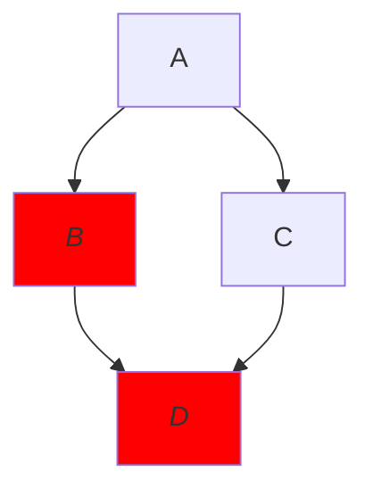

# Handleiding voor de website

## SAMENVATTING

- Wijzig **alleen** `.md`-bestanden.
- Blijf dus af van de volgende mappen en bestanden:, `/.git/`, `/system/`, `/*.html`, `/*.js`, `/*.liquid`, `/*.puml`, `/*.xml`, `/*.yml`
- Vul bij `date:` de datum van publiceren in de _branch_ `master` in (of vandaag), behalve:
    - als alleen de _front matter_ is gewijzigd (datum niet aanpassen);
    - als de wijziging uitsluitend redactioneel is (datum niet aanpassen);
    - als het gaat om een publicatie met een officiële datum, bijvoorbeeld als het in de map `/_beleidskaders/` staat (gebruik de officiële datum).
- Vul in de _front matter_ alleen metagegevens in die bestaan in de betreffende map, bijvoorbeeld het trefwoord is de unieke `title:` in de _front matter_ van een bestand in de map `_trefwoorden`.
- De waarde van de `title:` moet uniek zijn binnen de map.
- De naam van het bestand moet gelijk zijn aan de _slug_ van de `title:` (komt ongeveer neer op alle leestekens verwijderen en de spaties vervangen door een streepje `-`), gevolgd door`.md` (behalve in de map `/_beslisboomvragen/`).

## Adres van de website

De website staat in de repository [https://github.com/imbag/praktijkhandleiding/tree/master/docs](https://github.com/imbag/praktijkhandleiding/tree/master/docs) en wordt gepubliceerd op [imbag.github.io/praktijkhandleiding]({{-site.baseurl-}}). Als de naam van de repository wijzigt, wijzigt de naam van de website mee. Alternatief kan dat ook onder een eigen URL, zie [https://help.github.com/articles/using-a-custom-domain-with-github-pages](https://help.github.com/articles/using-a-custom-domain-with-github-pages).

## Onderliggende techniek en licenties

De website is gebouwd op [Github Pages](https://pages.github.com) en geprogrammeerd in [Jekyll](https://jekyllrb.com), [Liquid](https://help.shopify.com/themes/liquid), [HTML](https://www.w3schools.com/html), [JavaScript](https://www.javascript.com), [CSS](https://www.w3schools.com/css), [kramdown](https://kramdown.gettalong.org) en [Mermaid](https://mermaidjs.github.io). De vormgeving is afgeleid van [de sjabloon _Ed._](https://minicomp.github.io/ed) en de _snippet_ [_CSS Tags_](https://codepen.io/wbeeftink/pen/dIaDH). Voor beide geldt de MIT-licentie: zie [hier](https://raw.githubusercontent.com/minicomp/ed/master/LICENSE.md) voor _Ed._ en [hier](https://codepen.io/wbeeftink/details/dIaDH/#details-tab-license) voor _CSS Tags_.

De laatste release van Mermaid vind je [hier](https://unpkg.com/browse/mermaid/dist/).

Analoog aan de licentie die het ministerie heeft gekozen voor de inhoud van de Catalogus BAG, is de zelf geschreven code van de website onderworpen aan een Creative Commons-licentie, namelijk [Creative Commons Naamsvermelding-NietCommercieel-GelijkDelen 4.0 Internationaal](http://creativecommons.org/licenses/by-nc-sa/4.0). Hiervan is nog geen Nederlandse versie beschikbaar.

## Formaten

Alle teksten moeten worden geschreven in de Markdown-variant [kramdown](https://kramdown.gettalong.org). Dit is een eenvoudig te leren en toekomstbestendig tekstformaat dat lijkt op platte tekst en niet gebonden is aan welk specifiek softwarepakket dan ook en [de aandacht heeft van W3C](https://www.w3.org/community/markdown).

Het is mogelijk om eenvoudige diagrammen zoals stroomschema's in te voegen volgens de [Mermaid-specificatie](https://mermaidjs.github.io). Mermaid kent op dit moment veel minder gebruikers dan Markdown, maar volgt dezelfde aanpak, zoals vrij te gebruiken, open bron, opslaan als platte tekst, scheiden van inhoud en opmaak en eenvoudig door mensen te schrijven en te lezen zonder speciale software.

De manier waarop Jekyll, Markdown en Mermaid informatie structureren en verbinden, is in beginsel machine-leesbaar.

Verouderde browsers (zoals Internet Explorer) kunnen afbeeldingen in het Scalable Vector Graphics-formaat (`.svg`) niet goed weergegeven, maar voor moderne browsers biedt dit formaat juist aantrekkelijke voordelen. Zo blijven deze afbeeldingen scherp als je heel ver inzoomt of ze heel groot afdrukt en kan de browser tijdens het laden van de webpagina zelf een tekstuele beschrijving van een diagram omzetten naar een plaatje, zoals dat bij de Mermaid-diagrammen gebeurt.

## Inrichting van de repository

### Waar staat de website

De inhoud van de repository op GitHub is niet de website die online staat, maar wordt door GitHub Pages gebruikt om een website te genereren. Zodra je met behulp van een _commit_ (al dan niet via een _pull request_) de inhoud van de branch `master` wijzigt, wordt automatisch een nieuwe versie van de website gegenereerd. Dit kan enkele minuten duren.

Bij het genereren van de website kan de generator uit verschillende soorten pagina's kiezen. Dit wordt bepaald door de waarde van `layout:` in de _front matter_. In beginsel kies je hiervoor dezelfde waarde als die van andere bestanden in dezelfde map.

Doordat de branch `master` de bron vormt voor deze website, kunnen momentopnamen van de website worden bewaard als release. GitHub biedt ook aan om de website te genereren vanuit de map `/docs/`, maar dat is vooral zinvol als de website een bijproduct is, zoals bij de Catalogus BAG. Eenzelfde redenering geldt voor een website die wordt gegenereerd vanuit de branch `gh-pages`. Bovendien lijkt dat lastiger te beheren.

### Mappenstructuur binnen binnen`/docs/`

Het rubriek _teksten_ komt als zodanig niet voor op de website, maar wordt in deze handleiding gebruikt om de werking van de website te illustreren en representeert rubrieken als _objecttypen_, _attributen_, en dergelijke.

#### `/`

- `404.html`: de webpagina die wordt getoond als iemand een verkeerde URL intypt, zoals [imbag.github.io/praktijkhandleiding/verkeerd.html]({{-site.baseurl-}}/verkeerd.html).
- `_config.yml`: diverse besturingsparameters voor het genereren van de website.
- `atom.xml`: hiermee moet het mogelijk zijn om een atom-feed in te richten voor de website (nog niet uitgeprobeerd).
- `index.html`: de startpagina van de website.
- _`teksten.html`_: de startpagina voor het thema _teksten_ (let op het meervoud van de naam).
- `zoek.html`: zoeken met JavaScript.

#### `/archief/`

Hierin staan alleen bestanden die niet op de website komen.

#### `/afbeeldingen/`

In deze map staan alle afbeeldingen die worden aangeroepen vanuit de teksten in `/_snippets/`. Dit betreft alleen de teksten met een meervoudsnaam, zoals _tekst**en**-boven.md_. Afbeeldingen die worden aangeroepen vanuit snippets met een enkelvoudsnaam, zoals _tekst-artikelintro.md_, moeten waarschijnlijk staan in `/_layouts/afbeeldingen/` (maar dat komt nog niet voor).

#### `/_artikelen/`
- `afbeeldingen/`

In deze map staan de artikelen met de eigenlijke inhoud van de website.

#### `/system/assets/`

Bestanden die nodig zijn voor het raamwerk van de website.

##### `/system/assets/css/`

De stylesheet waarmee de websitegenerator begint bij het genereren van de website: `style.scss`

##### `/system/assets/fonts/`

Lettertypen voor de website.

##### `/system/assets/img/`

Afbeeldingen die alleen nodig zijn voor het raamwerk van de website.

##### `/system/assets/js/`

Javascript, uitsluitend ten behoeve van zoeken (`/zoek.html`).

#### `/system/_data/`

In deze map staan lijsten die worden verwerkt in allerlei webpagina's, zoals.

- `articles.yml`: lidwoorden.
- `search.yml`: de tekst die op de zoekpagina in een lege zoekbalk en bij het aantal resultaten staat als de zoekopdracht geen, één, of meerdere resultaten heeft opgeleverd.
- `stopwords.yml`: veelgebruikte woorden die worden genegeerd bij het zoeken.

#### `/system/_includes/`

HTML-bestanden die de basis vormen voor de te genereren website.

#### `/system/_layouts/`

- `default.html`
- `page.html`
- _`tekst.html`_

#### `/system/_sass/`

Stylesheets waaruit bij het genereren van de website de `.css`-stylesheets worden afgeleid via `/system/assets/css/style.scss`.

#### `/_snippets/`

In deze map staat statische tekst die wordt verwerkt in allerlei webpagina's, maar die **niet** zelfstandig een pagina vormen en **geen** eigen URL op de website krijgen.

- _`tekst-faq-intro.md`_: generieke tekst die staat meteen onder de tekst uit `/_teksten/abc.md`, maar boven de lijst van gerelateerde artikelen.
- _`tekst-item-top.md`_: generieke tekst die staat boven de tekst uit `/_teksten/abc.md` nadat je eerst in de zijbalk _Teksten_ hebt geselecteerd en daarna hebt gekozen voor tekst _abc_.
- _`tekst-taglist-intro.md`_: generieke tekst die staat meteen onder de lijst van artikelen en boven het overzicht van de labels uit de _front matter_ van `/_teksten/abc.md`.
- _`tekst-item-bottom.md`_: generieke tekst die helemaal onderaan de pagina van `/_teksten/abc.md` staat, net boven de voettekst.
- _`teksten-top.md`_: generieke tekst die staat boven het overzicht dat wordt getoond als je in de zijbalk _Teksten_ selecteert.
- _`teksten-bottom.md`: _generieke tekst die staat onder het overzicht dat wordt getoond als je in de zijbalk _Teksten_ selecteert.
- `footer.md`: de tekst die onderaan elke pagina tussen het copyright-jaartal en de datum en tijd van de websiteversie staat.
- `welcome-top.md`: de generieke tekst die boven de inhoudsopgave op de startpagina staat.
- `welcome-bottom.md`: de generieke tekst die onder de inhoudsopgave op de startpagina staat.
- `zoek-intro.md`: de tekst die boven de zoekbalk op de zoekpagina staat.

#### `/_notes/`

In deze map staan statische pagina's die niet doorverwijzen naar artikelen. Het verschil met de _snippets_ is dat _notes_ zelfstandig een pagina vormen en **wel** een eigen URL krijgen op de website. _Notes_ worden altijd aangeroepen vanuit de Markdowntekst van de gebruiker en niet door het systeem.

Een snelkoppeling naar een toelichtingspagina met de voorbeeldtitel `toelichtingstitel` wordt als volgt aangeroepen vanuit een Markdowntekst:

```
Achtergrondinformatie over dit onderwerp vindt u [hier]().
```

De tekst die niet tussen accolades staat, kan natuurlijk naar wens worden aangepast.

#### _`/_teksten/`_

De beschrijvingen van de teksten waarmee artikelen in `/_artikelen/` via de _front matter_ kunnen worden gemarkeerd.

- `afbeeldingen/`
- _`abc.md`_
- _`xyz.md`_

## Afbeeldingen

Alle afbeeldingen moeten worden geplaatst in de map `afbeeldingen/` die in dezelfde map staat als het tekstbestand met de verwijzing. Bijvoorbeeld `` in het bestand `/_artikelen/tekst.md` verwijst naar de afbeelding `/_artikelen/afbeeldingen/plaatje.svg`. De enige uitzondering hierop zijn verwijzingen vanuit de generieke teksten in de map `/_snippets/`, omdat deze tekstbestanden worden geïmporteerd in bestanden die in een andere map staan.

## Diagrammen

Diagrammen als stroomschema's, volgordediagrammen, projectplanningen kun je met Mermaid volledig specificeren binnen een Markdown-document. Dat gebeurt bij voorkeur in Liquid met _highlight_-blokken die zijn gemarkeerd als Mermaid-code. Dat doe je bijvoorbeeld voor een stroomdiagram op deze manier:

```

graph TB
    A-->B
    A-->C
    B-->D
    C-->D

```

Of anders in Markdown met codeblokken die zijn gemarkeerd als Mermaid-code:

````

````

Hierin geeft de eerste regel met `` of alleen ```` ```mermaid```` het begin aan van het Mermaid-blok en de laatste regel met `` of alleen ```` ``` ```` het einde. Deze regels ertussen specificeren het diagram in Mermaid-taal:

````
graph TB
    A-->B
    A-->C
    B-->D
    C-->D
````

Probeer altijd de standaardopmaak van de website te gebruiken. Als dat echt niet lukt, kun je een eigen opmaak definiëren op basis van [CSS](https://www.w3schools.com/cssref). Zo geef je op de volgende manier de stappen B en D uit het voorbeeld cursieve tekst op een rode achtergrond:

````

````

Deze [eigen opmaak](https://mermaidjs.github.io/flowchart.html#styling-and-classes) geldt alleen binnen het diagram en vervangt de betreffende opmaakinstellingen van de standaardopmaak. Als de standaardopmaak wijzigt, kan je eigen opmaak slecht leesbaar worden terwijl je misschien niet eens weet dat de standaardopmaak is gewijzigd. Wees daarom terughoudend met eigen opmaakregels. Als je ze toch nodig hebt, moet je de betreffende diagrammen steeds even handmatig controleren als je vermoedt dat de standaardopmaak is aangepast.

Meer informatie over hoe je diagrammen kunt maken met Mermaid, vind je [hier](https://mermaidjs.github.io).

> ### [Live Mermaid Editor](https://mermaidjs.github.io/mermaid-live-editor)
> [Hier](https://mermaidjs.github.io/mermaid-live-editor) vind je een _live editor_ waarmee je interactief Mermaid-diagrammen kunt ontwerpen. Let wel op dat de opmaak en configuratie hier iets anders kunnen zijn dan op de website van de Praktijkhandleiding.

Als een webpagina een Mermaid-diagram bevat, moet je in de _front matter_ van die pagina deze regel opnemen om de browser opdracht te geven om de Mermaid-software te laden:

`mermaid: true`

Dit staat niet standaard aan, omdat de browser van de gebruiker anders onnodig vaak een groot bestand moet laden. Houd er ook rekening mee dat gebruikers bij het laden van een pagina langer moeten wachten naarmate een webpagina meer van deze diagrammen bevat.

Voor een klikbare snelkoppeling naar een pagina **binnen de website** neem je een extra coderegel op in de specificatie van het diagram, zodat GitHub Pages bij het genereren van de website het juiste adres kan opnemen in de webpagina, bijvoorbeeld:

```
click A 
```

De code in dit voorbeeld verwijst bij knooppunt `A` van een stroomschema naar een document uit de map `_artikelen` die in de _front matter_ bij `title` de titel `voorbeeld` heeft (of `Voorbeeld` of `vooRBeeLd`).

Omdat GitHub Pages de webpagina-adressen toewijst, mogen diagrammen geen _hardcoded_ snelkoppelingen naar andere webpagina's **binnen deze website** bevatten. Je loopt anders het risico dat de koppeling bij een volgende versie van de website niet meer werkt. Snelkoppelingen naar webpagina's **buiten deze website**, dus buiten het domein van de parameter `baseurl` uit `_config.yml`, maak je wel _hardcoded_ en zullen dus verbreken als het adres van de bestemming wijzigt. Voor een klikbare snelkoppeling naar een pagina **buiten deze website** neem je conform de [documentatie van Mermaid](https://mermaidjs.github.io/flowchart.html#interaction) bijvoorbeeld de volgende coderegel op in de specificatie van een diagram:

```
click A "https://www.kadaster.nl"
```

## Informatie verbinden

> Deze paragraaf geldt alleen voor webpagina's **binnen** deze website. Voor verwijzingen naar elders heb je geen keus en kun je niet anders dan het adres hard overtypen en hopen dat het voorlopig niet zal veranderen. Als een dergelijk adres op veel plekken nodig is, kan er overigens wel een variabele voor worden aangemaakt in `\_config.yml`. Die kun je dan bijvoorbeeld aanroepen met `[{{ site.catalogus_bag_label -}}]({{- site.baseurl -}}{{- site.catalogus_bag_url -}}){:target="blank"}`.

De uiteindelijke inhoud van de praktijkhandleiding staat in de map `/_artikelen/`. De informatie in de andere mappen dient om de metagegevens te definiëren waarmee informatie aan elkaar wordt verbonden of voor de technische inrichting van de website.

Voor het verbinden van informatie gebruikt de website _front matter_. Dit is een verzameling van variabelen met hun waarden die helemaal bovenaan een bestand staat. De _front matter_ wordt voorafgegaan door een regel met alleen drie minnetjes. En ook meteen erna staat zo'n regel.

Dit is een voorbeeld van _front matter_:

```
---
layout: default
title: Gemeentelijke herindeling en gemeentegrenswijzigingen
date: 2018-07-01
editor: "Kadaster"
attributen: identificatie
relaties: ligt in
objecttypen: woonplaats, openbare ruimte, nummeraanduiding
trefwoorden: gemeentelijke herindeling
begrippen: bronhouder
---
```

### Verwijzen naar andere pagina's

Verwijzen naar andere bestanden van de website gebeurt met name via de _front matter_ van elk bestand. Dit is het bovenste gedeelte van elk bestand (tussen de regels met `---`), waarin variabelen staan die dienen als metagegevens of parameters bij de inhoud van het bestand. De metagegevens zijn bedoeld om de informatie te verbinden en de parameters beïnvloeden de werking van de websitesoftware. Tegenover elk metagegeven bij een bestand moet een ander bestand staan dat de waarde van het metagegeven als titel heeft. De naam en de waarde van dergelijke parameters moeten exact overeenkomen (zie elders in deze beschrijving).

Rechtstreeks met een Markdown-koppeling verwijzen naar de kop `## 4.5 Titel van de paragraaf` in het bestand `/_artikelen/voorbeeld.md`, is technisch mogelijk met `[verwijstekst]({{-site.baseurl-}}/artikelen/voorbeeld#45-titel-van-de-paragraaf)`, maar de semantische betekenis van zo'n koppeling is niet machine-leesbaar. Dit maakt zulke verwijzingen ongeschikt om ze als _linked data_ te ontsluiten. Daarnaast zal een dergelijke koppeling ophouden te werken als de naam van het doelbestand verandert, wat extra beheerwerk oplevert. De kans daarop is nog groter bij een volledig uitgeschreven websiteadres als `[verwijstekst](https://imbag.github.io/praktijkhandleiding/artikelen/voorbeeld#45-titel-van-de-paragraaf` (dus zonder `{{-site.baseurl-}}`). Dan gaat het namelijk ook mis als de locatie van de website verandert, bijvoorbeeld voor een [testomgeving](#een-testomgeving-inrichten).

### Catalogus

De Catalogus bevindt zich in een aparte map en hebben een speciale layout, namelijk _book_. Bij deze bestanden is het belangrijk dat elke paragraaf (of deelparagraaf) een aparte pagina vormt en dat elke ouderpagina via het gegeven `subpages:` verwijst naar alle bijbehorende kindpagina's (en dus niet andersom). Elke pagina, ongeacht ouder of kind, moet een kop hebben op het hoogste hoofdstukniveau, dus bijvoorbeeld `# Hoofdstuktitel`in Markdown. Binnen deze map is het mogelijk om te verwijzen naar elke willekeurige hoofdstuk- of paragraafkop. Je doet hierbij alsof de kop waarnaar je verwijst in hetzelfde bestand staat als de verwijzing zelf. De software van de website zorgt er dan voor dat deze verwijzing het doet. Ook hier doen deze verwijzingen niet mee voor _linked data_, dus neem ze ook op in de _front matter_ bij de regel `catalogus:`.

Een verwijzing naar de paragraaf `# 2.1.5 Mijn voorbeeldparagraaf`, ziet er standaard bijvoorbeeld uit als `zie [paragraafvoorbeeld](#215-mijn-voorbeeldparagraaf)`. Hierbij is `#215-mijn-voorbeeldparagraaf` de _slug_ van de paragraaftitel. Deze kun je bijvoorbeeld te weten komen door in de browser de `id` van de kop op te vragen (in Chrome doe je dit bijvoorbeeld door vanuit het contextmenu voor _Inspecteren_ te kiezen) of in de statusbalk te kijken naar de URL waarnaar de kop verwijst.

Je kunt ook zelf een `id` aan een kop toekennen met een [_block inline attribute list_](https://kramdown.gettalong.org/quickref.html#block-attributes), bijvoorbeeld:

```
# 2.1.5 Mijn voorbeeldparagraaf
{:#ditismijnid}
```

De verwijzing naar deze paragraaf wordt dan:

```
[paragraafvoorbeeld](#ditismijnid)
```

En in de _front matter_ behoort dan tevens te staan:

```
catalogus: 2.1.5 Mijn voorbeeldparagraaf, 3.5 Een andere paragraaf
```

### Afdrukweergave

Neem `printonly: true` op in de _front matter_ van een (afwijkende) pagina de pagina uit te sluiten van het kruimelpad en om onderaan de pagina geen koppelingen naar andere pagina's te tonen. Andere pagina's kunnen ook niet terugverwijzen. Je kunt de naam van deze variabele (nu: `printonly`) wijzigen. Pas hiervoor de waarde bij _flag:_ in \_data/print.yml **en** bij _defaults:_ in \_config.yml aan.

### Datum

In de _front matter_ staat in beginsel altijd een volgende regel:

```
date: 2018-07-01
```

Deze datum bepaalt wat bovenaan komt de staan in de tijdlijn. De tijdlijn attendeert gebruikers op wijzigingen, maar ze kunnen niet zien wat er is gewijzigd (GitHub houdt weliswaar de volledige historie van alles bij, maar GitHub Pages publiceert alleen de actuele versie). Als er inhoudelijk niets verandert, maar alleen een poging wordt gedaan om de leesbaarheid of vindbaarheid van de pagina op de website te verbeteren, hoeft niemand zijn of haar manier van werken aan te passen. Er is dan geen reden om de pagina bovenaan de tijdlijn te willen zetten en dus moet de datum dan niet wijzigen. Dit is bijvoorbeeld het geval als alleen de _front matter_ wijzigt.

In dit voorbeeld is de datum _1 juli 2018_. Tenzij het gaat om een beleidskader, is dit dus de dag waarop deze pagina voor het eerst is gepubliceerd of voor het laatst inhoudelijk is gewijzigd. Bij beleidskaders en andere teksten die formeel zijn vastgesteld, is de datum gelijk aan de officiële datum (dus ongeacht de datum waarop iets in de Praktijkhandleiding is verschenen of gewijzigd).

### _Front matter_ van artikelen

De volgende metagegevens zijn gedefineerd voor de _front matter_ van de artikelen in `_artikelen`:

```
---
layout: default
title:
date: 2018-06-28
description: ""
editor: ""
attributen:
beleidskaders:
beslisboomvragen:
gebeurtenissen:
kwaliteitsrapporten:
modeldocumenten:
objecttypen: woonplaats, openbare ruimte, nummeraanduiding, standplaats, ligplaats, pand, verblijfsobject
relaties:
trefwoorden:
---
```

Je kunt vaak meerdere waarden toekennen aan een variabele. Dat doe je door die waarden achter elkaar te zetten. Soms is het voldoende als er een spatie tussen staat, maar meestal moet er een komma tussen staan. Soms moet je waarden die uit meerdere woorden bestaan, tussen aanhalingstekens zetten, zoals meestal bij de titel. Soms mogen aanhalingstekens juist niet, zoals bij de namen van gerelateerde gebeurtenissen! Dit is voorlopig nog een kwestie van uitproberen. Dat geldt ook voor het gebruik van hoofdletters binnen _front matter_. Belangrijk is dat de `title:` - ongeacht het gebruik van hoofdletters of kleine letters! - uniek moet zijn binnen een map en dat de naam van het bestand gelijk is aan de _slug_ van de _titel_ (meestal komt dit neer op alle leestekens verwijderen en de spaties vervangen door een streepje `-`), gevolgd door`.md`.

### _Front matter_ van metagegevens

De overzichtpagina's van de meeste metagegevens hebben de volgende _front matter_:

```
---
layout: overview
siteindex: true
title: Tekst
sortkey: 000
sortorder: alphabetical
harvest: teksten
---
```

De titel en beschrijving van een metagegeven, die wordt ingevoerd bij `title:` (hier in dit voorbeeld: _Tekst_) en `description:`, mag geen dubbele punten `:` (gebruik: `&colon;`), geen komma's `,` (gebruik: `&comma;`), geen nummertekens `#` (gebruik: `&num;`) en geen Markdownopmaak bevatten. De dubbele punt wordt al gebruikt om de naam van het metagegeven of de parameter te scheiden van de waarden en de komma dient om meerdere waarden van metagegevens of parameters van elkaar te onderscheiden. Alle tekst uit de _front matter_ wordt niet als Markdown opgemaakt, maar als platte tekst gebruikt. Eventuele Markdowncodes worden daardoor zichtbaar op de website, bijvoorbeeld in automatisch gegenereerde lijsten. Als de waarde van een metagegeven enkele `'` of dubbele `"` aanhalingstekens bevat, kan het misschien nodig zijn om om het geheel dubbele of enkele aanhalingstekens te zetten, bijvoorbeeld: `title: 'Dit is een "bijzondere" titel'`.

De parameter `sortorder` kan de waarden `alphabetical`, `chronological` of `sortkey` hebben en bepaalt hoe lijstitems worden gesorteerd. Bij `chronological` komt de nieuwste bovenaan te staan, maar worden geen items zonder datum getoond. Bij `sortkey` staat de laagste sorteercode bovenaan (let op voorloopnullen worden genegeerd bij het sorteren, dus beter met een letter of met bijvoorbeeld `100` beginnen). Bij andere waarden wordt oplopend alfabetisch gesorteerd.

### Nieuwe metagegevens definiëren

Het is eenvoudig mogelijk om zelf metagegevens toe te voegen. Dit doe je voor het nieuwe metagegeven met de naam _tekst_ als volgt (let goed op hoofdletters/kleine letters en op meervoud/enkelvoud):

- Kopieer bijvoorbeeld `/_layouts/objecttype.html` naar `/_layouts/tekst.html`

- Wijzig in `/_layouts/tekst.html` de code `artikel.objecttypen` in `artikel.teksten`

- Maak de map `/_teksten/` aan voor de beschrijvingen van de verschillende waarden van het metagegeven _tekst_.

- Voeg aan de lijst met `collections:` in `/_config.yml` toe:

```
    teksten:
        output: true
        zoeken: true
        taggable: true
        datums: false
        origin:
        alias:
        referralHighlighting: true
```

- Verander `zoeken: true` in `zoeken: false` als de bestanden in de map `/_teksten/` buiten de zoekresultaten van de website moeten worden gelaten (dit heeft geen invloed op externe zoekmachines, zoals Google en DuckDuckGo).
- Verander `taggable: true` in `taggable: false` als het metagegeven niet als _tag_ moet worden getoond onderaan pagina's.
- Verander `referralHighlighting: true` in `referralHighlighting:` als `taggable: false``.
- Verander `referralHighlighting: true` in `referralHighlighting: false` als na het klikken op een _tag_ de woorden van de _tag_ niet moeten worden gemarkeerd op de doelpagina van de _tag_.
- Verander `alias:` in `alias: kruimelpadnaam` als niet de naam van de collectie moet worden getoond in het kruimelpad, maar de kruimelpadnaam.
- Verander `datums: false` in `datums: true` als de datum van een onderwerp uit de collectie (`date:` in _front matter_) moet worden getoond op de pagina van dat onderwerp. (In lijsten wordt de datum altijd getoond.)
- Verander `origin:` in `origin: herkomstcollectie` om het kruimelpad uit te breiden met een herkomstcollectie die verwijst naar onderwerpen in deze collectie.

- Voeg de volgende bestanden toe aan `/_snippets/`:

    - teksten-top.md:
    - teksten-bottom.md
    - teksten-item-top.md
    - teksten-faq-intro.md
    - teksten-item-bottom.md

- Begin deze bestanden met de volgende _front matter_: `title:`, gevolgd door de hiervoor genoemde naam van het bestand zonder extensie. Bijvoorbeeld:

```
---
title: teksten-top
---
```

- Kopieer bijvoorbeeld `/objecttypen.html` naar `/teksten.html`.

- Wijzig de regel met `title: Objecttypen` in `title: Teksten`.

- Wijzig de code `site.objecttypen` in `site.teksten`.

- Pas het getal bij `sortkey` aan, zodat het thema op de gewenste plek in de zijbalk en op de beginpagina komt te staan.

- Beschrijf de verschillende waarden van het metagegeven _tekst_, zoals _abc_ en _xyz_, in de bestanden `abc.md`, `xyz.md`, etc. in de map `/_teksten/`.

- Je kunt het nieuwe begrip/thema _Tekst_ nu gebruiken door aan de _front matter_ van de relevante artikelen in `/_artikelen/` bijvoorbeeld toe te voegen:

```
teksten: abc, xyz
```

## Lange artikelen

Bij lange artikelen kan het handig zijn om in de zijbalk de paragraaftitels te tonen van het artikel. Dit doe je door in de _front matter_ de parameter `toc:` op te nemen, met daaronder de exacte `title:` van de relevante hoofdstuk- en paragraafkoppen in de gewenste volgorde. Je negeert hierbij het hoofdstukniveau. Bij artikelen met een `subpages:` gebeurt dit alles automatisch. Als _front matter_ zowel een `toc:` als een `subpages:` bevat, gaat `toc:` voor.

Als je gebruik wilt maken van `toc:`, mogen de paragraaftitels geen dubbele punten `:`, geen komma's `,`, geen nummertekens `#`, en geen afbreekstreepjes `-` bevatten, maar `&colon;`, `&comma;`, `&num;` en een _non-breaking hyphen_ (Unicode `&#x2011;`) mogen wel.

Een voorbeeld:

```
toc:
- Paragraaftitel een
- Paragraaftitel 2
- Paragraaftitel 2.1.7
- Paragraaftitel 2.3
```

Alternatief kun je een inhoudsopgave tonen bovenaan het artikel (maar deze verschijnt niet in de zijbalk). Dit doe je door bij dat artikel tussen de _front matter_ en de eerste regel van het artikel de volgende code in te voegen:

```
## Inhoud
{:.no_toc}

* ToC
{:toc}

----
```

## Controleren of de verwijzingen kloppen

Om te controleren of de verwijzingen op de website kloppen, ga je naar [https://imbag.github.io/praktijkhandleiding/beheer]({{-site.baseurl-}}/beheer). Deze webpagina is niet bereikbaar vanuit de menustructuur van de Praktijkhandleiding, maar alleen door het webadres in te typen. Op deze webpagina staan alle pagina's van de Praktijkhandleiding waarop een of meer van de volgende fouten is geconstateerd:

- Pagina's die naar zichzelf verwijzen;
- Pagina's met dezelfde `title:` als andere pagina's in dezelfde collectie (map);
- Bronpagina's die verwijzen naar doelpagina's die (nog?) niet bestaan;
- Bronpagina's die meerdere keren verwijzen naar dezelfde doelpagina.

Pagina's waar geen andere pagina's naar verwijzen, hoeven niet onjuist te zijn. Ze zijn herkenbaar doordat er op de betreffende webpagina's geen koppelingen staan naar andere webpagina's.

Het overzicht wordt bij elke aanpassing van de website vernieuwd.

## Een testomgeving inrichten

Je kunt vanuit een repository maar één GitHub Pages-website genereren. Om te kunnen testen, moet je daarom een kopie maken van een momentopname van de productieomgeving. Hiertoe maak je eerst een nieuwe _private repository_ aan op GitHub. De naam van de _repository_, wordt de naam van de website, net zoals dat bij _repository_ "praktijkhandleiding", die je kunt vinden op de webpagina `https://github.com/imbag/praktijkhandleiding`, de GitHub Pages-website `https://imbag.github.io/praktijkhandleiding` hoort. Laat het vinkje bij "_Initialize this repository with a README_" weg en laat "_Add .gitignore: **None** ▾_" en "_Add a license: **None** ▾_" op _None_ staan.

Als voorbeeld maken we hier een testomgeving en dus een _repository_ aan met de naam _testwebsite_. Ga naar de instellingen van de nieuwe _repository_ en autoriseer iedereen die schrijfrechten nodig heeft via `https://github.com/imbag/testwebsite/settings/collaboration`. Zet ook de GitHub Pages-website aan op `https://github.com/imbag/testwebsite/settings`. Dit doe je door onder het kopje GitHub Pages de _source_ **_master branch_** te selecteren. (De waarschuwing "_⚠︎ Caution: This repository is private but the published site will be public._", kun je negeren.)

Kloon de nieuwe _repository_ met [GitHub Desktop](https://desktop.github.com) naar je computer. De _repository_ is dan nog leeg. Kopieer vervolgens alle mappen en bestanden van de Praktijkhandleiding integraal naar de map van de nieuwe _repository_. Gebruik hierbij de juiste versie van de Praktijkhandleiding. Dat mag de laatste _commit_ van de _master_ zijn, maar ook een eerdere _commit_ naar keuze. Onthoud deze _commit_!

Bewerk nu op je computer de inhoud van de map met de kloon van de nieuwe _repository_:

- Verwijder de verborgen map `/.git` (indien aanwezig);
- Pas in `/_config.yml` de regel die begint met `baseurl:` aan aan de naam van de nieuwe _repository_, dus in dit voorbeeld `baseurl: /testwebsite`.

Gebruik nu [GitHub Desktop](https://desktop.github.com) om de inhoud die je hebt klaargezet te synchroniseren met GitHub. _Commit_ hiertoe de wijzigingen en neem in de beschrijving van deze _commit_ op op welke _commit_ je de testomgeving hebt gebaseerd (dit is de _commit_ die je een paar stappen terug moest onthouden). Deze informatie kan namelijk later nog eens nodig zijn en is anders nauwelijks meer te achterhalen, omdat je de testomgeving op de beschreven manier namelijk vult met alleen een momentopname van de bron, zonder de historie.

De nieuwe testomgeving is nu klaar voor gebruik.
