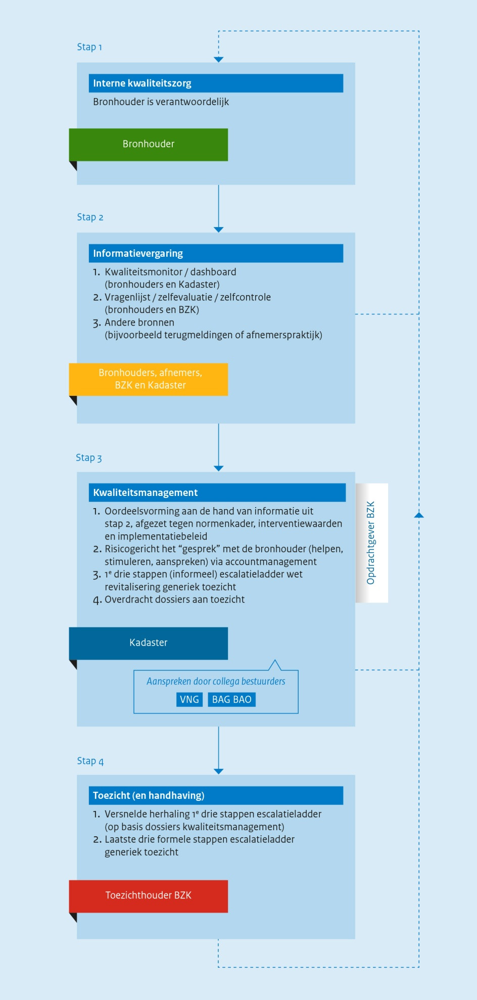
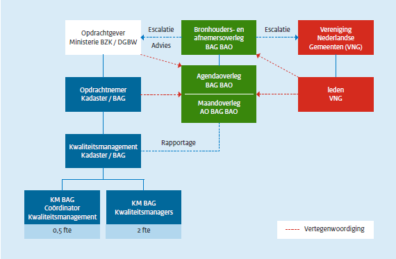

# Kwaliteit- en toezichtkader Basisregistratie Adressen en Gebouwen 2020

> Deze webversie van het _Kwaliteit- en toezichtkader Basisregistratie Adressen en Gebouwen 2020_ is een serviceproduct voor gebruikers. Aan de inhoud kunnen geen rechten worden ontleend. De formele versie van het _Kwaliteit- en toezichtkader Basisregistratie Adressen en Gebouwen 2020_ vindt u op [geobasisregistraties.nl](https://www.geobasisregistraties.nl/documenten/publicatie/2020/06/19/kwaliteit-en-toezichtkader-bag-2020){:target="_blank" rel="noreferrer"}.

_Versie_ \\
2020 - 1.0

_Auteurs_ \\
Martijn Odijk \\
Jan Willem Genuit \\
Damir Brnobic

_In afstemming met de Werkgroep Kwaliteit BAG van het Agendaoverleg BAG BAO_

_Datum_ \\
1 juli 2020

_Dit is een uitgave van het_ \\
Ministerie van Binnenlandse Zaken en Koninkrijksrelaties \\
Postbus 20011 \| 2500 EA Den Haag

----

# Inleiding

Eén van de belangrijkste veranderingen bij de overgang naar de gewijzigde BAG wet- en regelgeving is de inrichting van een nieuw kwaliteitsregime in een breder proces van kwaliteitsborging (bij bronhouders) – monitoring – kwaliteitsmanagement (centraal) en toezicht.[^1] . Deze beleidsnotitie schetst hier een overzicht van.

Het is allereerst van belang om te benadrukken dat bronhouders de verantwoordelijkheid hebben om de kwaliteit van de registratie conform de eisen in wet- en regelgeving te garanderen. Ter ondersteuning hiervan worden er, aanvullend op de kwaliteitsborging bij bronhouders zelf, middels bijvoorbeeld het Kadaster Kwaliteitsdashboard BAG, centraal instrumenten beschikbaar gesteld. Deze instrumenten dienen twee doelen, kwaliteitsborging bij de bronhouders zelf, maar ook operationalisering van de systeemverantwoordelijkheid van de minister van BZK voor de kwaliteit van de landelijke BAG. Daarnaast formuleert deze notitie zogenaamde interventiewaarden. Het kwaliteitsmanagement BAG, belegd bij het Kadaster, controleert op deze ondergrens en kan in actie komen zodra de datakwaliteit van de BAG structureel onder druk staat.

Aanvullend is in dit document overgangsbeleid opgenomen. Het in bijlage 2 geformuleerde implementatiebeleid bepaalt in hoeverre bronhouders nieuwe wet- en regelgeving met terugwerkende kracht dienen toe te passen op de huidige registratie. Dit faciliteert een soepele overgang van BAG 1.0 naar BAG 2.0 en heeft een tijdelijk karakter.

Interventiewaarden en implementatiebeleid zijn dynamisch van aard. Per jaar wordt, in overleg met het BAG Bronhouders- en Afnemersoverleg (BAG BAO), bekeken in hoeverre waarden of eisen aanpassing vragen. Op deze manier kan adequaat worden ingespeeld op belangen en behoeften van bronhouders en afnemers. Gezien het feit dat de implementatiefase van BAG 2.0 tot en met het eerste kwartaal van 2020 duurt is er tot nu toe terughoudend omgegaan met het formuleren van implementatiebeleid. In deze 2020-versie van het implementatiebeleid staat het beheersen van de impact voor de bronhouder centraal, net als in de 2019- en 2018-versie. Dat heeft te maken met het feit dat de in BAG 2.0 gekozen benadering van afbakening van invloed is op met name bijgebouwen. Een verschuiving in de afbakening van dergelijke objecten raakt daarnaast ook de Basisregistratie Grootschalige Topografie (BGT). Aangezien ook deze basisregistratie een doorontwikkeling doormaakt, kan nog niet gekozen worden voor een toekomstbestendige oplossing. Om deze reden is er, in overleg met bronhouders en afnemers, voor gekozen om op dit moment terughoudend te zijn met toepassing van de nieuwe benadering op bestaande bouwwerken. Hiermee is bewust gekozen voor een hybride situatie, waarbij sommige objecten van eenzelfde type anders geregistreerd zijn onder BAG 1.0 dan onder BAG 2.0.

In de tweede helft van 2020 zal op verzoek van afnemers van de BAG, wel de afbakening van windturbines onderzocht worden, in samenwerking met de BGT (en mogelijk de BRT). Dit kan leiden tot bijstelling van het implementatieadvies.

In de 2020-versie van het kwaliteitskader BAG is een heldere planning omtrent de zelfcontrolecyclus opgenomen, zodat het voor de bronhouders duidelijk is wanneer bevindingen uit de zelfcontrole teruggekoppeld worden. Daarom is de 2020-versie van het kwaliteitskader hernoemd naar ‘kwaliteits- en toezichtkader BAG’. Deze cyclus is eveneens volledig bruikbaar voor de Basisregistratie Grootschalige Topografie (BGT) en de Basisregistratie Ondergrond (BRO). Op termijn kunnen de kwaliteits- en toezichtkaders voor deze drie basisregistraties geïntegreerd worden. Dit past goed in Doorontwikkeling in Samenhang van de geo-(basis)registraties (DiS Geo).

Tot slot presenteert deze beleidsnotitie een totaaloverzicht van alle aanscherpingen in BAG 2.0. De inhoudelijke aanscherpingen zijn opgenomen in bijlage 2 en de technische wijzigingen in het informatiemodel in bijlage 3. Deze overzichten kunnen door bronhouders gebruikt worden voor een eigen impactanalyse op de interne processen en technische inrichting.

[^1]: Zie Memorie van Toelichting: [https://www.geobasisregistraties.nl/basisregistraties/documenten/kamerstuk/2016/06/28/memorie-van-toelichting-wetsontwerp-bag](https://www.geobasisregistraties.nl/basisregistraties/documenten/kamerstuk/2016/06/28/memorie-van-toelichting-wetsontwerp-bag){:target="_blank" rel="noreferrer"}

----

# 1. Normatieve kader

Sinds de inwerkingtredingsdatum van de herziene wet- en regelgeving voor de BAG, 1 juli 2018, wordt het normatieve kader gevormd door:

- De gewijzigde Wet bag[^2],
- Het gewijzigde Besluit bag[^3], en
- De Catalogus BAG 2018[^4].

De kwaliteitseisen die aan de gegevens in de BAG gesteld worden, zijn in deze documenten opgenomen. Alle gegevens die in de basisregistratie geregistreerd of gemuteerd worden moeten aan deze eisen voldoen.

In met name hoofdstuk 4 van de Catalogus staan de kwaliteitseisen beschreven die aan de BAG gesteld worden. In dat hoofdstuk is kwaliteit onderverdeeld in de onderdelen _volledigheid_, _compleetheid_, _juistheid_, _actualiteit_, _positionele_ _nauwkeurigheid_, _oppervlaktenauwkeurigheid_, _tijd_ _(tijdnauwkeurigheid, tijdconsistentie, tijdgeldigheid)_ en _aanwijzingen van mogelijke onjuistheden in de registratie_.

Een toelichting op het kwaliteitsregime is beschreven in paragraaf 5 en 6 van de [memorie van toelichting](https://zoek.officielebekendmakingen.nl/kst-34507-3.html){:target="_blank" rel="noreferrer"} bij de wijziging van de Wet bag.

De Catalogus bevat alle generieke en bijzondere verplichtingen. Deze twee typen worden hieronder verder toegelicht.

## 1.1. Generieke verplichtingen

Generieke verplichtingen hebben bijvoorbeeld betrekking op de objectafbakening, de inwinning of verwerking van gegevens of de opname van statussen. Deze verplichtingen zijn in de Catalogus vastgelegd; langs die weg zijn ze daadwerkelijk verplichtend.

## 1.2. Bijzondere verplichtingen

Bijzondere verplichtingen zijn uitzonderingen op de generieke verplichtingen. Denk daarbij aan het niet opnemen van een bouwwerk in de BAG, terwijl er wel wordt voldaan aan de definitie. Dit geldt bijvoorbeeld voor de hobbykas, die dan ook expliciet als uitzondering in de Catalogus is opgenomen bij de pandafbakening.

## 1.3 Toepassing

Het normatieve kader leidt niet voor iedere concrete situatie altijd tot een bij voorbaat eenduidige uitkomst. Het is de verantwoordelijkheid van de bronhouder om tot een resultaat te komen dat aansluit bij de doelen en principes van de BAG. Naast de formele documenten zijn met het oog daarop ook praktijkhandleidingen aan bronhouders en afnemers ter beschikking gesteld[^5].

[^2]: Staatsblad nr. 60 – 2017: [https://www.geobasisregistraties.nl/basisregistraties/documenten/publicatie/2017/02/24/staatsblad-wet-bag-nummer-60---2017](https://www.geobasisregistraties.nl/basisregistraties/documenten/publicatie/2017/02/24/staatsblad-wet-bag-nummer-60---2017){:target="_blank" rel="noreferrer"}

[^3]: Staatsblad nr. 311 – 2017: [https://www.geobasisregistraties.nl/basisregistraties/documenten/publicatie/2017/07/28/staatsblad-2017---311-besluit-van-6-juli-2017-tot-wijziging-van-het-besluit-basisregistraties-adressen-en-gebouwen-in-verband-met-modernisering-en-vereenvoudiging-van-de-registratie](https://www.geobasisregistraties.nl/basisregistraties/documenten/publicatie/2017/07/28/staatsblad-2017---311-besluit-van-6-juli-2017-tot-wijziging-van-het-besluit-basisregistraties-adressen-en-gebouwen-in-verband-met-modernisering-en-vereenvoudiging-van-de-registratie){:target="_blank" rel="noreferrer"}

[^4]: Staatscourant nr. 36227 – 2018: [https://zoek.officielebekendmakingen.nl/stcrt-2018-36227.html](https://zoek.officielebekendmakingen.nl/stcrt-2018-36227.html){:target="_blank" rel="noreferrer"} en bijlage Catalogus BAG 2018

[^5]: Praktijkhandleiding BAG zoals in beheer bij het Kadaster: [https://imbag.github.io/praktijkhandleiding/](https://imbag.github.io/praktijkhandleiding/){:target="_blank" rel="noreferrer"}

----

# 2. Beleid kwaliteitsmanagement en toezicht

De Catalogus bevat absolute normen: het moet altijd, het mag nooit of het moet bijvoorbeeld altijd binnen een bepaalde termijn. Dit hoofdstuk beschrijft enerzijds de relatie tussen de gewijzigde afbakening en bestaande registraties van bronhouders en anderzijds de gestelde ondergrens voor de kwaliteit van gegevens.

## 2.1. Implementatiebeleid

Volgens het oude Objectenhandboek (“BAG 1.0”) worden bijvoorbeeld 'silo's' als pand afgebakend. In de vigerende Catalogus komt dit begrip niet voor. Elk bouwwerk moet volgens dezelfde generieke regels worden afgebakend. Nieuwe silo's zullen dus vaak niet meer als pand worden afgebakend. Maar dat betekent niet dat bronhouders ook de al bestaande silo's actief moeten opsporen en uit de BAG halen. Dit geldt voor meer soorten objecten waarvoor de afbakening als gevolg van de Catalogus zal veranderen.

Voor al deze bestaande objecten is in het implementatiebeleid opgenomen wat het ministerie van de bronhouder verwacht. Dit beleid is opgenomen in bijlage 2. Vaak zal dit inhouden dat geen actieve inwinning wordt verwacht, maar dat objecten die in de reguliere processen, zoals een verleende omgevings- vergunning voor een verbouwing, of naar aanleiding van terugmeldingen naar voren komen wel moeten worden verwerkt. Dit implementatiebeleid is in deze versie van het Kwaliteitskader niet gewijzigd om bronhouders voldoende gelegenheid te geven de implementatie van de wijzingen voor de BAG (“BAG 2.0”) uit te voeren. De spelregels voor de overgang zijn in 2019 geüpdatet en weergegeven op de website van BZK[^6].

[^6]: [https://www.geobasisregistraties.nl/documenten/publicatie/2019/06/21/spelregelkader-bag-2019](https://www.geobasisregistraties.nl/documenten/publicatie/2019/06/21/spelregelkader-bag-2019){:target="_blank" rel="noreferrer"}

## 2.2. Interventiewaarden

Het is van belang dat de BAG van goede kwaliteit is. Om deze reden is in dit document een ondergrens voor de datakwaliteit geformuleerd voor zover deze centraal meetbaar is. Op het moment dat bronhouders door deze grens zakken, kan het Kwaliteitsmanagement BAG (Kadaster) met hen het gesprek aangaan. De ondergrens is in de vorm van zogenaamde interventiewaarden opgenomen in bijlage 1.

Uitgangspunt is dat interventiewaarden dynamisch zijn. De BAG kent een uitgebreid scala aan al dan niet (de-) centraal meetbare kwaliteitseisen. Denk daarbij aan maximaal toegestane afwijkingen voor oppervlakte en geometrie. De komende jaren zullen meer van dit soort kwaliteitseisen vertaald worden naar interventiewaarden.

De interventiewaarden en het implementatiebeleid worden niet in de Catalogus zelf opgenomen, maar steeds afzonderlijk door het ministerie vastgesteld. Deze worden jaarlijks heroverwogen, na advies van het BAG BAO (via het Agendaoverleg BAG BAO). Bijlagen 1 en 2 vormen het kader voor het eerste jaar vanaf de datum van inwerkingtreding. De operationalisering van een tweetal punten in Bijlage 1 is gewijzigd per 1 juli 2019. Dit betreft de operationalisering van de meting van de verwerkingstermijn definitieve pandgeometrie en de meting van de afhandeltermijn in onderzoek. Overigens heeft dit niet geleid tot wijzigingen in de tekst van bijlage 1, maar leidt dit alleen tot een andere operationalisering in het Kwaliteitsdashboard BAG voor bronhouders.

Voor het kwaliteitskader 2020 hebben er geen wijzigingen plaatsgevonden in de interventiewaarden en het implementatiebeleid. Naar verwachting zal het implementatieadvies voor windturbines in 2020 aangepast worden (2e helft 2020), dit advies wordt in samenhang met de BGT (en BRT) opgepakt.

----

# 3. Systeem van kwaliteitsborging

De inhoud van de BAG dient van hoge kwaliteit te zijn. Hiertoe zijn verschillende kwaliteitswaarborgen aanwezig, zoals borging bij de bronhouder, terugmelding van fouten door afnemers, landelijke onafhankelijke kwaliteitsmonitoring door kwaliteitsmanagement (als eventuele opmaat naar het
toezicht), het (horizontale) toezicht binnen de bronhouderorganisaties (gemeenten) en het (verticale) toezicht door de minister. Met de laatste twee stappen vult de minister de systeemverantwoordelijkheid voor de kwaliteit van de BAG in.

De kwaliteit zal blijken in de diverse processen binnen en buiten de overheid waarvoor deze basisregistratie wordt gebruikt, maar uit het verloop van die processen alleen kan geen meetbare kwaliteit worden afgeleid. Hieronder beschrijven we de vier stappen van de kwaliteitsborging van de BAG.

In de memorie van toelichting van de gewijzigde Wet bag[^7] wordt het volgende aangegeven in hoofdstuk 6, Kwaliteitszorg en toezicht:

_“In geval van gerede twijfel over de juistheid van gegevens hebben bestuursorganen reeds een terugmeldplicht op grond van de wet, welke verplichting binnen het stelsel van basisregistraties geldt als een belangrijke «zelfreinigende factor» voor het stelsel, die kwaliteitsverhogend werkt. Dit is in overeenstemming met de tweede eis aan basisregistraties, zoals beschreven in de brief van 3 maart 2003 van de Ministers van Binnenlandse Zaken en Koninkrijksrelaties, Volkshuisvesting, Ruimtelijke Ordening en Milieubeheer en de Staatssecretaris van Economische Zaken.4 In het kader van kwaliteitszorg heeft het echter een toegevoegde waarde indien niet alleen de terugmeldingen, die telkens op een individueel object of gegeven betrekking hebben, worden afgehandeld. Ook een breder, samenhangend inzicht in de kwaliteit van de registratie draagt bij aan de kwaliteitszorg. Zoals in hoofdstuk 5 van deze toelichting is opgemerkt, zullen gemeenten in hun verantwoordelijkheid voor het bijhouden van de basisregistratie worden ondersteund door een gewijzigd systeem van kwaliteitszorg. Dit gebeurt langs twee lijnen. De Minister van Infrastructuur en Milieu houdt de kwaliteit van de gemeentelijke registratie in de gaten door middel van regelmatige bestandsanalyses en bestandsvergelijkingen met andere (basis)registraties. De Minister van Infrastructuur en Milieu informeert burgemeester en wethouders over de resultaten. Bestandsanalyses en bestandsvergelijkingen bieden niet alleen de mogelijkheid om individuele onvolkomenheden op te sporen, maar kunnen tevens inzicht bieden in de aard van meervoudig gesignaleerde onvolkomenheden. Naast het feit dat analyses en vergelijkingen aldus kwaliteitsinformatie voor de gemeente zelf opleveren, kunnen de resultaten ervan tevens eventueel aanleiding vormen voor nader, gericht toezicht. Dit toezicht zal zich dan kunnen richten op de oplossing van oorzaken die tot meervoudig gesignaleerde onvolkomenheden leiden. Naast het in de gaten houden van de kwaliteit van de registratie voorziet het voorstel in een wettelijke verplichting voor burgemeester en wethouders om jaarlijks onderzoek te doen naar de inrichting en de werking van hun basisregistratie, alsmede naar de verwerking van gegevens in de basisregistratie, en om een rapportage van de resultaten van dat onderzoek aan de Minister van Infrastructuur en Milieu toe te zenden. Voor de BAG wordt een zelfcontrole voorzien die bestaat uit ten minste een vragenlijst over interne kwaliteitszorg. Daaraan kunnen steekproeven op inhoudelijke kwaliteit worden toegevoegd. Voor een en ander zal op basis van de regeling door het Ministerie van Infrastructuur en Milieu een elektronisch instrument ter beschikking worden gesteld, dat technisch en inhoudelijk in de loop der tijd wordt ontwikkeld, mede rekening houdend met gebruikservaringen van de bronhouders. Zodoende zal voor het onderzoek en de rapportage een verdere uitwerking worden gegeven bij ministeriële regeling. Voor het onderzoek, dat vooral gericht is op de wijze waarop de gemeente de kwaliteitszorg in het kader van de registratie heeft georganiseerd, zal aan de gemeenten een eenvoudig evaluatie-instrument ter beschikking worden gesteld. Met deze aanpak, die in de plaats komt van de huidige in de wet geregelde externe inspecties, wordt voorzien in een vorm van toezicht die zich meer direct richt op de kwaliteit van de registratie, waar nodig gecombineerd met aandacht voor de met de registratie samenhangende processen binnen een gemeente. Als een gemeente de uit de Wet bag voortvloeiende taken niet of niet naar behoren uitvoert, is de Minister van Infrastructuur en Milieu op grond van bestaande wetgeving bevoegd tot indeplaatsstelling. Deze bevoegdheid is met de invoering van de Wet revitalisering generiek toezicht [(Stb. 2012, 233)](https://zoek.officielebekendmakingen.nl/stb-2012-233.html){:target="_blank" rel="noreferrer"} geregeld in artikel 124 tot en met 124g van de Gemeentewet, in samenhang met bijlage I bij de Gemeentewet.”_

Het kwaliteit- en toezichtkader BAG werkt het bovenstaande uit conform de inrichting van het ‘vierstappenmodel’ (zie figuur 1).

_Figuur 1: vierstappenmodel kwaliteitsborging_

[^7]: [https://zoek.officielebekendmakingen.nl/kst-34507-3.html](https://zoek.officielebekendmakingen.nl/kst-34507-3.html){:target="_blank" rel="noreferrer"}

## 3.1. Stap 1. interne kwaliteitszorg

Het uitgangspunt van BAG-wet- en regelgeving is dat de bronhouder zelf verantwoordelijk is voor het waarborgen van de kwaliteit van de registratie en daarover verantwoording aflegt. De bronhouder dient in eerste instantie zelf maatregelen te nemen om de datakwaliteit te waarborgen.

Een suggestie is om als bronhouder periodiek (of wanneer sprake is van een specifieke uitdaging) een vrijwillige steekproef uit te voeren. Dat kan bijvoorbeeld door attribuutwaarden te controleren aan de hand van brondocumenten of deze met aanverwante registraties te confronteren. Zo zouden bijvoorbeeld gebruiksdoelen aan moeten sluiten bij de bijbehorende omgevingsvergunning en (oorspronkelijke) bouwjaren uit de BAG en WOZ overeen moeten komen.

In het kwaliteits- en toezichtkader 2020 zijn verplichte steekproeven niet aan de orde.

## 3.2. Stap 2: informatievergaring

Naast het feit dat de bronhouder zelf maatregelen dient te treffen om de kwaliteit hoog te houden, zijn aanvullende instrumenten ontwikkeld om hierbij te ondersteunen. Er is allereerst een monitor voor de gegevenskwaliteit gelanceerd, die op basis van de Landelijke Voorziening opvallende zaken en fouten inzichtelijk maakt. Deze monitor, het zogenaamde Kadaster Kwaliteitsdashboard BAG voor bronhouders, ondersteunt de gemeente bij zijn verantwoordelijkheid als bronhouder. De monitor geeft het Kwaliteitsmanagement BAG (Kadaster) en het ministerie van BZK ook mogelijkheden om op een centrale en uniforme wijze de gegevenskwaliteit te monitoren en fungeert als informatiesysteem voor de opmaat naar de toezichtfase. De bestandsvergelijkingen- en analyses hebben dus, zoals ook beschreven in de memorie van toelichting voor de wetswijziging van de BAG, een tweeledige doelstelling.

Daarnaast is een methodiek van periodieke zelfcontrole geïntroduceerd die de bronhouder (horizontaal) en toezichthouder (verticaal) nadere informatie opleveren over de inrichting van de processen, informatieveiligheid en gegevenskwaliteit. In dit kader kan er door de toezichthouder om aanvullend (bewijs)materiaal gevraagd worden. Een dergelijke methodiek wordt ook gehanteerd bij de Wet basisregistratie personen (BRP),bij de Wet basisregistratie grootschalige topografie (BGT) en de Wet basisregistratie ondergrond (BRO). Deze methodiek is onderdeel van de ENSIA[^8]-systematiek ontwikkeld door het ministerie van BZK, het ministerie van SZW en de VNG.

[^8]: ENSIA: Eenduidige Normatiek Single Information Audit, zie [ensia.nl](https://www.ensia.nl){:target="_blank" rel="noreferrer"}

Bij de inrichting van de kwaliteitsmonitor en de zelfcontrole kunnen jaarlijks accenten/speerpunten worden opgenomen. Dit geeft de mogelijkheid om in verschillende jaren verschillende aandachtspunten nader te bekijken, als bijvoorbeeld signalen uit de praktijk hier aanleiding toe geven. De prioriteiten voor de inrichting van de kwaliteitsmonitor worden door het ministerie van BZK in overleg met de bronhouders en afnemers bepaald. De prioriteiten in de zelfcontrole worden door het ministerie van BZK in de rol van toezichthouder bepaald.
De volgende stappen worden in de cyclus van de zelfcontrole voorzien. Het platform ENSIA wordt gehanteerd bij het invullen van de zelfcontrole vragenlijsten door de bronhouders. De vragenlijsten- en bestuurlijke rapportages dienen voor de horizontale (binnen de bronhouderorganisatie) en de verticale (naar de toezichthouder) verantwoording.

Generieke jaarcyclus zelfcontrole:

- 1 juli 2020 start de invulperiode voor de ENSIA vragenlijst. Deze datum is geformaliseerd in het bredere kader van ENSIA;
- 31 december 2020 is de deadline voor het invullen van de vragenlijst. Na dit moment kan eerste deel analyse van de resultaten door toezichthouder en kwaliteitsmanagement zo nodig al starten. Deze datum is ook geformaliseerd in het bredere kader van ENSIA;
- 1 mei 2021 is de deadline voor het indienen van de bestuurlijke verantwoordings-rapportage. Deze datum is ook geformaliseerd in het bredere kader van ENSIA;
- 1 juni 2021 (streefdatum) ontvangt de bronhouder een (digitale) ontvangstbevestiging van de toezichthouder of via het ENSIA-systeem;
- 1 oktober 2021 (streefdatum): de uiterlijke reactiedatum op de ingeleverd bestuurlijke rapportages aan de bronhouders door BZK met feedback op de rapportage. De benodigde doorlooptijd op de rapportages is afhankelijk van het type feedback dat gegeven wordt (individueel of gestandaardiseerd) in relatie tot de capaciteit binnen BZK;
- Resultaten uit de zelfcontrole en evaluatiebevindingen kunnen weer input zijn voor de prioriteiten van het kwaliteits- en toezichtprogramma in het jaar erop (dit kan landen in het nieuwe kwaliteit- en toezichtkader). Het nieuwe kwaliteit- en toezichtkader wordt ultimo op 1 juli 2021 gepubliceerd. Tegelijkertijd met de publicatie door BZK wordt er over de nieuwe prioriteiten gecommuniceerd en duidelijk aangegeven met welke partijen (Agendaoverleg BAG BAO, BAG BAO, Kadaster, Kwaliteitsmanagement BAG, VNG) is afgestemd zodat het richting bronhouders ook voldoende lading krijgt;
- Voor 1 juli 2021 moet ook de nieuwe vragenlijst worden opgesteld (bijgesteld). De afstemming met bronhouders en afnemers vindt plaats via het BAG BAO (gemandateerd naar het Agendaoverleg BAG BAO). Hiervoor kan door het Agendaoverleg BAG BAO een werkgroep ingericht worden.

Naast deze analyses kunnen ook bestandsvergelijkingen worden uitgevoerd, bijvoorbeeld met andere (basis-) registraties. Bepaalde problemen in de afnemerspraktijk en problemen in de bijhouding door bronhouders kunnen leiden tot een prioritering in de uit te voeren bestandsvergelijkingen.

Ook kan gebruik worden gemaakt van onderzoeken naar de kwaliteit van de koppelingen tussen verschillende basisregistraties. Daarnaast kunnen signalen uit de praktijk van afnemers van de basisregistratie aanleiding geven om nader onderzoek te doen naar de kwaliteit van de basisregistratie binnen bepaalde gemeenten. Bestandsanalyses en -vergelijkingen bieden niet alleen de mogelijkheid om individuele onvolkomenheden in beeld te brengen, maar kunnen ook inzicht bieden in de aard van meervoudig gesignaleerde onvolkomenheden. Daarmee ontstaat de mogelijkheid om de kwaliteit in het totale stelsel te verbeteren.

Tot slot is er voor de BAG een terugmeldsysteem ingericht. Op basis van dit systeem kunnen verschillende gebruikers (zowel verplichte gebruikers als overige gebruikers) van de BAG terugmeldingen doen naar bronhouders indien er (gerede) twijfel is bij de kwaliteit van een gegeven. Voor de verplichte gebruikers is het verplicht om een terugmelding te doen bij gerede twijfel, voor overige gebruikers is dit optioneel.

## 3.3. Stap 3. kwaliteitsmanagement

Voor stap 3, en de opmaat naar stap 4, is oordeelsvorming op basis van de informatie uit stap 2 van belang. Voor de BAG is hiervoor het Kwaliteitsmanagement BAG bij het Kadaster ingericht (zie paragraaf 4.5). Het Kwaliteitsmanagement BAG zal periodiek individueel bronhouders bezoeken of samenbrengen in (intervisie) bijeenkomsten om interactie tussen bronhouders te bevorderen en daar het gesprek te voeren over het beheer en gebruik van de BAG en eventuele issues die daarbij een rol spelen.

De informatie zoals beschreven in stap 2 biedt de bronhouder informatie om verbeteringen door te voeren, maar het biedt de landelijke kwaliteitsmanager ook een goede basis om een oordeel te vormen over de (ontwikkeling van de) landelijke kwaliteit alsmede van de individuele gemeentelijke basisregistratie. Op basis van dit oordeel kan, indien de resultaten of andere signalen hiertoe aanleiding geven, de landelijke kwaliteitsmanager het gesprek met de gemeente voeren over de kwaliteit van de gemeentelijke basisregistratie, eventuele tekortkomingen, en afspraken maken over maatregelen die getroffen kunnen worden binnen een bepaalde periode. De kwaliteitsmanager kan de escalatieladder inzetten en ook een kwaliteitsdossier overdragen aan de toezichthouder. Stap 3 vormt daarmee de opmaat naar stap 4, de toezichtfase.

### 3.3.1. Escalatiestappen

De escalatieladder conform interbestuurlijk toezicht is van toepassing[^9]. Deze escalatieladder bestaat uit de volgende zes stappen:

1. Signaleren (alle bronnen mogelijk);
2. Informatie opvragen, analyseren en beoordelen;
3. Afspraken: acties, termijnen en vervolg;
4. Vooraankondiging, juridische interventie;
5. Besluit tot indeplaatsstelling laatste termijn;
6. Sanctie; indeplaatsstelling.

In het nieuwe kwaliteitsregime worden de eerste drie stappen (informeel) centraal uitgevoerd door het Kwaliteitsmanagement BAG bij het Kadaster. Bij onvoldoende vertrouwen in de voortgang kan echter ook de escalatie gestart worden naar het Agendaoverleg BAG BAO, BAG BAO zelf, de Vereniging van Nederlandse Gemeenten (VNG) of het ministerie van BZK. Deze escalatiestappen bevinden zich feitelijk tussen stap 3 (afspraken vanuit kwaliteitsmanagement) en stap 4 (vooraankondiging juridische interventie door de toezichthouder) in. De escalatieladder dient een aaneenschakeling te zijn van elkaar aanvullende en versterkende maatregelen om bronhouders in beweging te brengen om daarmee te voldoen aan de gestelde kwaliteitseisen van de BAG.

In de escalatieladder worden de volgende stappen
onderscheiden:

- A. Escalatie op _tactisch_ niveau: na onvoldoende voortgang in stap 3 informeert het Kwaliteitsmanagement BAG de voorzitter en secretaris van het Agendaoverleg BAG BAO. In het Agendaoverleg BAG BAO (of het "Maandoverleg" met vertegenwoordigers uit het Agendaoverleg BAG BAO) worden de eerste escalatiestappen besproken. Hierin zijn de volgende opties mogelijk:

    - Inschakelen VNG en die met betreffende bronhouders laten schakelen;
    - De voorzitter van het AO schakelt (telefonisch/schriftelijk, binnen twee weken na overdracht) intercollegiaal met een functionaris (bijvoorbeeld de Gemeentesecretaris) van de betreffende gemeente.

    Daarna vindt schriftelijke terugkoppeling plaats naar Kwaliteitsmanagement BAG over de gemaakte afspraken, zodat Kwaliteitsmanagement actief de voortgang van de afspraken kan monitoren en bewaken.

- B. Indien dit niet leidt tot de gewenste resultaten kan escalatie op _bestuurlijk_ niveau plaatsvinden. Hiertoe wordt de voorzitter en secretaris van het BAG BAO geïnformeerd. De voorzitter van het BAG BAO kan vervolgens een bestuurlijk gesprek voeren of een bestuurlijke brief verzenden. Er wordt teruggekoppeld naar Kwaliteitsmanagement BAG en Agendaoverleg BAG BAO over de resultaten. En ook in dit geval kan Kwaliteitsmanagement de voortgang bij de bronhouder monitoren en bewaken.

- C. Indien stap B niet tot de gewenste resultaten leidt kan ook het ministerie van BZK in stelling gebracht worden. Door de verantwoordelijk directeur bij BZK kan een bestuurlijk gesprek gevoerd worden met de betreffende bronhouder en kunnen bestuurlijke brieven gezonden worden. Ook kan de Gemeenteraad van de betreffende gemeente geïnformeerd worden. BZK koppelt aan Kwaliteitsmanagement en BAG BAO terug over de geboekte resultaten. Kwaliteitsmanagement blijft de betreffende bronhouder monitoren.

Doel van Kwaliteitsmanagement is en blijft om zoveel als mogelijk uit de formele escalatie weg te blijven en de kwaliteit in goede samenwerking met bronhouders te verbeteren.

[^9]: Wet revitalisering generiek toezicht: [Stb. 2012, 233](https://zoek.officielebekendmakingen.nl/stb-2012-233.html){:target="_blank" rel="noreferrer"}

## 3.4. Stap 4. interbestuurlijk toezicht en handhaving

Gezien het grote belang van een goed functionerende basisregistratie adressen en gebouwen zal de minister van Binnenlandse Zaken en Koninkrijksrelaties de nodige (juridische) voorzieningen kunnen treffen indien burgemeester en wethouders in ernstige mate tekort (blijven) schieten. Bijvoorbeeld indien een gemeente bij de bijhouding structureel de verplichtingen niet nakomt of afwijkt van de uniforme objectafbakening. Hierbij is eveneens de Wet revitalisering interbestuurlijk toezicht van toepassing. Met de invoering van deze Wet is in artikel 299, tweede lid van de Gemeentewet, in samenhang met de daarbij behorende bijlage, geregeld dat de minister van Binnenlandse Zaken en Koninkrijksrelaties bevoegd is tot indeplaatsstelling in geval van verwaarlozing door een gemeente van uit de Wet basisregistratie adressen en gebouwen voortvloeiende taken. De minister is zodoende bevoegd om maatregelen te nemen in het kader van handhaving. Voor het daarmee samenhangende interbestuurlijk toezicht geldt het 'Algemeen beleidskader indeplaatsstelling bij taakverwaarlozing', dat door de minister van Binnenlandse Zaken en Koninkrijksrelaties bij brief van 7 maart 2011 aan de Tweede Kamer is toegezonden. In stap 4 kunnen alle zes de stappen uit de escalatieladder gezet worden. Stap 1 tot en met 3 kunnen (formeel) versneld uitgevoerd worden op basis van het dossier van Kwaliteitsmanagement BAG. De stappen 4 tot en met 6 zijn formele juridische stappen in het kader van Indeplaatsstelling.

Met deze aanpak wordt voorzien in een vorm van toezicht die zich meer direct richt op de kwaliteit van de registratie, waar nodig gecombineerd met aandacht voor de met de registratie samenhangende processen binnen een gemeente. De inrichting van de zelfcontrole is nader uitgewerkt in de ministeriële regeling zelfcontrole.

## 3.5. Governance Kwaliteitsmanagement

Het Kwaliteitsmanagement BAG is volgens de volgende governancestructuur ingeregeld:

_Figuur 2: governance Kwaliteitsmanagement_

----

# Bijlage 1. interventiewaarden

## Interventiewaarden

Voor alle eisen die gesteld worden in wet- en regelgeving, zoals bijvoorbeeld het binnen vier werkdagen registreren van brondocumenten in de BAG, geldt als norm: 100%. Daarnaast bestaat er een ondergrens waarbij het Kwaliteitsmanagement BAG (Kadaster) in actie kan komen richting bronhouder. Die ondergrens is vertaald naar de hieronder geformuleerde interventiewaarden. Een interventiewaarde neemt niet weg dat de generieke kwaliteitsnorm 100% blijft.

Onderstaande interventiewaarden zijn meetbaar in de Landelijke Voorziening. Het kan voorkomen dat er een technische storing optreedt in deze voorziening. In dat geval corrigeert het Kadaster de meting. Zo wordt voorkomen dat de bronhouder onterecht op fouten wordt aangesproken. Bij het vaststellen van de toekomstige interventiewaarden zullen gebruikers van de BAG betrokken worden.

Voor 2020 worden geen wijzigingen voorgesteld t.a.v. de 2019-versie.

| Nr. | Eis | Interventiewaarde |
| :--- | :--- | :--- |
| 1. | Mutaties die voortkomen uit reguliere brondocumenten, constateringen en ambtelijke verklaringen worden binnen vier werkdagen geregistreerd. | 98% |
| 2. | Afhandeling gegevens 'in onderzoek' vindt plaats binnen zes maanden. | 98% — Bij 100 of minder terugmeldingen per jaar: maximaal twee terugmeldingen later dan zes maanden |
| 3. | Binnen zes maanden na de melding verbouwing gereed of gebruiksgereed worden panden voorzien van definitieve pandgeometrie. | 98% — Bij 100 of minder meldingen per jaar: maximaal twee meldingen later dan zes maanden |
| 4. | Relaties tussen administratieve en geometrische gegevens kloppen. Denk daarbij aan adresseerbare objecten in de juiste woonplaats en verblijfsobjecten binnen het bijbehorende pand. | 100% |
| 5. | Postcodes in de Landelijke Voorziening BAG en het postcodebestand komen met elkaar overeen voor zover het BAG-objecten betreffen. | 100% |
| 6. | Statuscombinaties van objecten sluiten aan bij het Processenhandboek BAG of de Catalogus BAG 2018, afhankelijk van de vraag in hoeverre de beheerapplicatie IMBAG 2.0 ondersteunt of niet. | 100% |
| 7. | Adresseerbare objecten zijn altijd aan minimaal één nummeraanduiding gekoppeld en nummeraanduidingen altijd aan maximaal één adresseerbaar object. | 100% |

## Doorontwikkeling

In deze 2020-versie van het kwaliteitskader zijn uitsluitend centraal meetbare interventiewaarden opgenomen. Op deze manier sluiten dit document en het Kadaster Kwaliteitsdashboard BAG op elkaar aan. Mogelijk aanvullende interventiewaarden die op een later moment geïntroduceerd worden, en nu dus nog niet gelden, zijn hieronder opgenomen. Deze lijst is niet uitputtend en alleen bedoeld om een beeld te geven van de richting waarin de interventiewaarden zich kunnen ontwikkelen.

| Omschrijving |
| :--- |
| Een drietrapsraket voor interventiewaarden, bijvoorbeeld voor de vierdagentermijn: 98% voldoen binnen vier werkdagen, 99% voldoen binnen tien werkdagen, 100% voldoen binnen vijftien werkdagen. |
| De Landelijke Voorziening BAG is gelijk aan de gemeentelijke BAG. Het aantal objecten, de attribuutwaarden en voorkomens van deze objecten in de gemeentelijke BAG zijn daarmee gelijk aan die in de Landelijke Voorziening BAG. |
| Terugmeldingen van belanghebbenden worden binnen twee werkdagen opgelost of leiden tot het in onderzoek plaatsen van het/de betreffende gegeven(s). |
| Alle berichten aan de Landelijke Voorziening BAG zijn binnen vijf werkdagen na de documentdatum correct aangeboden. |
| Afhandeling foutrapportages Kadaster Kwaliteitsdashboard BAG vindt plaats binnen zes maanden. |
| Een kortere onderzoekstermijn dan zes maanden hanteren voor bepaalde attributen. |

----

# Bijlage 2. implementatiebeleid en ‑advies

## Implementatiebeleid

Implementatiebeleid is erop gericht om de overgang naar toepassing van de nieuwe Wet bag zo soepel mogelijk te laten verlopen. Dit beleid formuleert waar de eisen in de uitvoeringspraktijk (eventueel tijdelijk) mogen afwijken van de formele norm zoals vastgelegd in wet- en regelgeving. Zo hoeft die formele norm voorlopig niet met terugwerkende kracht te worden toegepast op de huidige registratie. Voor alle nieuwe mutaties, en in het geval van terugmeldingen, dienen vanaf de datum inwerkingtreding de regels wel conform de Catalogus te worden gehanteerd. Jaarlijkse mutatiesignalering wordt niet gezien als aanleiding om objecten met terugwerkende kracht in de registratie op te nemen.

Hieronder is per aanscherping in BAG 2.0 aangegeven of de toepassing ervan op de huidige registratie verplicht is. 'Ja' houdt in dat voor alle relevante objecten of attributen de aangepaste regel toegepast moet zijn voor een bepaalde deadline. 'Nee' betekent dat de aanpassing niet met terugwerkende kracht toegepast hoeft te worden op de bestaande registratie. Afhankelijk van de behoeften en belangen van bronhouders en afnemers kan een 'Nee' in een volgende versie van het kwaliteitskader een 'Ja' worden.

In de 2020-versie zijn t.o.v. de 2019-versie geen wijzingen opgetreden, in afwachting van de samenhangende doorontwikkeling blijven alle ‘nee-waarden’ op nee staan. Het implementatiebeleid zal in samenhang met de andere geo-basisregistraties (DiS Geo, doorontwikkeling in samenhang van de geo-(basis)registraties) vorm krijgen.

### Algemene aanpassingen en aanscherpingen

| Nr. | Omschrijving | Verplichte toepassing op huidige registratie |
| :--- | :--- | :--- |
| 1.1 | Bij de wijziging van de geometrie van woonplaatsen en van openbare ruimten blijft het ID ongewijzigd. Ook bij splitsen van deze BAG-objecten blijft het oorspronkelijke ID behouden. | Nee |
| 1.2 | Voor de kwaliteitseisen van ingemeten geometrie geldt niet langer een afzonderlijke eis voor landelijk gebied. Voor zowel bebouwd als landelijk gebied geldt voortaan dezelfde eis, die tevens gelijk is aan de BGT-nauwkeurigheid: een relatieve puntprecisie van 30 cm. | Nee |
| 1.3 | De nauwkeurigheid van de omtrek van standplaatsen en ligplaatsen moest vergelijkbaar zijn met de nauwkeurigheid van de BGT. Nu hanteren we een absolute puntprecisie van 40 cm. | Nee |
| 1.4 | Z-coördinaat bij panden, mits gelegen in planaire vlak, is mogelijk. Het verzoek aan de bronhouders is om het invullen van dit coördinaat ongewijzigd te laten in afwachting van landelijke besluitvorming inzake 3D-geometrie. | Nee |
| 1.5 | Bij stand- en ligplaatsen mogen geen z-coördinaten meer worden geregistreerd. In de oude catalogus stond het domein van de attribuutsoort ('Ruimtelijke coördinaten') dit theoretisch wel toe. | Nee |
| 1.6 | Het datatype van Bouwjaar is gewijzigd van een string naar een gYear (een jaar dat bestaat binnen de Gregoriaanse kalender). Het bouwjaar `0000` is daarmee niet meer toegestaan. | Nee |
| 1.7 | Voor strandpaviljoens mag een standplaats worden aangewezen volgens de Memorie van Toelichting bij de Wet bag: "In dit onderdeel wordt een definitie van het begrip standplaats voorgesteld. Daaronder wordt verstaan de locatie waar met panden vergelijkbare bouwwerken permanent of semi-permanent kunnen worden geplaatst. Hierbij kan onder meer worden gedacht aan woonwagens en strandpaviljoens." | Nee |
| 1.8 | Bij het verlenen van ingrijpende verbouwingen worden nieuwe verblijfsobjecten altijd eerst met de status `gevormd` opgenomen, waarbij de bestaande verblijfsobjecten ongewijzigd blijven. Als het nieuwe verblijfsobject de status `in gebruik (niet ingemeten)` krijgt, dan wordt tevens het verblijfsobject waarvoor het (deels) in de plaats komt ingetrokken. | Nee |
| 1.9 | Toepassing van het nevenadres blijft beperkt tot een relevante toegang tot hetzelfde adresseerbare object. Dit nevenadres mag aan dezelfde openbare ruimte liggen als het hoofdadres. | Nee |
| 1.10 | In het te vervallen objectenhandboek staat: "Het is niet wenselijk om nummeraanduidingen te relateren aan openbare ruimten van het type 'kunstwerk' of 'administratief gebied'". Deze tekst is geschrapt. Er zijn omstandigheden denkbaar dat een dergelijke relatering wel aan de orde kan zijn en aangenomen mag worden dat bronhouders hier verstandig mee omgaan. | Nee |

### Toevoeging nieuwe statussen

| Nr. | Omschrijving | Verplichte toepassing op huidige registratie |
| :--- | :--- | :--- |
| 2.1 | De status `verbouwing` wordt toegevoegd aan de levenscyclus van panden en verblijfsobjecten. In het geval van een verleende verbouwing gaat de status nu naar `verbouwing` in plaats van terug naar `in gebruik (niet ingemeten)`. | Nee |
| 2.2 | De status `ten onrechte opgevoerd` wordt toegevoegd aan de levenscyclus van panden en verblijfsobjecten. Bij het historisch maken van objecten die ten onrechte in de BAG zijn opgenomen, wordt niet langer de status `pand gesloopt` en/of `verblijfsobject ingetrokken` gebruikt. | Nee |

### Aanscherping objectafbakening

| Nr. | Omschrijving | Verplichte toepassing op huidige registratie |
| :--- | :--- | :--- |
| 3.1 | Pandafbakeningscriteria buiten de beslisboom, te weten: het gebruikte materiaal (hout of kunststof versus steen), de vergunningsplichtigheid en wel of geen onderdeel van het oorspronkelijke bouwplan, komen te vervallen. | Nee |
| 3.2 | In het te vervallen objectenhandboek staan veel voorbeelden van 'soorten objecten', zoals stal, schuur, silo, loods, grachtenpand, kas, zendmast etc. De generieke (afbakenings-) voorschriften gelden ook voor al deze objecten. Tenzij daar een bijzondere aanleiding (beschreven in een specifieke regel) voor bestaat, worden geen 'soorten objecten' meer benoemd. Hetzelfde geldt voor uitzonderingen zoals de 'prefab houten schuur'. | Nee |
| 3.3 | Indien duidelijk is dat een bouwwerk dat aan de definitie van een pand voldoet, slechts gedurende beperkte tijd zal bestaan, ligt opname in de registratie niet zonder meer in de rede. We doen hiermee een uitspraak over tijdelijkheid in de BAG, namelijk dat de bronhouder dit naar eigen inzicht mag invullen. | Nee |
| 3.4 | Ten aanzien van de 'stal direct aan de woning' geldt niet langer de uitzondering dat die niet aan de naastgelegen woning wordt toegerekend als geen tussendeur aanwezig is. De aangebouwde, dienstbare stal is altijd onderdeel van het verblijfsobject en dus ook de gebruiksoppervlakte. | Nee |
| 3.5 | De uitzondering verdwijnt dat agrarische bedrijven niet als apart verblijfsobject worden afgebakend als de bewoner van de bijbehorende bedrijfswoning ook het bedrijf runt. | Nee |
| 3.6 | Het NEN2580-begrip 'binnenruimte' is toegevoegd aan de verblijfsobjectafbakeningscriteria. Een gevolg is dat voor een verblijfsobject op het grensvlak met de bodem expliciet een verharde vloerconstructie vereist is. Voor een pand geldt deze eis niet. | Nee |
| 3.7 | Ten aanzien van de ontsluiting van verblijfsobjecten wordt expliciet onderscheid gemaakt tussen de 'gedeelde verkeersruimte' en de 'ontsluiting via een ander verblijfsobject'. Dat laatste is alleen toegestaan in specifieke, in de Catalogus BAG 2018 beschreven situaties. In alle andere situaties dient een verblijfsobject te allen tijde te beschikken over een eigen toegang vanaf de openbare weg, eigen erf of gedeelde verkeersruimte. | Nee |
| 3.8 | Alleen binnenruimten die binnendoor bereikbaar zijn en aangebouwde bijgebouwen (al dan niet voorzien van tussendeur) maken onderdeel uit van het verblijfsobject. Een exclusief ondersteunende basisvoorziening die niet binnendoor bereikbaar is, doet niet mee met het verblijfsobject, maar de vierkante meters maken wel deel uit van de gebruiksoppervlakte. | Nee |
| 3.9 | Bij de afbakening van verblijfsobjecten wordt nadrukkelijk eerst naar het gebruiksdoel gekeken alvorens objecten worden afgebakend. Dat heeft te maken met de basisvoorzieningen bij gebruiksdoelen die als criterium gelden. Voor 'overige gebruiksfunctie' en 'industriefunctie' geldt geen basisvoorzieningeneis. | Nee |
| 3.10 | Bij de verblijfsobjectafbakening hoeven er geen deuren, sloten en dergelijke aanwezig te zijn, mits deze wel eenvoudig kunnen worden geplaatst. | Nee |
| 3.11 | Loopbruggen worden, indien van toepassing, niet langer als afzonderlijk pand afgebakend. Ze worden voortaan toegevoegd aan één van de bestaande panden. | Nee |
| 3.12 | Bedrijfsverzamelgebouw dienen voortaan volgens de algemene afbakeningsvoorschriften te worden getoetst. Aan de catalogus is wel een specifieke regel voor ontsluiting toegevoegd om te voorkomen dat de centrale toegang/hal, indien deze voor verblijfsobjectafbakening in aanmerking komt, leidt tot een probleem met de 'ontsluiting via een ander verblijfsobject'. | Nee |
| 3.13 | Open frontstallen (met openingen in de gevel op circa één meter hoogte) worden ook onder de nieuwe wet afgebakend als pand. Dergelijke objecten vallen binnen de interpretatie van het pandafbakeningscriterium "volledig door wanden omsloten." | Nee |
| 3.14 | In het te vervallen objectenhandboek is opgenomen dat bij een 'kantoorflatgebouw' niet meteen de kleinste eenheden moeten worden afgebakend die aan de definitie van een verblijfsobject voldoen. Bronhouders mogen dat meteen doen, maar hebben ook de ruimte daarmee te wachten tot daar aanleiding toe ontstaat op basis van bijvoorbeeld een kleinere eenheid die zelfstandig gebruikt wordt of op verzoek van de beheerder. | Nee |
| 3.15 | De vraag of de ruimte geschikt is voor wonen, werken, recreëren of een garagebox is vervallen als verblijfsobjectafbakeningscriterium, omdat de vraag overbodig is gezien de rest van de beslisboom. | N.v.t. |
| 3.16 | In de beslisboom voor verblijfsobjecten is de formulering bij "duurzaam met de aarde verbonden" aangepast. Hierbij is het besluit over verplaatsbare objecten (zoals stacaravans) verwerkt. | N.v.t. |

### Aanpassing brondocumentgebruik

| Nr. | Omschrijving | Verplichte toepassing op huidige registratie |
| :--- | :--- | :--- |
| 4.1 | Brondocumenten hoeven geen unieke verwijzing naar het register meer te bevatten. Wel blijft de verplichting bestaan dat brondocumenten teruggevonden moeten kunnen worden. | Nee |
| 4.2 | Er blijven alleen nog twee soorten verklaringen over: het document van constatering (genoemd in de Wet bag) en de ambtelijke verklaring (genoemd in het Besluit bag). De ambtelijke verklaring vervangt de huidige ambtshalve correctie, verklaring signalering wijziging in feitelijke situatie en verklaring mutatie ten behoeve van goede registratie. | Nee |
| 4.3 | Een gedoogbesluit wordt nu ten onrechte aangemerkt als toestemming die tot aanpassing van o.a. een gebruiksdoel leidt. Dit is onjuist; gedogen betekent dat iets illegaal is, maar dat (als uitgangspunt tijdelijk) van handhaving wordt afgezien. | Nee |

### Aanpassing 'in onderzoek'

| Nr. | Omschrijving | Verplichte toepassing op huidige registratie |
| :--- | :--- | :--- |
| 5.1 | De indicatie 'in onderzoek' wordt voortaan per attribuut in plaats van per object bijgehouden. | Nee |
| 5.2 | Op het moment dat de twijfel over de onjuistheid valt binnen de toleranties van dit gegeven (bijvoorbeeld voor geometrie of oppervlakte) zoals gesteld in hoofdstuk 4.6 van de catalogus, terwijl de teruggemelde waarde aantoonbaar van hogere kwaliteit is, dan is bronhouder toch verplicht het gegeven aan te passen, of in onderzoek te plaatsen. | Nee |

## Implementatieadvies

### Verschuivingen in objectafbakening

Een aantal objecten voldoet wel aan de objectafbakeningsregels van het oude Objectenhandboek en niet aan die van de Catalogus BAG 2018 en andersom. Dat betekent dat opnieuw afbakenen van deze objecten leidt tot impact voor bronhouders. Daarom wordt deze activiteit op dit moment niet gevraagd. Daarnaast heeft deze afbakening consequenties voor de consistentie tussen de BAG en de BGT en leidt in sommige gevallen mogelijk tot informatieverlies. Tenslotte ontwikkelt de BGT op dit moment door en vindt een oriëntatie plaats op de vraag hoe op de langere termijn met deze objecten zal worden omgegaan in het licht van het komen tot een integrale objectenregistratie.

Om bovenstaande redenen is hier een uitputtend overzicht opgenomen van dergelijke objecten. Het advies is om terughoudend te zijn met het, bijvoorbeeld via mutatiesignalering, opnieuw afbakenen van bestaande gevallen aan zowel BAG- als BGT-kant. Het is verstandig om te wachten tot de verschillende aanpassingen in BGT-informatiemodellen en -documentatie zijn doorgevoerd. Vervolgens zal, in overleg met bronhouders en afnemers, in een toekomstige versie van deze beleidsnotitie aangegeven worden welke objecten wanneer met terugwerkende kracht volgens de aanscherpte BAG-afbakeningsregels geregistreerd moeten worden.

Voor de BGT is inmiddels een werkafspraak opgesteld en gepubliceerd door Geonovum: [https://docs.geostandaarden.nl/bgt/vv-wa-
IMGeo-20180701/](https://docs.geostandaarden.nl/bgt/vv-wa-IMGeo-20180701/){:target="_blank" rel="noreferrer"}

Vanuit afnemers zijn er meerdere verzoeken geuit tot uniforme opname van windturbines in de BAG en BGT (en BRT). Omdat in verschillende gemeenten nu windturbines verwijderd worden uit de BGT. Hier kunnen we een themagerichte aanpak voor gaan formuleren (in het verlengde van de eerdere werkafspraak). Dit raakt de BAG, BGT en BRT, dit zal naar verwachting leiden tot een implementatieadvies voor de 2e helft van 2020. Hierover zal afzonderlijk vanuit DiS Geo en de afzonderlijke basisregistraties gecommuniceerd worden.

| Soort BAG-pand | Pand volgens BAG Objectenhandboek? | Pand volgens Catalogus BAG 2018? | Impact op BGT-registratie |
| :--- | :--- | :--- | :--- |
| Houten/kunststof schuur | Nee | Ja, mits bouwwerk voldoet aan pandcriteria | Grote impact door hoge aantallen |
| Niet vergunningplichtige schuur | Nee | Ja, mits bouwwerk voldoet aan pandcriteria | Grote impact door hoge aantallen |
| Niet gefundeerde schuur | Nee | Ja, mits bouwwerk voldoet aan pandcriteria | Grote impact door hoge aantallen |
| Geen deel van oorspronkelijk plan uitmakende schuur | Nee | Ja, mits bouwwerk voldoet aan pandcriteria | Grote impact door hoge aantallen |
| Beperkt duurzame schuur | Nee | Ja, mits bouwwerk voldoet aan pandcriteria | Grote impact door hoge aantallen |
| Prefab schuur | Nee | Ja, mits bouwwerk voldoet aan pandcriteria | Grote impact door hoge aantallen |
| Windturbine | Nee | Ja, mits bouwwerk voldoet aan pandcriteria | Informatieverlies |
| Bunker | Nee | Ja, mits in gebruik | Vereist aanpassingen in IMBGT/IMGeo |
| Open (front-) stal | Ja, tenzij \> 1 open zijde | Ja, mits bouwwerk voldoet aan pandcriteria | Vereist aanpassingen in IMBGT/IMGeo |
| Rioolgemaal | Ja, mits deur bovengronds | Ja, mits bouwwerk voldoet aan pandcriteria | Vereist aanpassingen in IMBGT/IMGeo |
| Onderbemaling | Ja, mits deur bovengronds | Ja, mits bouwwerk voldoet aan pandcriteria | Vereist aanpassingen in IMBGT/IMGeo |
| Station (incl. metro) | Ja | Ja, mits bouwwerk voldoet aan pandcriteria | Vereist aanpassingen in IMBGT/IMGeo |
| Silo | Ja | Ja, mits bouwwerk voldoet aan pandcriteria | Vereist aanpassingen in IMBGT/IMGeo |
| Parkeergarage | Ja, mits afsluitbaar | Ja, mits bouwwerk voldoet aan pandcriteria | Geen |
| Publieke lift/trappenhuis | Nee | Ja, mits bouwwerk voldoet aan pandcriteria | Geen |
| Wachtruimte op perron | Nee | Ja, mits bouwwerk voldoet aan pandcriteria | Geen |
| Loopbrug | Ja | Nee, onderdeel van ander pand | Geen |

### Toepassing langere documentnummers

Geadviseerd wordt om toepassing van de volgende wijziging uit te stellen tot het moment dat de huidige BAG-extracten niet meer wordt ondersteund door de Landelijke Voorziening. De reden is dat IMBAG 2.0 meer karakters ondersteunt en het 'BAG 1.0'-extract het documentnummer zou afkappen, waardoor voor afnemers informatieverlies optreedt in de overgangsfase naar BAG 2.0.

| Omschrijving wijziging |
| :--- |
| De lengte van het 'documentnummer' is aangepast naar maximaal 40 posities. |

----

# Bijlage 3. overzicht technische wijzigingen

| Nr. | Omschrijving wijziging |
| :--- | :--- |
| 1 | Het conceptuele model geeft aan op welke BAG-gegevens materiële historie van toepassing is. De implementatie hiervan wordt beschreven in een logisch informatiemodel. Er is bij materiële historie gekozen voor 'beginGeldigheid' en 'eindGeldigheid'. |
| 2 | Het formaat/type van 'beginGeldigheid' en 'eindGeldigheid' is aangepast van 'DatumTijd' naar 'Datum', conform de definitie van het gegeven. |
| 3 | Indicatie 'inOnderzoek' is een meta-gegeven geworden en niet langer een gegeven met een domeinwaardenlijst `Ja` of `Nee`. |
| 4 | Kardinaliteiten worden nu geschreven als '[0..1]' i.p.v. '[0-1]'. |
| 5 | In de huidige catalogus staat de geometrie van een Woonplaats als vlak (GM_Surface) gespecificeerd. In de huidige uitwisseling tussen bronhouder en LV kan de geometrie van Woonplaats als vlak of multivlak worden opgenomen. In het conceptueel model is nu de geometrie van een Woonplaats als datatype "VlakOfMultiVlak" opgenomen. Dit betekent een wijziging t.o.v. de huidige catalogus; echter reeds geïmplementeerd in het bestaande aanleverkoppelvlak. |
| 6 | In het logisch informatiemodel worden voorkomens/versies van een object (zoals een Nummeraanduiding en een verblijfsobject) onderscheiden waarin waarden van attributen veranderd zijn t.o.v. andere voorkomens/versies. Elke voorkomen/versie van een object dient voorzien te zijn van een voorkomenidentificatie. Dit is nieuw. |
| 7 | Niet langer worden objecten in onderzoek geplaatst, maar worden individuele kenmerken (attributen of relaties) van die objecten in onderzoek gezet (en daar weer 'uitgehaald'), aangegeven via een waardenlijst met de namen van deze attributen. De levenscyclus van objecten en hun attributen wordt onderscheiden van de levenscyclus van het in- onderzoek zetten en daar weer 'uithalen' van attributen van die objecten. Per object is er dus sprake van twee levenscycli: van de inhoudelijke kenmerken daarvan en van het onderzoeken van potentiële fouten in de waarden van die kenmerken. In de transformatie van deze gegevens naar BAG 1.0 (en binnengemeentelijke mutaties) worden deze tijdlijnen samengevoegd tot één tijdlijn. Door mutaties (van het object of In onderzoek) altijd in te laten gaan na (of op) de begindatum van het laatste voorkomen van het object en de onderzoekstijdlijn(en) bij dat object, ontstaat er altijd een goede tijdlijn in BAG 1.0. Afnemers van BAG 1.0 producten moeten erop kunnen vertrouwen dat in alle gevallen een geldige tijdlijn geleverd wordt. Daarom is het (zolang het BAG 1.0 koppelvlak openstaat voor afnemers van de BAG) niet toegestaan een mutatie op een object door te voeren met een begindatum vóór de begindatum van het laatste voorkomen van de onderzoekstijdlijnen van het object. Een mutatie in het verleden is namelijk niet toegestaan in de BAG. De onderzoekvoorkomens die ontstaan als gevolg van het beëindigen van een onderzoek zijn hierbij ook van belang.   Een hierboven beschreven mutatie wordt niet getransformeerd naar BAG 1.0 en daarmee niet zichtbaar in de BAG 1.0 producten. Een uitgebreide versie van de werkafspraak is te vinden op: [https://zakelijk.kadaster.nl/wat-verandert-er#Werkafspraak](https://zakelijk.kadaster.nl/wat-verandert-er#Werkafspraak){:target="_blank" rel="noreferrer"} |
| 8 | In dit metamodel zijn afspraken vastgelegd welke stereotypen (bijv. "Objecttype" of "Enumeratie") zijn toegestaan en welke metagegevens bij de objecten en attributen worden opgenomen (bijv. indicatie materiële historie, of indicatie authentiek). Dit zijn metagegevens die niet worden uitgewisseld en hebben geen impact op het koppelvlak van bronhouders naar LV of LV naar afnemers. |
| 9 | Uitgangspunt is consistent houden van de naamgeving in gegevensmodel en uitwisseling. Om die reden is de naam van 'indicatie geconstateerd', die werd uitgewisseld als 'officieel', nu opgenomen als 'geconstateerd' en 'woonplaatsstatus' verkort naar 'status' bij het object Woonplaats. De relaties tussen Nummeraanduiding, Openbare ruimte en Woonplaats hebben een naamgeving 'ligt in (gerelateerde woonplaats)' of 'ligt aan (gerelateerde openbare ruimte)' om betekenisvolle relatienamen te krijgen. |
| 10 | In BAG 2.0 wordt de opmaak van de tijdstippen aangepast naar de opmaak conform ISO8601. Dit betekent dat een tijdstip wijzigt van van `yyyymmddhhuummss` naar `yyyy-mm-ddThh:mm:ss`. Dit wordt niet technisch in het conceptueel gegevensmodel vastgelegd; wel stelt KKG-metamodel dat Date, DateTime en Year wordt uitgewisseld cf. ISO8601. |
| 11 | Voor formele historie zijn de volgende tijdstippen toegevoegd in hoofdstuk 9: 'tijdstipRegistratie', 'eindRegistratie'. Daarnaast is moment van opname in LV opgenomen als attribuut 'LV-registratiedatum' in het logisch informatiemodel. |
| 12 | In IMBAG heeft elke relatie een naam en een rol. Zo is de term 'bijbehorende woonplaats' van een openbare ruimte aangepast naar de naam 'ligt in' en de rol naar 'gerelateerde woonplaats'. Dit is voor alle relaties gedaan. |
| 13 | Bij Postcode is in het conceptuele model gespecificeerd dat het metagegeven 'mogelijk geen waarde' Ja is. De postcode mag ontbreken, als bekend is dat er een postcode zou moeten zijn (omdat de nummeraanduiding een postaal afgiftepunt is) maar dat deze postcode niet (tijdig) bekend is bij de bronhouder. In de implementatie werkt dit uit naar de bijbehorende technische standaard. |
| 14 | Om dubbele tijdstippen te voorkomen mag in de nacht van zomertijd naar wintertijd geen tijdstip worden toegekend aan (versies van) objecten. |
| 15 | Het koppelvlak StUF-LVBAG is vernieuwd en gebaseerd op StUF 3.01 (onderlaag). |
| 16 | Ligplaats en standplaats zijn 2D geworden in plaats van 3D. Er mag bij bepaalde geometrieën gekozen worden voor 2D óf 3D. Deze keuze moet expliciet aangegeven worden in de door GML aangereikte srsDimension. |

----

# Voetnoten
