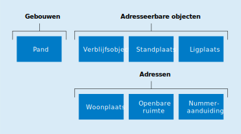

# 2.3 Objecten

De BAG is een objectenregistratie. Dit betekent dat in de registratie bepaalde objecten concreet worden afgebakend en van een unieke aanduiding voorzien. Het zijn deze objecten waaraan vervolgens de te registreren gegevens worden "opgehangen". Van deze objecten worden de geometrische en/of administratieve eigenschappen vastgelegd in de BAG.

De BAG-objecten zijn te verdelen in drie groepen: adressen, adresseerbare objecten en gebouwen (zie figuur 2.3.a). Een officieel adres is samengesteld uit de objecten Woonplaats, Openbare ruimte en Nummeraanduiding. Een officieel adres wordt toegekend aan een adresseerbaar object (Verblijfsobject, Standplaats of Ligplaats).

Met betrekking tot met gebouwen samenhangende objecten wordt onderscheid gemaakt tussen panden en verblijfsobjecten. Dit onderscheid is met name ingegeven vanuit de gedachte dat beide soorten objecten een eigen karakter en een eigen dynamiek kennen. Daar waar binnen de definiëring van een verblijfsobject het samenhangende gebruik van een eenheid centraal staat, gaat het bij de definiëring van het pand om het vaststellen van een samenhangende (bouw-) constructieve eenheid.

In de BAG worden feitelijke objecten in de werkelijkheid, zoals gerealiseerde panden en verblijfsobjecten, en virtuele objecten zoals stand- en ligplaatsen en vergunde panden en verblijfsobjecten geregistreerd.

