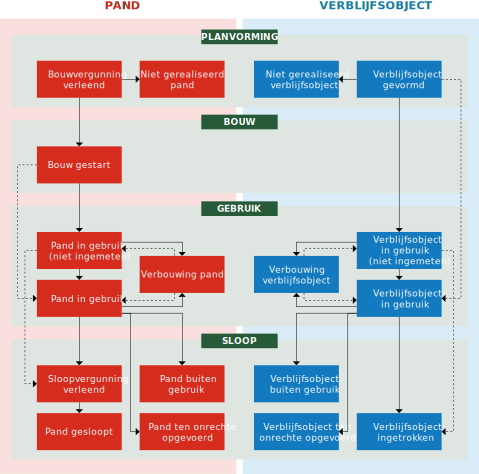

# 3.6 Levenscyclus

De levenscyclus van een BAG-object beschrijft de opeenvolgende fasen in de ontwikkeling van een object. Hierbij dient de werkelijkheid zoveel mogelijk in de registratie zichtbaar te zijn. In de verschillende fasen zijn er situaties die aanleiding geven tot het wijzigen van de gegevens van het object. De fase van ontwikkeling waarin een BAG-object zich bevindt, wordt met een eigenschap _status_ bij het object geregistreerd.

In de levenscyclus van een pand en verblijfsobject wordt in hoofdlijnen een onderscheid gemaakt tussen de vier fasen planvorming, bouw, gebruik en sloop. Binnen deze fasen kunnen verschillende statussen aan het object worden toegekend. De levenscyclus van een pand of een verblijfsobject volgt meestal een logische volgorde van statussen (zie figuur 3.6.a), maar fasen in de levenscyclus mogen ook worden overgeslagen.

In de levenscycli van standplaatsen, ligplaatsen, openbare ruimten, nummeraanduidingen en woonplaatsen wordt onderscheid gemaakt tussen het benoemen en het intrekken van deze objecten.

Binnen een fase van de levenscyclus kunnen attributen worden gewijzigd, zoals het _gebruiksdoel_ bij een verblijfsobject of de geometrie van een pand.

Verder gelden de volgende regels voor het toewijzen van een status aan een object:

1. Indien voor een pand met de status `Bouwvergunning verleend` of `Bouw gestart` een nieuwe omgevingsvergunning wordt verleend, worden wel de gegevens van het pand gewijzigd conform de omgevingsvergunning, maar de status van het pand blijft ongewijzigd.
1. Indien:
    - een pand de status `Pand in gebruik (niet ingemeten)` of `Pand in gebruik` heeft bereikt, kan de status van het pand niet meer terug naar `Bouwvergunning verleend` of `Bouw gestart`, tenzij sprake is van een ten onrechte toegekende status.
    - een verblijfsobject de status `Verblijfobject in gebruik (niet ingemeten)` of `Verblijfsobject in gebruik` heeft bereikt, kan de status van het verblijfsobject niet meer terug naar `Verblijfsobject gevormd`, tenzij sprake is van een ten onrechte toegekende status.
1. Elke statusovergang is toegestaan, mits deze een correctie betreft van een ten onrechte toegekende status.
1. Als een vergunning wordt verleend voor de verbouwing van een pand en/of verblijfsobjecten, krijgen het pand en/of verblijfsobjecten die als gevolg van deze verbouwing als zodanig zullen blijven bestaan, maar waarvan een of meer gegevens in de BAG zullen wijzigen, de status `Verbouwing pand` of `Verbouwing verblijfsobject`. Als de verbouwing is afgerond, krijgt het pand de status `Pand in gebruik (niet ingemeten)` of `Pand in gebruik`, en de verblijfsobjecten de status `Verblijfsobject in gebruik (niet ingemeten)` of `Verblijfsobject in gebruik`.
1. Als een vergunning wordt verleend voor het splitsen of samenvoegen van verblijfsobjecten, worden de nieuw te realiseren Verblijfsobjecten worden opgenomen met de status `Verblijfsobject gevormd`, terwijl de 'oude' Verblijfsobjecten hun status tijdens de verbouwing behouden (meestal `Verblijfsobject in gebruik`). Als de verbouwing is afgerond, worden de 'oude' Verblijfsobjecten ingetrokken, terwijl de nieuwe Verblijfsobjecten de status `Verblijfsobject in gebruik (niet ingemeten)` of `Verblijfsobject in gebruik` krijgen zodra zij gebruiksgereed zijn.
1. Als een vergunning wordt verleend voor het toevoegen van verblijfsobjecten aan bestaande panden of een verbouwing waarbij het aantal verblijfsobjecten verandert, worden nieuwe Verblijfsobjecten opgenomen met de status `Verblijfsobject gevormd`.
1. Bij een verbouwing op een pand krijgen de eventueel aanwezige Verblijfsobjecten de status `Verbouwing verblijfsobject`, ongeacht of de pandcontouren wijzigen. Als de pandcontouren wijzigen, krijgt het Pand de status `Verbouwing pand`.
1. Indien er meerdere verbouwingen aan een pand worden verricht, krijgt het pand na voltooiing van de laatste verbouwing de status `Pand in gebruik (niet ingemeten)` of `Pand in gebruik`.
1. Indien de geometrie van een pand of verblijfsobject is ingemeten voordat de bouw is afgerond en er geen nieuwe geometrie hoeft te worden ingemeten, krijgt het pand of verblijfsobject meteen de status `Pand in gebruik` of `Verblijfsobject in gebruik` zodra het gereed is voor gebruik na afronding van de bouw.
1. Indien een verblijfsobject de status `Verblijfsobject in gebruik (niet ingemeten)` heeft gekregen, krijgen ook de een of meer panden waarin het verblijfsobject is gelegen, de status `Pand in gebruik (niet ingemeten)`.
1. Indien in een vergund pand met meerdere verblijfsobjecten een of meerdere verblijfsobjecten de status `Verblijfsobject in gebruik (niet ingemeten)` of `Verblijfsobject in gebruik` krijgen, dan krijgt het pand meteen de status `Pand in gebruik (niet ingemeten)`, respectievelijk `Pand in gebruik`.
1. De status `Sloopvergunning verleend` is zowel van toepassing op situaties waarin specifiek voor het betreffende pand een sloopvergunning is verleend, als op situaties waarin op grond van andere regelgeving geen sloopvergunning nodig is (omdat deze andere regelgeving daarmee in wezen al vergunning heeft verleend).
1. Indien een object de status `niet gerealiseerd`, `ten onrechte opgevoerd`, `gesloopt` of `ingetrokken` heeft, is het feitelijk beëindigd en kan de status niet meer worden gewijzigd. Alleen objecten die ten onrechte een van deze statussen hebben gekregen, kunnen middels een schriftelijke verklaring herleven.
1. Bij elke mutatie wordt de actuele status toegekend. Muteren in het verleden is niet toegestaan.
