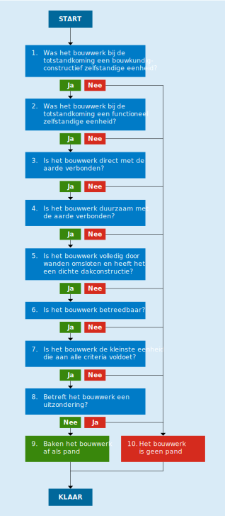

# 10.6 Afbakening van panden

## START

Voor deze beslisboom (zie figuur 10.6.a) deelt de bronhouder een bouwkundige constructie op in een of meer bouwwerken en toetst deze elk afzonderlijk aan de definitie van een pand.

BRONNEN [^10-60]

## 1. Was het bouwwerk bij de totstandkoming een bouwkundig-constructief zelfstandige eenheid?

Een bouwwerk is een bouwkundig-constructief zelfstandige eenheid als het slopen ervan redelijkerwijs geen aangrenzende bouwkundige constructies zal doen instorten. Elk bouwwerk dat onderdeel uitmaakt van een serie van naast elkaar gebouwde en overwegend gelijkvormige bouwwerken, wordt geacht een bouwkundig-constructief zelfstandige eenheid te zijn.

Een doorgang die een bouwwerk verbindt met een ander bouwwerk, waardoor dat andere bouwwerk binnendoor kan worden bereikt zonder in de openlucht te komen (al dan niet onder een overkapping), bijvoorbeeld een tussendeur of een gedeelde verkeersruimte of een loopbrug, blijft buiten beschouwing bij de beoordeling van de constructieve zelfstandigheid van de verbonden bouwwerken.

Een bouwkundig-constructief onzelfstandige verbinding tussen bouwkundig-constructief zelfstandige bouwwerken, bijvoorbeeld een loopbrug, wordt uitsluitend afgebakend als deze niet alleen is bedoeld of wordt gebruikt voor het verplaatsen van mensen of goederen op een hoogte boven de grond. Een dergelijke onzelfstandige verbinding wordt dan afgebakend als een deel van een van de verbonden bouwwerken.

Bouwwerken die deels over elkaar zijn gebouwd, maar wel onafhankelijk van elkaar bouwkundig-constructief zelfstandig zijn, worden onafhankelijk van elkaar afgebakend.

BRONNEN [^10-61] [^10-62] [^10-63]

## 2. Was het bouwwerk bij de totstandkoming een functioneel zelfstandige eenheid?

Een pand huisvest bij de totstandkoming nul, een of meer gehele verblijfsobjecten. Daarna mag een verblijfsobject wel in meerdere panden liggen, omdat de afbakening van bestaande panden niet wordt aangepast bij het samenvoegen van verblijfsobjecten.

Een bouwwerk is geen afzonderlijk pand als dit bouwwerk bij de totstandkoming exclusief ondersteunend is aan het bouwwerk waartegen het rechtstreeks is aangebouwd. Het maakt hierbij niet uit of:

- het ondersteunende bouwwerk bouwkundig-constructief zelfstandig is;
- het ondersteunende bouwwerk later werd gebouwd dan het bouwwerk waaraan het ondersteunend is;
- het ondersteunende bouwwerk alleen buitenom kan worden bereikt door in de openlucht te komen (al dan niet onder een overkapping);
- het ondersteunende bouwwerk exclusief ondersteunend is aan slechts een gedeelte van het bouwwerk waartegen het rechtstreeks is aangebouwd;
- de bouwwerken deels ook tegen andere bouwwerken zijn aangebouwd;
- er ook andere ondersteunende bouwwerken ondersteunend zijn aan hetzelfde bouwwerk.

Dergelijke aangebouwde bouwwerken die exclusief ondersteunend zijn aan hetzelfde bouwwerk, vormen voor de afbakening van panden een ondeelbare eenheid met het bouwwerk waaraan ze ondersteunend zijn.

BRONNEN [^10-64] [^10-65] [^10-66]

## 3. Is het bouwwerk direct met de aarde verbonden?

Een pand moet een directe constructieve verbinding met de aarde hebben. Het geheel of gedeeltelijk stapelen van panden kan uitsluitend als al deze panden onafhankelijk van elkaar bouwkundig-constructief zelfstandig zijn.

BRONNEN [^10-67] [^10-68]

## 4. Is het bouwwerk duurzaam met de aarde verbonden?

Een bouwwerk kan geen pand zijn als het naar aard en constructie als geheel verplaatsbaar is. Het is verplaatsbaar als het zonder scheiding van integrerende onderdelen die tezamen het bouwwerk vormen, kan worden aangevoerd, verplaatst of afgevoerd. Een subjectieve intentie tot duurzame aanwezigheid is niet doorslaggevend. Elementen die zijn toegevoegd aan een bouwwerk dat op zichzelf verplaatsbaar is (zoals een tochtportaal voor de ingang van een stacaravan) zijn geen integrerende onderdelen. Dergelijke toevoegingen zijn niet verweven met het geheel, omdat na het verwijderen ervan nog steeds een geheel overblijft dat op zichzelf kan functioneren.

Als duidelijk is dat een bouwwerk dat aan de definitie van een pand kan voldoen, slechts gedurende beperkte tijd zal bestaan, ligt opname in de registratie niet zonder meer in de rede.

BRONNEN [^10-69] [^10-70] [^10-70a]

## 5. Is het bouwwerk volledig door wanden omsloten en heeft het een dichte dakconstructie?

Een pand moet bij de totstandkoming over de volledige hoogte zijn omsloten door wanden en een dichte dakconstructie hebben. Beweegbare delen in de gevel, het dak of de laagstgelegen vloer, zoals deuren en ramen, te openen lichtkappen en kruipluiken worden op grond van NEN 2580:2007 niet als permanente openingen beschouwd. Hetzelfde geldt voor ventilatieopeningen en ‑kanalen in de gevel, in het dak of in de vloer, zelfs als deze niet afsluitbaar zijn. Hekken, roosterwerken en gaasafzettingen zijn op grond van NEN 2580:2007 wel permanente openingen. Beweegbare delen hoeven niet aanwezig zijn, mits ze wel eenvoudig kunnen worden geplaatst.

Een pand heeft geen andere beweegbare delen dan die voor het openen en sluiten van openingen in de gevel, het dak of de laagstgelegen vloer. Eventuele andere beweegbare delen aan het pand worden niet als permanente openingen beschouwd, mits het bouwwerk tezamen met deze beweegbare delen volledig door wanden is omsloten en een dichte dakconstructie heeft. Beweegbare delen die volledig zijn omsloten door niet-beweegbare, blijven buiten beschouwing.

Een schuur of stal met openingen in de gevel op circa een meter hoogte wordt als volledig door wanden omsloten beschouwd.

Een pand hoeft geen dichte vloerconstructie te hebben op het grensvlak met de bodem. Niet-afsluitbare openingen die permanent via de vloer in verbinding staan met buiten, zijn daarom toegestaan, bijvoorbeeld voor een trap of een andere voorziening voor verticaal verkeer of voor het open water in een botenhuis.

_Definities uit NEN 2580:2007 zijn overgenomen met toestemming van NEN te Delft, www.nen.nl._

BRONNEN [^10-71] [^10-72] [^10-73] [^10-74] [^10-75] [^10-76] [^10-77] [^10-78] [^10-79] [^10-80] [^10-81]

## 6. Is het bouwwerk betreedbaar?

Een pand moet bij de totstandkoming voor mensen toegankelijk zijn en voldoende stahoogte bieden aan een volwassen persoon.

Een pand dient bij de totstandkoming te beschikken over een of meer verticale toegangsdeuren waardoor mensen naar binnen kunnen. Een bouwwerk dat uitsluitend beschikt over andersoortige toegangen, zoals een horizontaal toegangsluik, wordt niet als pand afgebakend.

Een pand dat na een verbouwing geen eigen toegang meer heeft, blijft een apart pand.

BRONNEN [^10-82] [^10-83] [^10-84]

## 7. Is het bouwwerk de kleinste eenheid die aan alle criteria voldoet?

Een pand moet ondeelbaar zijn en mag bij de totstandkoming niet kunnen worden opgedeeld in kleinere eenheden die elk afzonderlijk aan de definitie van een pand voldoen.

BRONNEN [^10-85] [^10-86]

## 8. Betreft het bouwwerk een uitzondering?

Voor de afbakening van panden gelden drie uitzonderingen:

- Bunkers:
    Een historische bunker wordt pas afgebakend wanneer deze in gebruik wordt genomen.

- Hobbykassen:
    Een hobbykas (meestal voor privégebruik in tuinen van particulieren) wordt niet als pand afgebakend.

- Militaire objecten:
    Een militair object wordt niet afgebakend wanneer de Minister van Defensie aangeeft dat registratie niet wenselijk is. Normale kantoorruimten en (delen van) kazernes die aan de openbare weg liggen, worden in beginsel wel afgebakend.

BRONNEN [^10-87] [^10-88]

## 9. Baken het bouwwerk af als pand

Dit bouwwerk voldoet aan de BAG-definitie van een pand.

BRONNEN [^10-89] [^10-90]

## 10. Het bouwwerk is geen pand

Hoewel dit bouwwerk op zichzelf geen pand is, kan het wel geheel of gedeeltelijk onderdeel zijn van een pand of, opgeknipt in delen, onderdeel zijn van meerdere panden.

## KLAAR

[^10-60]: Memorie van toelichting bij de Wet basisregistraties adressen en gebouwen, kamerstuk, 2006/07, 30 968, nr. 3, 28 februari 2007: "De afbakening en benoeming van de objecten is overigens een administratief proces, dat volledig losstaat van de feitelijk bestaande eigendoms- en gebruiksverhoudingen ten aanzien van een object." [https://zoek.officielebekendmakingen.nl/kst-30968-3.html](https://zoek.officielebekendmakingen.nl/kst-30968-3.html)

[^10-61]: Wet basisregistraties adressen en gebouwen, artikel 1, onderdeel k: "pand: kleinste bij de totstandkoming functioneel en bouwkundig-constructief zelfstandige eenheid die direct en duurzaam met de aarde is verbonden en betreedbaar en afsluitbaar is". [http://wetten.overheid.nl/jci1.3:c:BWBR0023466](http://wetten.overheid.nl/jci1.3:c:BWBR0023466#Hoofdstuk1_Artikel1)

[^10-62]: Memorie van toelichting bij de Wet basisregistraties adressen en gebouwen, kamerstuk, 2006/07, 30 968, nr. 3, 28 februari 2007: "Volgens artikel 1, onderdeel o, van het wetsvoorstel wordt onder een pand verstaan de kleinste, bij de totstandkoming functioneel en bouwkundig-constructief zelfstandige eenheid die direct en duurzaam met de aarde is verbonden. Hiermee wordt – meer dan met bijvoorbeeld een voor andere dan registratiedoeleinden gehanteerde term gebouw – aangesloten bij datgene wat in de praktijk als pand wordt gezien. De pandbegrenzing wijzigt niet door samenvoeging of splitsing. Hiermee worden complicaties voorkomen die in het kader van de registratie kunnen ontstaan in geval van doorbraken in scheidingsmuren tussen gebouwen." [https://zoek.officielebekendmakingen.nl/kst-30968-3.html](https://zoek.officielebekendmakingen.nl/kst-30968-3.html)

[^10-63]: Memorie van toelichting bij de Wet basisregistraties adressen en gebouwen, kamerstuk, 2006/07, 30 968, nr. 3, 28 februari 2007: "Binnen de gebouwenregistratie wordt ten aanzien van met gebouwen samenhangende objecten een onderscheid gemaakt tussen panden en verblijfsobjecten. Dit onderscheid is met name ingegeven vanuit de gedachte dat beide soorten objecten een eigen karakter en een eigen dynamiek kennen. Daar waar binnen de definiëring van een verblijfsobject het samenhangende gebruik van een eenheid centraal staat, gaat het bij de definiëring van het pand om het vaststellen van een samenhangende (bouw)constructieve eenheid. Verblijfsobjecten zijn bij de bouw altijd gelegen binnen een enkel pand. Als gevolg van telkens wisselend gebruik en wijzigingen van gebruiksbehoeften zijn verblijfsobjecten in de loop der tijd regelmatig aan wijzigingen onderhevig. Dit geldt in veel mindere mate voor de bouwkundige constructie. Daar waar sprake is van een dergelijke wijziging gaat het in veel gevallen om beperkte wijzigingen waarbij door enkele kleinere aanpassingen de bestaande bouwconstructie enigszins wordt aangepast om verbindingen tussen verschillende verblijfsobjecten of tussen verschillende panden mogelijk te maken. Hierbij kan worden gedacht aan het aanbrengen van een deuropening in een bouwmuur of het vervangen van een gedeelte van een bouwmuur door een staalconstructie. Dit leidt in het algemeen niet tot wijziging van de begrenzing van het pand. Dit laatste is overigens meestal wel het geval als er bijvoorbeeld sprake is van een aanzienlijke aanbouw (dus niet bij een erker). Binnen de definitie van pand staat dan ook centraal het eerder genoemde element dat een pand bij de bouw een constructief zelfstandige eenheid betreft. De mate waarin sprake is van een samenhangende zelfstandige constructie zal derhalve in een vroegtijdig stadium moeten worden vastgesteld. In de definitie is eveneens opgenomen dat een pand bij de totstandkoming functioneel zelfstandig dient te zijn. Met dit laatste element wordt in praktische zin bedoeld dat het betreffende pand bij de bouw slechts uit gehele verblijfsobjecten dient te bestaan. Door het samenvoegen van in verschillende panden gelegen verblijfsobjecten is het mogelijk dat hiervan in een later stadium geen sprake meer is. Dit betekent dat doorbraken van panden niet worden doorvertaald in het aanpassen van de pandbegrenzingen in de gebouwenregistratie." [https://zoek.officielebekendmakingen.nl/kst-30968-3.html](https://zoek.officielebekendmakingen.nl/kst-30968-3.html)

[^10-64]: Wet basisregistraties adressen en gebouwen, artikel 1, onderdeel k: "pand: kleinste bij de totstandkoming functioneel en bouwkundig-constructief zelfstandige eenheid die direct en duurzaam met de aarde is verbonden en betreedbaar en afsluitbaar is". [http://wetten.overheid.nl/jci1.3:c:BWBR0023466](http://wetten.overheid.nl/jci1.3:c:BWBR0023466#Hoofdstuk1_Artikel1)

[^10-65]: Memorie van toelichting bij de Wet basisregistraties adressen en gebouwen, kamerstuk, 2006/07, 30 968, nr. 3, 28 februari 2007: "In de definitie is eveneens opgenomen dat een pand bij de totstandkoming functioneel zelfstandig dient te zijn. Met dit laatste element wordt in praktische zin bedoeld dat het betreffende pand bij de bouw slechts uit gehele verblijfsobjecten dient te bestaan. Door het samenvoegen van in verschillende panden gelegen verblijfsobjecten is het mogelijk dat hiervan in een later stadium geen sprake meer is. Dit betekent dat doorbraken van panden niet worden doorvertaald in het aanpassen van de pandbegrenzingen in de gebouwenregistratie." [https://zoek.officielebekendmakingen.nl/kst-30968-3.html](https://zoek.officielebekendmakingen.nl/kst-30968-3.html)

[^10-66]: Memorie van toelichting bij de wijziging van de Wet basisregistraties adressen en gebouwen en de Kadasterwet, kamerstukken II, 2008/09, 31 726, nr. 3, 7 oktober 2008: "Ten vierde wordt aan de definitie een clausule toegevoegd («en in functioneel opzicht zelfstandig is») die tot gevolg heeft dat een eenheid van gebruik die aan alle voorgaande elementen van het begrip verblijfsobject voldoet niettemin buiten de reikwijdte van dat begrip valt indien die eenheid in functioneel opzicht niet zelfstandig is. Het aanmerken van een dergelijke eenheid als verblijfsobject is in het kader van de gebouwenregistratie ongewenst. Het criterium van de functionele zelfstandigheid houdt in dat een eenheid van gebruik die onlosmakelijk is verbonden met en ondersteunend is aan een bepaalde nabijgelegen andere eenheid van gebruik, standplaats of ligplaats, niet als afzonderlijk verblijfsobject wordt aangemerkt. Dit geldt bijvoorbeeld voor een kelderbox bij een flatwoning, een vrijstaande garage bij een woning of een vrijstaande schuur bij een boerderij. Indien deze objecten echter niet (meer) ondersteunend worden gebruikt – bijvoorbeeld in de garage komt een bedrijf of de schuur wordt omgebouwd tot kampeerboerderij – vormen zij wel een afzonderlijk verblijfsobject." [https://zoek.officielebekendmakingen.nl/kst-31726-3.html](https://zoek.officielebekendmakingen.nl/kst-31726-3.html)

[^10-67]: Wet basisregistraties adressen en gebouwen, artikel 1, onderdeel k: "pand: kleinste bij de totstandkoming functioneel en bouwkundig-constructief zelfstandige eenheid die direct en duurzaam met de aarde is verbonden en betreedbaar en afsluitbaar is". [http://wetten.overheid.nl/jci1.3:c:BWBR0023466](http://wetten.overheid.nl/jci1.3:c:BWBR0023466#Hoofdstuk1_Artikel1)

[^10-68]: Memorie van toelichting bij de Wet basisregistraties adressen en gebouwen, kamerstuk, 2006/07, 30 968, nr. 3, 28 februari 2007: "Met het aspect «direct» wordt beoogd aan te geven dat in de gebouwenregistratie in principe geen sprake kan zijn van panden die geen directe constructieve verbinding met de aarde hebben. Hiermee wordt voorkomen dat de complexiteit van de afbakening van panden enorm zou toenemen, omdat ook met stapeling van panden rekening zou moeten worden gehouden." [https://zoek.officielebekendmakingen.nl/kst-30968-3.html](https://zoek.officielebekendmakingen.nl/kst-30968-3.html)

[^10-69]: Wet basisregistraties adressen en gebouwen, artikel 1, onderdeel k: "pand: kleinste bij de totstandkoming functioneel en bouwkundig-constructief zelfstandige eenheid die direct en duurzaam met de aarde is verbonden en betreedbaar en afsluitbaar is". [http://wetten.overheid.nl/jci1.3:c:BWBR0023466](http://wetten.overheid.nl/jci1.3:c:BWBR0023466#Hoofdstuk1_Artikel1)

[^10-70]: Memorie van toelichting bij de Wet basisregistraties adressen en gebouwen, kamerstuk, 2006/07, 30 968, nr. 3, 28 februari 2007: "Aan de definitie is tenslotte nog als element toegevoegd, dat het pand als zodanig direct en duurzaam met de aarde is verbonden. Met het aspect «duurzaam» wordt beoogd tijdelijke bouwwerken en niet vast met de aarde verbonden bouwwerken uit te sluiten." [https://zoek.officielebekendmakingen.nl/kst-30968-3.html](https://zoek.officielebekendmakingen.nl/kst-30968-3.html)

[^10-70a]: Brief van het ministerie van Infrastructuur en Milieu van 16 juni 2016 aan de colleges van burgemeester en wethouders van alle gemeenten over de omgang met stacaravans in relatie tot de pandafbakening in de Basisregistraties Adressen en Gebouwen. [https://www.geobasisregistraties.nl/documenten/brief/2016/06/17/brief-van-ienm-aan-alle-gemeenten-inzake-stacaravans-en-de-bag](https://www.geobasisregistraties.nl/documenten/brief/2016/06/17/brief-van-ienm-aan-alle-gemeenten-inzake-stacaravans-en-de-bag)

[^10-71]: Wet basisregistraties adressen en gebouwen, artikel 1, onderdeel k: "pand: kleinste bij de totstandkoming functioneel en bouwkundig-constructief zelfstandige eenheid die direct en duurzaam met de aarde is verbonden en betreedbaar en afsluitbaar is". [http://wetten.overheid.nl/jci1.3:c:BWBR0023466](http://wetten.overheid.nl/jci1.3:c:BWBR0023466#Hoofdstuk1_Artikel1)

[^10-72]: Wijziging van de Wet basisregistraties adressen en gebouwen en de Kadasterwet, vergaderjaar 2008-2009, 31 726, nr. 2, 7 oktober 2008, onderdeel A, onder 3: "In onderdeel o wordt na 'is verbonden' toegevoegd: en betreedbaar en afsluitbaar is." [https://zoek.officielebekendmakingen.nl/kst-31726-2.html](https://zoek.officielebekendmakingen.nl/kst-31726-2.html)

[^10-73]: Memorie van toelichting bij de wijziging van de Wet basisregistraties adressen en gebouwen en de Kadasterwet, kamerstukken II, 2008/09, 31 726, nr. 3, 7 oktober 2008: "De in onderdeel A, onder 3, voorgestelde wijziging van het begrip pand heeft tot gevolg dat om van een pand in de zin van de wet te kunnen spreken, tevens moet worden voldaan aan de eis dat de desbetreffende functioneel en bouwkundig-constructief zelfstandige eenheid betreedbaar en afsluitbaar is." [https://zoek.officielebekendmakingen.nl/kst-31726-3.html](https://zoek.officielebekendmakingen.nl/kst-31726-3.html)

[^10-74]: Memorie van toelichting bij de wijziging van de Wet basisregistraties adressen en gebouwen en de Kadasterwet, kamerstukken II, 2008/09, 31 726, nr. 3, 7 oktober 2008: "Met het element «afsluitbaar» wordt tot uitdrukking gebracht dat uitsluitend die eenheden die een volledig door wanden omsloten binnenruimte kennen als pand worden aangemerkt. Dit brengt mee dat objecten als carports, abri’s en open muziektenten niet als zodanig zijn te kwalificeren." [https://zoek.officielebekendmakingen.nl/kst-31726-3.html](https://zoek.officielebekendmakingen.nl/kst-31726-3.html)

[^10-75]: Memorie van toelichting bij de wijziging van de Wet basisregistraties adressen en gebouwen en de Kadasterwet, kamerstukken II, 2008/09, 31 726, nr. 3, 7 oktober 2008: "De eis van afsluitbaarheid houdt in dit verband in dat het gebruik van de desbetreffende eenheid exclusief moet zijn. Hiermee is de begrenzing van het verblijfsobject scherper omschreven." [https://zoek.officielebekendmakingen.nl/kst-31726-3.html](https://zoek.officielebekendmakingen.nl/kst-31726-3.html)

[^10-76]: NEN 2580:2007, artikel 2.1.2: Een binnenruimte is een "ruimte die aan alle zijden volledig wordt begrensd door bouwkundige scheidingsconstructies." Definitie overgenomen met toestemming van NEN te Delft. [https://www.nen.nl/NEN-Shop/Norm/NEN-25802007-nl.htm](https://www.nen.nl/NEN-Shop/Norm/NEN-25802007-nl.htm)

[^10-77]: NEN 2580:2007, toelichting bij artikel 2.1.2: "Een binnenruimte is in beginsel aan alle kanten omsloten door wanden over de volledige hoogte en voorzien van een dichte vloerconstructie aan zowel de onder- als bovenzijde." \[...\] "Beweegbare delen in de gevel, het dak of de laagstgelegen vloer, zoals deuren en ramen, te openen lichtkappen en kruipluiken worden niet als permanente openingen beschouwd. Hetzelfde geldt voor ventilatieopeningen en ‑kanalen in de gevel, in het dak of in de vloer, zelfs als deze niet afsluitbaar zijn." Definitie overgenomen met toestemming van NEN te Delft. [https://www.nen.nl/NEN-Shop/Norm/NEN-25802007-nl.htm](https://www.nen.nl/NEN-Shop/Norm/NEN-25802007-nl.htm)

[^10-78]: NEN 2580:2007, artikel 2.1.3: Een gebouwgebonden buitenruimte is een "ruimte die door het deels ontbreken van uitwendige bouwkundige scheidingsconstructies permanent in open verbinding staat met de bodem en/of de buitenlucht. OPMERKING: Gebouwgebonden buitenruimten worden onderscheiden in: overdekte gebouwgebonden buitenruimten en niet-overdekte gebouwgebonden buitenruimten." Definitie overgenomen met toestemming van NEN te Delft. [https://www.nen.nl/NEN-Shop/Norm/NEN-25802007-nl.htm](https://www.nen.nl/NEN-Shop/Norm/NEN-25802007-nl.htm)

[^10-79]: NEN 2580:2007, toelichting bij artikel 2.1.3: "Ruimten, die plaatselijk van de buitenlucht zijn gescheiden door een hek, roosterwerk of gaasafzetting, zoals half verdiepte parkeergarages en opslagruimten voor gasflessen, worden daarentegen (zie 2.1.2) wel als gebouwgebonden buitenruimten opgevat. Een toegankelijke kruipruimte met een hoogte van 1,5 m of meer en zonder verharde vloer (bijvoorbeeld zandgrond) kan niet als binnenruimte worden aangemerkt, omdat een bouwkundige scheidingsconstructie op het grensvlak met de bodem ontbreekt. Een dergelijke kruipruimte wordt als gebouwgebonden buitenruimte beschouwd. Onder de term 'bodem' wordt ook open water verstaan. Een botenhuis moet om die reden eveneens als gebouwgebonden buitenruimte worden gekwalificeerd.” Definitie overgenomen met toestemming van NEN te Delft. [https://www.nen.nl/NEN-Shop/Norm/NEN-25802007-nl.htm](https://www.nen.nl/NEN-Shop/Norm/NEN-25802007-nl.htm)

[^10-80]: NEN 2580:2007, artikel 2.2.9: "ruimte of voorziening voor verticaal verkeer: ruimte of voorziening voor de verkeersafwikkeling tussen de bouwlagen van een gebouw". Definitie overgenomen met toestemming van NEN te Delft. [https://www.nen.nl/NEN-Shop/Norm/NEN-25802007-nl.htm](https://www.nen.nl/NEN-Shop/Norm/NEN-25802007-nl.htm)

[^10-81]: NEN 2580:2007, toelichting bij artikel 2.2.9: "Voorbeelden van ruimten voor verticaal verkeer zijn trappenhuizen inclusief rooksluizen en liftschachten. Voorbeelden van voorzieningen voor verticaal verkeer zijn (rol)trappen, hefplateaus en hellingbanen, die deel uitmaken van ruimten met andere functies. Als voorwaarde voor verticaal verkeer geldt dat er sprake moet zijn van circulatie tussen de onderscheiden bouwlagen van een gebouw. Buiten beschouwing blijven de voorzieningen, zoals (rol)trappen, hefplateaus en hellingbanen, die een niveauverschil van minder dan 1,5 m overbruggen. Dergelijke hoogteverschillen blijven immers binnen één bouwlaag." Definitie overgenomen met toestemming van NEN te Delft. [https://www.nen.nl/NEN-Shop/Norm/NEN-25802007-nl.htm](https://www.nen.nl/NEN-Shop/Norm/NEN-25802007-nl.htm)

[^10-82]: Wet basisregistraties adressen en gebouwen, artikel 1, onderdeel k: "pand: kleinste bij de totstandkoming functioneel en bouwkundig-constructief zelfstandige eenheid die direct en duurzaam met de aarde is verbonden en betreedbaar en afsluitbaar is". [http://wetten.overheid.nl/jci1.3:c:BWBR0023466](http://wetten.overheid.nl/jci1.3:c:BWBR0023466#Hoofdstuk1_Artikel1)

[^10-83]: Wijziging van de Wet basisregistraties adressen en gebouwen en de Kadasterwet, vergaderjaar 2008-2009, 31 726, nr. 2, 7 oktober 2008, onderdeel A, onder 3: "In onderdeel o wordt na 'is verbonden' toegevoegd: en betreedbaar en afsluitbaar is." [https://zoek.officielebekendmakingen.nl/kst-31726-2.html](https://zoek.officielebekendmakingen.nl/kst-31726-2.html)

[^10-84]: Memorie van toelichting bij de wijziging van de Wet basisregistraties adressen en gebouwen en de Kadasterwet, kamerstukken II, 2008/09, 31 726, nr. 3, 7 oktober 2008: "De in onderdeel A, onder 3, voorgestelde wijziging van het begrip pand heeft tot gevolg dat om van een pand in de zin van de wet te kunnen spreken, tevens moet worden voldaan aan eis dat de desbetreffende functioneel en bouwkundig-constructief zelfstandige eenheid betreedbaar en afsluitbaar is. Het element «betreedbaar» brengt tot uitdrukking dat het moet gaan om objecten die voor mensen toegankelijk zijn. Hiermee wordt beoogd uitsluitend die objecten in de registratie op te nemen die aan bepaalde minimale afmetingen voldoen. Op deze wijze wordt met name een aantal objecten die zijn bedoeld voor het onderbrengen van technische voorzieningen (zoals niet betreedbare transformatorhuisjes van een zeer beperkte omvang) van registratie uitgesloten." [https://zoek.officielebekendmakingen.nl/kst-31726-3.html](https://zoek.officielebekendmakingen.nl/kst-31726-3.html)

[^10-85]: Wet basisregistraties adressen en gebouwen, artikel 1, onderdeel k: "pand: kleinste bij de totstandkoming functioneel en bouwkundig-constructief zelfstandige eenheid die direct en duurzaam met de aarde is verbonden en betreedbaar en afsluitbaar is". [http://wetten.overheid.nl/jci1.3:c:BWBR0023466](http://wetten.overheid.nl/jci1.3:c:BWBR0023466#Hoofdstuk1_Artikel1)

[^10-86]: Memorie van toelichting bij de Wet basisregistraties adressen en gebouwen, kamerstuk, 2006/07, 30 968, nr. 3, 28 februari 2007: "Gekozen is voor de benaming pand. Hiervoor kunnen een aantal redenen worden aangegeven. In de eerste plaats is het begrip gebouw op veel plaatsen in gebruik voor een object dat is gedefinieerd als volledig vrijstaand. Vanuit de bestaande behoeften ten aanzien van gebouwinformatie levert dit weinig bruikbare objecten op. In het geval van bijvoorbeeld gebouwen met portiekwoningen bestaat er vooral behoefte aan het onderkennen van de verschillende trappenhuizen met daaraan gelegen woningen en minder aan het gebouw als geheel. Door de keuze van het begrip pand, wordt de mogelijkheid opengehouden om het gehele gebouw toch als een gebouw aan te merken. In de tweede plaats sluit de beoogde invulling van het begrip pand in grote lijnen aan op de eerder door de VNG opgestelde Gemeentelijk Functioneel Ontwerpen, met dien verstande dat in tegenstelling tot de aldaar gedefinieerde panden de afbakening van het pand op grond van dit wetsvoorstel na de bouw in principe niet meer wijzigt. Bovendien is het voor het vaststellen van de kleinste bouwconstructieve eenheid niet noodzakelijk in de objectdefinitie uit te gaan van de wel in de definitie van de Gemeentelijk Functioneel Ontwerpen opgenomen doorlopende bouwmuren. Binnen moderne constructietechnieken is bovendien lang niet altijd meer sprake van de feitelijke aanwezigheid van bouwmuren. Een derde reden om het begrip pand te gebruiken is dat de toepassing van de definitie ziet op objecten die in het dagelijks taalgebruik ook als pand worden aangemerkt. Het meest evident is dit het geval bij grachtenpanden." [https://zoek.officielebekendmakingen.nl/kst-30968-3.html](https://zoek.officielebekendmakingen.nl/kst-30968-3.html)

[^10-87]: Wet basisregistraties adressen en gebouwen, artikel 5: "In de basisregistratie gebouwen worden geen gegevens opgenomen met betrekking tot panden, verblijfsobjecten, standplaatsen of ligplaatsen die in gebruik zijn bij de krijgsmacht of bij een krijgsmacht van een bondgenootschappelijke mogendheid, voor zover tegen het opnemen van die gegevens naar het oordeel van Onze Minister van Defensie bezwaar bestaat." [http://wetten.overheid.nl/jci1.3:c:BWBR0023466](http://wetten.overheid.nl/jci1.3:c:BWBR0023466#Hoofdstuk1_Artikel5)

[^10-88]: Memorie van toelichting bij de Wet basisregistraties adressen en gebouwen, kamerstuk, 2006/07, 30 968, nr. 3, 28 februari 2007: "Met deze bepaling wordt voorkomen dat ten aanzien van militaire objecten gegevens in de registratie worden opgenomen terwijl dit niet wenselijk is. Normale kantoorruimten en (delen van) kazernes die aan de openbare weg liggen, vallen in beginsel niet onder deze uitzondering. Het gaat uitsluitend om die objecten die wel in aanmerking zouden komen voor registratie, maar waarvan de Minister van Defensie aangeeft dat registratie niet wenselijk is." [https://zoek.officielebekendmakingen.nl/kst-30968-3.html](https://zoek.officielebekendmakingen.nl/kst-30968-3.html)

[^10-89]: Memorie van toelichting bij de Wet basisregistraties adressen en gebouwen, kamerstuk, 2006/07, 30 968, nr. 3, 28 februari 2007: "De pandbegrenzing wijzigt niet door samenvoeging of splitsing. Hiermee worden complicaties voorkomen die in het kader van de registratie kunnen ontstaan in geval van doorbraken in scheidingsmuren tussen gebouwen." [https://zoek.officielebekendmakingen.nl/kst-30968-3.html](https://zoek.officielebekendmakingen.nl/kst-30968-3.html)

[^10-90]: Memorie van toelichting bij de Wet basisregistraties adressen en gebouwen, kamerstuk, 2006/07, 30 968, nr. 3, 28 februari 2007: "Als gevolg van telkens wisselend gebruik en wijzigingen van gebruiksbehoeften zijn verblijfsobjecten in de loop der tijd regelmatig aan wijzigingen onderhevig. Dit geldt in veel mindere mate voor de bouwkundige constructie. Daar waar sprake is van een dergelijke wijziging gaat het in veel gevallen om beperkte wijzigingen waarbij door enkele kleinere aanpassingen de bestaande bouwconstructie enigszins wordt aangepast om verbindingen tussen verschillende verblijfsobjecten of tussen verschillende panden mogelijk te maken. Hierbij kan worden gedacht aan het aanbrengen van een deuropening in een bouwmuur of het vervangen van een gedeelte van een bouwmuur door een staalconstructie. Dit leidt in het algemeen niet tot wijziging van de begrenzing van het pand. Dit laatste is overigens meestal wel het geval als er bijvoorbeeld sprake is van een aanzienlijke aanbouw (dus niet bij een erker). Binnen de definitie van pand staat dan ook centraal het eerder genoemde element dat een pand bij de bouw een constructief zelfstandige eenheid betreft. De mate waarin sprake is van een samenhangende zelfstandige constructie zal derhalve in een vroegtijdig stadium moeten worden vastgesteld. In de definitie is eveneens opgenomen dat een pand bij de totstandkoming functioneel zelfstandig dient te zijn. Met dit laatste element wordt in praktische zin bedoeld dat het betreffende pand bij de bouw slechts uit gehele verblijfsobjecten dient te bestaan. Door het samenvoegen van in verschillende panden gelegen verblijfsobjecten is het mogelijk dat hiervan in een later stadium geen sprake meer is. Dit betekent dat doorbraken van panden niet worden doorvertaald in het aanpassen van de pandbegrenzingen in de gebouwenregistratie." [https://zoek.officielebekendmakingen.nl/kst-30968-3.html](https://zoek.officielebekendmakingen.nl/kst-30968-3.html)
