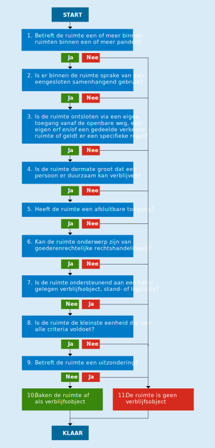

# 10.8 Afbakening van verblijfsobjecten

## START

Voor deze beslisboom (zie figuur 10.8.a) deelt de bronhouder een pand of een reeks van panden op in ruimten (niet te verwarren met bijvoorbeeld binnenruimten in de zin van NEN 2580:2007 of verblijfsruimten in de zin van het Bouwbesluit 2012) en toetst elk van deze ruimten afzonderlijk aan de definitie van een verblijfsobject.

Bij het opdelen van panden in ruimten zoekt de bronhouder naar de kleinste eenheid van gebruik. Hierbij redeneert de bronhouder van binnen naar buiten. De binnenste eigen toegang bepaalt waar een verblijfsobject begint, mits de ruimte achter deze toegang voldoet aan de definitie van een verblijfsobject.

Vanuit informatiekundig oogpunt zou het afbakenen van verblijfs- en andere objecten moeten plaatsvinden zonder eerst naar het gebruiksdoel of andere attribuutwaarden te kijken. Voor de praktijk van de BAG is het echter nodig dat bijvoorbeeld een garage bij een woning geen verblijfsobject wordt als er een bed in wordt gezet, terwijl wel een verblijfsobject kan ontstaan indien er een bureau in wordt geplaatst voor de uitoefening van een beroep of bedrijf (mits de garage in beide situaties in alle andere opzichten zelfstandig kan voldoen aan de definitie van een verblijfsobject).

BRONNEN [^10-100] [^10-101] [^10-102] [^10-103] [^10-104]

## 1. Betreft de ruimte een of meer binnenruimten binnen een of meer panden?

Een verblijfsobject is een eenheid van gebruik die bestaat uit een of meer binnenruimten binnen een of meer panden. Deze binnenruimten moeten voldoen aan de definitie van een binnenruimte volgens NEN 2580:2007.

Een verblijfsobject moet over de volledige hoogte zijn omsloten door wanden en een dichte plafond- of dakconstructie en een dichte vloerconstructie hebben. Beweegbare delen in de gevel, het dak of de laagstgelegen vloer, zoals deuren en ramen, te openen lichtkappen en kruipluiken worden op grond van NEN 2580:2007 niet als permanente openingen beschouwd. Hetzelfde geldt voor ventilatieopeningen en ‑kanalen in de gevel, in het dak of in de vloer, zelfs als deze niet afsluitbaar zijn. Hekken, roosterwerken en gaasafzettingen zijn op grond van NEN 2580:2007 wel permanente openingen.

Verblijfsobjecten zijn bij de totstandkoming van een pand volledig gelegen binnen dat pand. Na een verbouwing kan een verblijfsobject zich uitstrekken over meerdere aaneengesloten panden.

_Definities uit NEN 2580:2007 zijn overgenomen met toestemming van NEN te Delft, www.nen.nl._

BRONNEN [^10-105] [^10-106] [^10-107] [^10-108] [^10-109] [^10-110] [^10-111] [^10-112]

## 2. Is er binnen de ruimte sprake van aaneengesloten samenhangend gebruik?

Bij een verblijfsobject staat het samenhangende gebruik van een ruimte centraal. Er dient in ruimtelijke zin sprake te zijn van een eenheid van gebruik.

Er kan alleen sprake zijn van een eenheid van gebruik als die eenheid exclusief beschikt over alle basisvoorzieningen die zijn vereist voor alle gebruiksdoelen van het verblijfsobject.

Per gebruiksdoel zijn de minimaal vereiste basisvoorzieningen:

- bijeenkomstfunctie: water, toilet;
- celfunctie: water, toilet;
- gezondheidszorgfunctie: water, toilet;
- industriefunctie: geen basisvoorzieningen vereist;
- kantoorfunctie: water, toilet;
- logiesfunctie: keuken, douche, toilet;
- onderwijsfunctie: water, toilet;
- overige gebruiksfunctie: geen basisvoorzieningen vereist;
- sportfunctie: water, toilet;
- winkelfunctie: water, toilet;
- woonfunctie: keuken, douche, toilet.

De basisvoorzieningen houden in dat een verblijfsobject tezamen met zowel alle nabijgelegen ondersteunende ruimten die exclusief ondersteunend zijn aan het verblijfsobject als met alle nabijgelegen openbaar toegankelijke binnenruimten, minimaal moet beschikken over:

- water: een aansluiting voor drinkwater en een afvoer voor huishoudelijk afvalwater;
- keuken: de basisvoorziening water en een aansluiting voor energie en een opstelplaats voor een aanrecht en een opstelplaats voor een kooktoestel;
- douche: de basisvoorziening water en een aansluiting voor energie en een opstelplaats voor een douche of een bad;
- toilet: de basisvoorziening water en een opstelplaats voor een toilet.

De binnenruimten van een verblijfsobject moeten onderling binnendoor bereikbaar zijn zonder het verblijfsobject te verlaten. Binnenruimten aan weerszijden van bouwkundige scheidingsconstructies tussen bouwwerken die tezamen een ondeelbare eenheid vormen in de afbakening van panden (zie [stap 2 van paragraaf 10.6](#2-was-het-bouwwerk-bij-de-totstandkoming-een-functioneel-zelfstandige-eenheid)) en die elk alleen daarom niet zelfstandig voldoen aan de definitie van een pand, worden hierbij geacht onderling binnendoor bereikbaar te zijn als het ontbreken van openingen in dergelijke scheidingsconstructies de enige belemmering vormt om een groter verblijfsobject af te bakenen. Zo maakt een garagebox die rechtstreeks tegen een woning is aangebouwd en exclusief ondersteunend is aan de woning, samen met de woning deel uit van hetzelfde verblijfsobject, ongeacht of de garagebox vanuit de woning alleen te bereiken is door in de openlucht te komen.

BRONNEN [^10-113] [^10-114]

## 3. Is de ruimte ontsloten via een eigen toegang vanaf de openbare weg, een eigen erf en/of een gedeelde verkeersruimte of geldt er een specifieke regel?

Een verblijfsobject moet beschikken over een of meer eigen afsluitbare toegangen vanaf de openbare weg, een eigen erf en/of een gedeelde verkeersruimte, tenzij een specifieke regel in deze catalogus toestaat dat een verblijfsobject is ontsloten via een ander verblijfsobject. Ongeacht hoe de ruimte is ontsloten, maken gedeelde verkeersruimten nooit deel uit van het verblijfsobject.

### Specifieke regel voor ziekenhuizen

_Een ziekenhuis als geheel zal in het algemeen worden aangemerkt als één verblijfsobject. De gebruikelijke situatie zal zijn dat een groot ziekenhuis wordt beschouwd als één pand met één verblijfsobject. Eventuele inpandige zelfstandige ruimten (zoals bijvoorbeeld een zelfstandig afsluitbaar restaurant of een zelfstandig functionerende en afsluitbare praktijk voor fysiotherapie) worden als verblijfsobject onderscheiden mits ze beschikken over een eigen toegang (vanaf de openbare weg, een erf of een gedeelde verkeersruimte). Dat geldt ook als de toegang tot deze ruimte loopt via een hal of gang van het ziekenhuis. Bekeken vanuit de zelfstandige praktijkruimte of het restaurant in het ziekenhuis functioneren de hal en de gangen van het ziekenhuis als ontsluiting. Ruimtes voor specialistische artsen en poliklinieken worden beschouwd als integraal onderdeel van het ziekenhuis en worden niet als verblijfsobject afgebakend._

### Specifieke regel voor twee-over-een-trapwoningen

_Een type woning dat in oude kernen soms voorkomt, zijn de twee-over-een-trapwoningen. In een twee-over-een-trapwoning moet men via het trappenhuis (de hal van) de woning van iemand anders doorkruisen om de eigen woning te bereiken. Er is geen sprake van een eigen afsluitbare toegang vanaf de openbare weg of een gedeelde verkeersruimte. Volgens de definitie van een verblijfsobject zouden deze eenheden geen verblijfsobjecten zijn. In deze gevallen is dat ongewenst en wordt een uitzondering op de definitie gemaakt: de eenheden bij een twee-over-een-trapwoning worden wel als afzonderlijke verblijfsobjecten afgebakend._

### Specifieke regel voor zorgcomplexen

_Het kan zijn dat een gedeelte van het complex per kamer zal worden afgebakend, terwijl een ander deel één verblijfsobject vormt, dat dan bestaat uit bijvoorbeeld een bijeenkomstruimte, verpleegkamers, keuken en dergelijke. Daarbij kan zich de situatie voordoen dat de hal en gang van het grote verblijfsobject ook dienen ter ontsluiting van de los afgebakende kamers._

### Specifieke regel voor studentencomplexen

_Een deel van een verblijfsobject kan tegelijkertijd dienen als ontsluiting voor andere verblijfsobjecten._

### Specifieke regel voor recepties bij de toegang van een gebouw

_Als een ruimte met een receptie voldoet aan de definitie van een verblijfsobject, dan wordt deze ruimte afgebakend als verblijfsobject. Als het afbakenen van de ruimte met de receptie tot gevolg zou hebben dat andere ruimten hun eigen toegang tot de openbare weg, een eigen erf en/of een gedeelde verkeersruimte kwijtraken en alleen daardoor niet meer zelfstandig aan de definitie van een verblijfsobject voldoen, dan dient het verblijfsobject met de receptie als ontsluiting voor de daarachter gelegen verblijfsobjecten._

BRONNEN [^10-115] [^10-116] [^10-117] [^10-118] [^10-119] [^10-120] [^10-121] [^10-122]

## 4. Is de ruimte dermate groot dat een persoon er duurzaam kan verblijven?

Een verblijfsobject is voor mensen toegankelijk en heeft voldoende stahoogte voor een volwassen persoon.

Een verblijfsobject moet beschikken over een of meer verticale toegangsdeuren. Een ruimte die uitsluitend beschikt over andersoortige toegangen, zoals een horizontaal toegangsluik, wordt niet als verblijfsobject afgebakend.

## 5. Heeft de ruimte een afsluitbare toegang?

Een verblijfsobject moet exclusief te gebruiken zijn. Alle toegangen van een verblijfsobject moeten daarom afsluitbaar zijn. Sloten en beweegbare delen in de gevel, het dak of de laagstgelegen vloer, zoals deuren en ramen, te openen lichtkappen en kruipluiken hoeven niet aanwezig zijn, mits deze wel eenvoudig kunnen worden geplaatst.

BRONNEN [^10-123] [^10-124] [^10-125] [^10-126] [^10-127]

## 6. Kan de ruimte onderwerp zijn van goederenrechtelijke rechtshandelingen?

Een ruimte die niet onderwerp kan zijn van goederenrechtelijke rechtshandelingen, zoals koop en verkoop, bijvoorbeeld een hotelkamer, een slaapruimte in een verzorgingshuis of een cel in een gevangenis, kan geen verblijfsobject zijn.

BRONNEN [^10-128] [^10-129] [^10-130]

## 7. Is de ruimte ondersteunend aan een nabijgelegen verblijfsobject, standplaats of ligplaats?

Een ondersteunende ruimte die exclusief ondersteunend is aan een nabijgelegen verblijfsobject, standplaats of ligplaats, wordt niet als verblijfsobject afgebakend, bijvoorbeeld een kelderbox bij een flatwoning.

Andere ondersteunende ruimten worden afgebakend als verblijfsobject als ze aan de definitie van een verblijfsobject voldoen, bijvoorbeeld garageboxen onder of bij een flatgebouw of afgelegen stallen.

Een ruimte die niet langer ondersteunend is, wordt afgebakend als verblijfsobject als deze ruimte voldoet aan de definitie van een verblijfsobject, ongeacht of de ruimte zich bevindt in een aangebouwd bouwwerk of niet, bijvoorbeeld als een vrijstaande schuur bij een boerderij wordt omgebouwd tot kampeerboerderij.

BRONNEN [^10-131] [^10-132] [^10-133] [^10-134]

## 8. Is de ruimte de kleinste eenheid die aan alle criteria voldoet?

Een verblijfsobject moet ondeelbaar zijn en mag bij de afbakening niet kunnen worden opgedeeld in kleinere eenheden die elk afzonderlijk aan de definitie van een verblijfsobject voldoen.

BRONNEN [^10-136] [^10-137] [^10-138]

## 9. Betreft de ruimte een uitzondering?

Voor de afbakening van verblijfsobjecten geldt een uitzondering:

- Meerdere afgelegen ruimten bij elkaar:
    Als er meerdere ondersteunende ruimten, zoals stallen, schuren, kassen, garageboxen of schaapskooien, bij elkaar liggen en deze ondersteunend zijn aan een verblijfsobject waarmee een directe ruimtelijke relatie ontbreekt en deze ruimten functioneel bij elkaar horen en meerdere van deze ruimten afzonderlijk kunnen voldoen aan de definitie van een verblijfsobject, dan wordt alleen de ruimte waarvan de vindbaarheid het belangrijkste is, afgebakend als verblijfsobject. Als de ruimten (deels) niet functioneel bij elkaar horen, dan geldt deze uitzondering per cluster van ruimten die functioneel bij elkaar horen. Er worden in totaal evenveel verblijfsobjecten afgebakend als dat er clusters worden onderscheiden.

BRONNEN [^10-139]

## 10. Baken de ruimte af als verblijfsobject

Deze ruimte voldoet aan de BAG-definitie van een verblijfsobject.

## 11. De ruimte is geen verblijfsobject

Hoewel deze ruimte op zichzelf geen verblijfsobject is, kan het wel geheel of gedeeltelijk onderdeel zijn van een verblijfsobject of, opgeknipt in delen, onderdeel zijn van meerdere verblijfsobjecten.

## KLAAR

[^10-100]: Memorie van toelichting bij de Wet basisregistraties adressen en gebouwen, kamerstuk, 2006/07, 30 968, nr. 3, 28 februari 2007: "De afbakening en benoeming van de objecten is overigens een administratief proces, dat volledig losstaat van de feitelijk bestaande eigendoms- en gebruiksverhoudingen ten aanzien van een object." [https://zoek.officielebekendmakingen.nl/kst-30968-3.html](https://zoek.officielebekendmakingen.nl/kst-30968-3.html)

[^10-101]: Memorie van toelichting bij de Wet basisregistraties adressen en gebouwen, kamerstuk, 2006/07, 30 968, nr. 3, 28 februari 2007: "De kern van de voorgestelde definitie van verblijfsobject wordt gevormd door het begrip eenheid van gebruik. Daarmee wordt benadrukt dat de afbakening van een verblijfsobject met name afhankelijk is van de functie die een ruimte vervult. Door opneming van de zinsnede «voor woon-, bedrijfsmatige of recreatieve doeleinden geschikt» wordt beoogd aan te geven dat het gaat om ruimten die voor specifieke doeleinden bestemd zijn. Hierbij dienen woon- en bedrijfsmatige doeleinden overigens ruim te worden opgevat. Voor woningen en winkels zal een dergelijk onderscheid in het algemeen duidelijk zijn. Maar ook een losstaande garagebox kan worden opgevat als een voor woon- of bedrijfsmatige doeleinden geschikte eenheid van gebruik en beheer. Indien de garagebox wordt gebruikt als stalling van een auto van een bewoner van een nabijgelegen flat zal de nadruk daarbij meer liggen op (ondersteunende) woondoeleinden, dan dat dit het geval is bij het gebruik van een dergelijke garagebox als opslagruimte voor een aannemersbedrijf (bedrijfsmatige doeleinden)." [https://zoek.officielebekendmakingen.nl/kst-30968-3.html](https://zoek.officielebekendmakingen.nl/kst-30968-3.html)

[^10-102]: NEN 2580:2007, artikel 2.1.2: Een binnenruimte is een "ruimte die aan alle zijden volledig wordt begrensd door bouwkundige scheidingsconstructies." Definitie overgenomen met toestemming van NEN te Delft. [https://www.nen.nl/NEN-Shop/Norm/NEN-25802007-nl.htm](https://www.nen.nl/NEN-Shop/Norm/NEN-25802007-nl.htm)

[^10-103]: Kadaster & ministerie van Infrastructuur en Milieu (2014) Stappenplan en voorbeeldafbakening studentencomplexen, versie 1.0: "Uit informatiekundig oogpunt kan het merkwaardig lijken dat de waarde van een attribuut van een object (zoals gebruiksdoel) bepalend kan zijn voor het al dan niet bestaan van het object. Niettemin leidt het begrip ‘eenheid van gebruik’ met het criterium van functionele zelfstandigheid er bijvoorbeeld toe dat een garage bij een woning geen verblijfsobject wordt als er een bed in wordt gezet, terwijl wel een verblijfsobject kan ontstaan indien er een bureau in wordt geplaatst voor de uitoefening van een beroep of bedrijf." [http://www.kadaster.nl/web/artikel/download/BAG-stappenplan-afbakenen-studentencomplexen.htm](http://www.kadaster.nl/web/artikel/download/BAG-stappenplan-afbakenen-studentencomplexen.htm)

[^10-104]: ISO/IEC 19505-1:2012(E), artikel 11.4.2: "A class describes a set of objects that share the same specifications of attributes, operations, constraints, and semantics." [http://www.omg.org/spec/UML/ISO/19505-1/PDF](http://www.omg.org/spec/UML/ISO/19505-1/PDF)

[^10-105]: Wet basisregistraties adressen en gebouwen, artikel 1, onderdeel m: "verblijfsobject: kleinste binnen één of meer panden gelegen en voor woon-, bedrijfsmatige, of recreatieve doeleinden geschikte eenheid van gebruik die ontsloten wordt via een eigen afsluitbare toegang vanaf de openbare weg, een erf of een gedeelde verkeersruimte, onderwerp kan zijn van goederenrechtelijke rechtshandelingen en in functioneel opzicht zelfstandig is". [http://wetten.overheid.nl/jci1.3:c:BWBR0023466](http://wetten.overheid.nl/jci1.3:c:BWBR0023466#Hoofdstuk1_Artikel1)

[^10-106]: Wijziging van de Wet basisregistraties adressen en gebouwen en de Kadasterwet, vergaderjaar 2008-2009, 31 726, nr. 2, 7 oktober 2008, onderdeel A, onder 4: "verblijfsobject: kleinste binnen één of meer panden gelegen en voor woon-, bedrijfsmatige, of recreatieve doeleinden geschikte eenheid van gebruik die ontsloten wordt via een eigen afsluitbare toegang vanaf de openbare weg, een erf of een gedeelde verkeersruimte, onderwerp kan zijn van goederenrechtelijke rechtshandelingen en in functioneel opzicht zelfstandig is." [https://zoek.officielebekendmakingen.nl/kst-31726-2.html](https://zoek.officielebekendmakingen.nl/kst-31726-2.html)

[^10-107]: Memorie van toelichting bij de Wet basisregistraties adressen en gebouwen, kamerstuk, 2006/07, 30 968, nr. 3, 28 februari 2007, deel II, artikel 1, onderdeel o: "Verblijfsobjecten zijn bij de bouw altijd gelegen binnen een enkel pand. Als gevolg van telkens wisselend gebruik en wijzigingen van gebruiksbehoeften zijn verblijfsobjecten in de loop der tijd regelmatig aan wijzigingen onderhevig. \[...\] In de definitie is eveneens opgenomen dat een pand bij de totstandkoming functioneel zelfstandig dient te zijn. Met dit laatste element wordt in praktische zin bedoeld dat het betreffende pand bij de bouw slechts uit gehele verblijfsobjecten dient te bestaan. Door het samenvoegen van in verschillende panden gelegen verblijfsobjecten is het mogelijk dat hiervan in een later stadium geen sprake meer is." [https://zoek.officielebekendmakingen.nl/kst-30968-3.html](https://zoek.officielebekendmakingen.nl/kst-30968-3.html)

[^10-108]: Memorie van toelichting bij de Wet basisregistraties adressen en gebouwen, kamerstuk, 2006/07, 30 968, nr. 3, 28 februari 2007, deel II, artikel 1, onderdeel q: "Het begrip «eenheid van gebruik» is op zichzelf nog onvoldoende onderscheidend om tot een eenduidige objectafbakening te komen. Hiertoe dient er nog een aantal nuanceringen op de kern van de definitie worden aangebracht. \[...\] Een tweede nuancering heeft betrekking op de aard van de eenheid van gebruik. In de eerste plaats dient benadrukt te worden dat een verblijfsobject onderdeel moet vormen van één of meer panden. Hiermee wordt onder meer uitgesloten dat tenten en tijdelijk geplaatste bouwwerken worden aangemerkt als verblijfsobject. \[...\] in aansluiting op hetgeen daarover hiervoor bij het pand is opgemerkt, wordt bij de definitie van het verblijfsobject niet langer uitgegaan van de aanname dat een verblijfsobject altijd dient te zijn gelegen binnen een enkel pand. Initieel (bij de bouw) zal dit weliswaar het geval zijn, maar latere doorbraken tussen meerdere panden (zoals een doorbraak van een tweetal grachtenpanden) zullen leiden tot een verblijfsobject gelegen binnen meerdere panden." [https://zoek.officielebekendmakingen.nl/kst-30968-3.html](https://zoek.officielebekendmakingen.nl/kst-30968-3.html)

[^10-109]: NEN 2580:2007, artikel 2.1.2: Een binnenruimte is een "ruimte die aan alle zijden volledig wordt begrensd door bouwkundige scheidingsconstructies." Definitie overgenomen met toestemming van NEN te Delft. [https://www.nen.nl/NEN-Shop/Norm/NEN-25802007-nl.htm](https://www.nen.nl/NEN-Shop/Norm/NEN-25802007-nl.htm)

[^10-110]: NEN 2580:2007, toelichting bij artikel 2.1.2: "Een binnenruimte is in beginsel aan alle kanten omsloten door wanden over de volledige hoogte en voorzien van een dichte vloerconstructie aan zowel de onder- als bovenzijde. Hierop zijn uitzonderingen mogelijk bijvoorbeeld bij een vide. De aard van de vloeropening en de grootte in relatie tot de totale vloeroppervlakte zullen dan moeten uitwijzen of er sprake is van één binnenruimte of twee of meer binnenruimten, die niet volledig van elkaar zijn gescheiden. Dit onderscheid kan van belang zijn voor het vaststellen van de inhoud van afzonderlijke ruimten. Beweegbare delen in de gevel, het dak of de laagstgelegen vloer, zoals deuren en ramen, te openen lichtkappen en kruipluiken worden niet als permanente openingen beschouwd. Hetzelfde geldt voor ventilatieopeningen en ‑kanalen in de gevel, in het dak of in de vloer, zelfs als deze niet afsluitbaar zijn. Installatieruimten zoals bedoeld voor het stoken van aardgasapparatuur, containerruimten voor vuilnis of fietsenstallingen die volledig zijn omsloten maar wel continu door een ventilatierooster met buitenlucht worden geventileerd, moeten daarom als binnenruimten worden beschouwd." Definitie overgenomen met toestemming van NEN te Delft. [https://www.nen.nl/NEN-Shop/Norm/NEN-25802007-nl.htm](https://www.nen.nl/NEN-Shop/Norm/NEN-25802007-nl.htm)

[^10-111]: NEN 2580:2007, artikel 2.1.3: Een gebouwgebonden buitenruimte is een "ruimte die door het deels ontbreken van uitwendige bouwkundige scheidingsconstructies permanent in open verbinding staat met de bodem en/of de buitenlucht. OPMERKING: Gebouwgebonden buitenruimten worden onderscheiden in: overdekte gebouwgebonden buitenruimten en niet-overdekte gebouwgebonden buitenruimten." Definitie overgenomen met toestemming van NEN te Delft. [https://www.nen.nl/NEN-Shop/Norm/NEN-25802007-nl.htm](https://www.nen.nl/NEN-Shop/Norm/NEN-25802007-nl.htm)

[^10-112]: NEN 2580:2007, toelichting bij artikel 2.1.3: "Ruimten, die plaatselijk van de buitenlucht zijn gescheiden door een hek, roosterwerk of glasafzetting, zoals half verdiepte parkeergarages en opslagruimten voor gasflessen, worden daarentegen (zie 2.1.2) wel als gebouwgebonden buitenruimten opgevat. Een toegankelijke kruipruimte met een hoogte van 1,5 m of meer en zonder verharde vloer (bijvoorbeeld zandgrond) kan niet als binnenruimte worden aangemerkt, omdat een bouwkundige scheidingsconstructie op het grensvlak met de bodem ontbreekt. Een dergelijke kruipruimte wordt als gebouwgebonden buitenruimte beschouwd. Onder de term 'bodem' wordt ook open water verstaan. Een botenhuis moet om die reden eveneens als gebouwgebonden buitenruimte worden gekwalificeerd." Definitie overgenomen met toestemming van NEN te Delft. [https://www.nen.nl/NEN-Shop/Norm/NEN-25802007-nl.htm](https://www.nen.nl/NEN-Shop/Norm/NEN-25802007-nl.htm)

[^10-113]: Memorie van toelichting bij de Wet basisregistraties adressen en gebouwen, kamerstuk, 2006/07, 30 968, nr. 3, 28 februari 2007: "Daar waar binnen de definiëring van een verblijfsobject het samenhangende gebruik van een eenheid centraal staat, gaat het bij de definiëring van het pand om het vaststellen van een samenhangende (bouw)constructieve eenheid." [https://zoek.officielebekendmakingen.nl/kst-30968-3.html](https://zoek.officielebekendmakingen.nl/kst-30968-3.html)

[^10-114]: Memorie van toelichting bij de Wet basisregistraties adressen en gebouwen, kamerstuk, 2006/07, 30 968, nr. 3, 28 februari 2007: "De kern van de voorgestelde definitie van verblijfsobject wordt gevormd door het begrip eenheid van gebruik. Daarmee wordt benadrukt dat de afbakening van een verblijfsobject met name afhankelijk is van de functie die een ruimte vervult." [https://zoek.officielebekendmakingen.nl/kst-30968-3.html](https://zoek.officielebekendmakingen.nl/kst-30968-3.html)

[^10-115]: Wet basisregistraties adressen en gebouwen, artikel 1, onderdeel m: "verblijfsobject: kleinste binnen één of meer panden gelegen en voor woon-, bedrijfsmatige, of recreatieve doeleinden geschikte eenheid van gebruik die ontsloten wordt via een eigen afsluitbare toegang vanaf de openbare weg, een erf of een gedeelde verkeersruimte, onderwerp kan zijn van goederenrechtelijke rechtshandelingen en in functioneel opzicht zelfstandig is". [http://wetten.overheid.nl/jci1.3:c:BWBR0023466](http://wetten.overheid.nl/jci1.3:c:BWBR0023466#Hoofdstuk1_Artikel1)

[^10-116]: Wet basisregistraties adressen en gebouwen, artikel 30, lid 1: "Omtrent de werking van de landelijke voorziening en andere aangelegenheden betreffende het gebruik van de basisregistratie, voeren de Dienst en een representatieve vertegenwoordiging van burgemeester en wethouders van de gemeenten overleg met een representatieve vertegenwoordiging van de afnemers." [http://wetten.overheid.nl/jci1.3:c:BWBR0023466](http://wetten.overheid.nl/jci1.3:c:BWBR0023466#Hoofdstuk4_Paragraaf2_Artikel30)

[^10-117]: Wijziging van de Wet basisregistraties adressen en gebouwen en de Kadasterwet, vergaderjaar 2008-2009, 31 726, nr. 2, 7 oktober 2008, onderdeel A, onder 4: "verblijfsobject: kleinste binnen één of meer panden gelegen en voor woon-, bedrijfsmatige, of recreatieve doeleinden geschikte eenheid van gebruik die ontsloten wordt via een eigen afsluitbare toegang vanaf de openbare weg, een erf of een gedeelde verkeersruimte, onderwerp kan zijn van goederenrechtelijke rechtshandelingen en in functioneel opzicht zelfstandig is." [https://zoek.officielebekendmakingen.nl/kst-31726-2.html](https://zoek.officielebekendmakingen.nl/kst-31726-2.html)

[^10-118]: Memorie van toelichting bij de Wet basisregistraties adressen en gebouwen, kamerstuk, 2006/07, 30 968, nr. 3, 28 februari 2007, deel II, artikel 1, onderdeel q: "Het begrip «eenheid van gebruik» is op zichzelf nog onvoldoende onderscheidend om tot een eenduidige objectafbakening te komen. Hiertoe dient er nog een aantal nuanceringen op de kern van de definitie worden aangebracht. Het eerste aspect dat hierbij van belang is, heeft betrekking op de «zelfstandigheid» die een dergelijke eenheid dient te vertonen. Dit begrip zelfstandigheid blijkt in de praktijk het eenvoudigst te toetsen door te bezien in hoeverre de genoemde eenheid over een eigen toegang beschikt. Daartoe is in de definitie opgenomen dat deze toegang dient te zijn gelegen aan de openbare weg, een eigen erf of een gemeenschappelijke verkeersruimte. Met dit laatste element wordt bijvoorbeeld uitgesloten dat afsluitbare kamers binnen een woning worden aangemerkt als verblijfsobject. Er wordt dan ook gesproken over «een eenheid van gebruik en beheer, die ontsloten wordt via een eigen toegang vanaf de openbare weg, een erf of een gedeelde verkeersruimte»." [https://zoek.officielebekendmakingen.nl/kst-30968-3.html](https://zoek.officielebekendmakingen.nl/kst-30968-3.html)

[^10-119]: Project STOUT (STelsel Oplossingen en UitvoeringsTraject) & ministerie van Infrastructuur en Milieu (2012) Bijzondere gebouwen. Besluit van BAG BAO.

[^10-120]: Project STOUT (STelsel Oplossingen en UitvoeringsTraject) & ministerie van Infrastructuur en Milieu (2013) Besluit studentencomplexen. Besluit van BAG BAO. [http://www.kadaster.nl/web/artikel/download/BAG-studentencomplexen-besluit-BAG-BAO-1.htm](http://www.kadaster.nl/web/artikel/download/BAG-studentencomplexen-besluit-BAG-BAO-1.htm)

[^10-121]: Ministerie van Infrastructuur en Milieu (2013) Besluitvorming BAG BAO inzake afbakening studentenflats in de BAG. [https://www.kadaster.nl/web/artikel/download/Brief-IenM-afbakening-studentenflats-in-de-BAG-1.htm](https://www.kadaster.nl/web/artikel/download/Brief-IenM-afbakening-studentenflats-in-de-BAG-1.htm)

[^10-122]: Kadaster & ministerie van Infrastructuur en Milieu (2014) Stappenplan en voorbeeldafbakening studentencomplexen, versie 1.0. [http://www.kadaster.nl/web/artikel/download/BAG-stappenplan-afbakenen-studentencomplexen.htm](http://www.kadaster.nl/web/artikel/download/BAG-stappenplan-afbakenen-studentencomplexen.htm)

[^10-123]: Wet basisregistraties adressen en gebouwen, artikel 1, onderdeel m: "verblijfsobject: kleinste binnen één of meer panden gelegen en voor woon-, bedrijfsmatige, of recreatieve doeleinden geschikte eenheid van gebruik die ontsloten wordt via een eigen afsluitbare toegang vanaf de openbare weg, een erf of een gedeelde verkeersruimte, onderwerp kan zijn van goederenrechtelijke rechtshandelingen en in functioneel opzicht zelfstandig is". [http://wetten.overheid.nl/jci1.3:c:BWBR0023466](http://wetten.overheid.nl/jci1.3:c:BWBR0023466#Hoofdstuk1_Artikel1)

[^10-124]: Wijziging van de Wet basisregistraties adressen en gebouwen en de Kadasterwet, vergaderjaar 2008-2009, 31 726, nr. 2, 7 oktober 2008, onderdeel A, onder 4: "verblijfsobject: kleinste binnen één of meer panden gelegen en voor woon-, bedrijfsmatige, of recreatieve doeleinden geschikte eenheid van gebruik die ontsloten wordt via een eigen afsluitbare toegang vanaf de openbare weg, een erf of een gedeelde verkeersruimte, onderwerp kan zijn van goederenrechtelijke rechtshandelingen en in functioneel opzicht zelfstandig is." [https://zoek.officielebekendmakingen.nl/kst-31726-2.html](https://zoek.officielebekendmakingen.nl/kst-31726-2.html)

[^10-125]: Memorie van toelichting bij de Wet basisregistraties adressen en gebouwen, kamerstuk, 2006/07, 30 968, nr. 3, 28 februari 2007, deel II, artikel 1, onderdeel q: "Het begrip «eenheid van gebruik» is op zichzelf nog onvoldoende onderscheidend om tot een eenduidige objectafbakening te komen. Hiertoe dient er nog een aantal nuanceringen op de kern van de definitie worden aangebracht. Het eerste aspect dat hierbij van belang is, heeft betrekking op de «zelfstandigheid» die een dergelijke eenheid dient te vertonen. Dit begrip zelfstandigheid blijkt in de praktijk het eenvoudigst te toetsen door te bezien in hoeverre de genoemde eenheid over een eigen toegang beschikt. Daartoe is in de definitie opgenomen dat deze toegang dient te zijn gelegen aan de openbare weg, een eigen erf of een gemeenschappelijke verkeersruimte. Met dit laatste element wordt bijvoorbeeld uitgesloten dat afsluitbare kamers binnen een woning worden aangemerkt als verblijfsobject. Er wordt dan ook gesproken over «een eenheid van gebruik en beheer, die ontsloten wordt via een eigen toegang vanaf de openbare weg, een erf of een gedeelde verkeersruimte»." [https://zoek.officielebekendmakingen.nl/kst-30968-3.html](https://zoek.officielebekendmakingen.nl/kst-30968-3.html)

[^10-126]: Memorie van toelichting bij de wijziging van de Wet basisregistraties adressen en gebouwen en de Kadasterwet, kamerstukken II, 2008/09, 31 726, nr. 3, 7 oktober 2008: "Ten derde wordt niet langer gesproken over «een eigen toegang», maar «een eigen afsluitbare toegang». De eis van afsluitbaarheid houdt in dit verband in dat het gebruik van de desbetreffende eenheid exclusief moet zijn. Hiermee is de begrenzing van het verblijfsobject scherper omschreven." [https://zoek.officielebekendmakingen.nl/kst-31726-3.html](https://zoek.officielebekendmakingen.nl/kst-31726-3.html)

[^10-127]: Kadaster & ministerie van Infrastructuur en Milieu (2014) Stappenplan en voorbeeldafbakening studentencomplexen, versie 1.0. [http://www.kadaster.nl/web/artikel/download/BAG-stappenplan-afbakenen-studentencomplexen.htm](http://www.kadaster.nl/web/artikel/download/BAG-stappenplan-afbakenen-studentencomplexen.htm)

[^10-128]: Wet basisregistraties adressen en gebouwen, artikel 1, onderdeel m: "verblijfsobject: kleinste binnen één of meer panden gelegen en voor woon-, bedrijfsmatige, of recreatieve doeleinden geschikte eenheid van gebruik die ontsloten wordt via een eigen afsluitbare toegang vanaf de openbare weg, een erf of een gedeelde verkeersruimte, onderwerp kan zijn van goederenrechtelijke rechtshandelingen en in functioneel opzicht zelfstandig is". [http://wetten.overheid.nl/jci1.3:c:BWBR0023466](http://wetten.overheid.nl/jci1.3:c:BWBR0023466#Hoofdstuk1_Artikel1)

[^10-129]: Wijziging van de Wet basisregistraties adressen en gebouwen en de Kadasterwet, vergaderjaar 2008-2009, 31 726, nr. 2, 7 oktober 2008, onderdeel A, onder 4: "verblijfsobject: kleinste binnen één of meer panden gelegen en voor woon-, bedrijfsmatige, of recreatieve doeleinden geschikte eenheid van gebruik die ontsloten wordt via een eigen afsluitbare toegang vanaf de openbare weg, een erf of een gedeelde verkeersruimte, onderwerp kan zijn van goederenrechtelijke rechtshandelingen en in functioneel opzicht zelfstandig is." [https://zoek.officielebekendmakingen.nl/kst-31726-2.html](https://zoek.officielebekendmakingen.nl/kst-31726-2.html)

[^10-130]: Memorie van toelichting bij de Wet basisregistraties adressen en gebouwen, kamerstuk, 2006/07, 30 968, nr. 3, 28 februari 2007, deel II, artikel 1, onderdeel q: "Het begrip «eenheid van gebruik» is op zichzelf nog onvoldoende onderscheidend om tot een eenduidige objectafbakening te komen. Hiertoe dient er nog een aantal nuanceringen op de kern van de definitie worden aangebracht. \[...\] Een andere nuancering heeft betrekking op de mogelijkheid dat het object van registratie onderwerp kan zijn van goederenrechtelijke rechtshandelingen, zoals koop en verkoop. Deze nuancering is aangebracht om bepaalde soorten eenheden die gezien al de voorgaande nuanceringen als verblijfsobject zouden kunnen worden aangemerkt, maar dat gezien hun aard niet zijn, niet als zodanig aan te merken. Hierbij dient onder meer gedacht te worden aan vormen van institutioneel wonen (zoals slaapruimten in verzorgingshuizen en cellen in gevangenissen) en hotelkamers. Bijvoorbeeld een hotelkamer kan wel – evenals een woning – onderwerp zijn van een huurovereenkomst, maar kan in tegenstelling tot een woning geen onderwerp zijn van koop." [https://zoek.officielebekendmakingen.nl/kst-30968-3.html](https://zoek.officielebekendmakingen.nl/kst-30968-3.html)

[^10-131]: Wet basisregistraties adressen en gebouwen, artikel 1, onderdeel m: "verblijfsobject: kleinste binnen één of meer panden gelegen en voor woon-, bedrijfsmatige, of recreatieve doeleinden geschikte eenheid van gebruik die ontsloten wordt via een eigen afsluitbare toegang vanaf de openbare weg, een erf of een gedeelde verkeersruimte, onderwerp kan zijn van goederenrechtelijke rechtshandelingen en in functioneel opzicht zelfstandig is". [http://wetten.overheid.nl/jci1.3:c:BWBR0023466](http://wetten.overheid.nl/jci1.3:c:BWBR0023466#Hoofdstuk1_Artikel1)

[^10-132]: Wijziging van de Wet basisregistraties adressen en gebouwen en de Kadasterwet, vergaderjaar 2008-2009, 31 726, nr. 2, 7 oktober 2008, onderdeel A, onder 4: "verblijfsobject: kleinste binnen één of meer panden gelegen en voor woon-, bedrijfsmatige, of recreatieve doeleinden geschikte eenheid van gebruik die ontsloten wordt via een eigen afsluitbare toegang vanaf de openbare weg, een erf of een gedeelde verkeersruimte, onderwerp kan zijn van goederenrechtelijke rechtshandelingen en in functioneel opzicht zelfstandig is." [https://zoek.officielebekendmakingen.nl/kst-31726-2.html](https://zoek.officielebekendmakingen.nl/kst-31726-2.html)

[^10-133]: Memorie van toelichting bij de wijziging van de Wet basisregistraties adressen en gebouwen en de Kadasterwet, kamerstukken II, 2008/09, 31 726, nr. 3, 7 oktober 2008: "De in onderdeel A, onder 4, voorgestelde wijziging van het begrip verblijfsobject heeft betrekking op een viertal onderdelen. \[...\] Ten vierde wordt aan de definitie een clausule toegevoegd («en in functioneel opzicht zelfstandig is») die tot gevolg heeft dat een eenheid van gebruik die aan alle voorgaande elementen van het begrip verblijfsobject voldoet niettemin buiten de reikwijdte van dat begrip valt indien die eenheid in functioneel opzicht niet zelfstandig is. Het aanmerken van een dergelijke eenheid als verblijfsobject is in het kader van de gebouwen registratie ongewenst. Het criterium van de functionele zelfstandigheid houdt in dat een eenheid van gebruik die onlosmakelijk is verbonden met en ondersteunend is aan een bepaalde nabijgelegen andere eenheid van gebruik, standplaats of ligplaats, niet als afzonderlijk verblijfsobject wordt aangemerkt. Dit geldt bijvoorbeeld voor een kelderbox bij een flatwoning, een vrijstaande garage bij een woning of een vrijstaande schuur bij een boerderij. Indien deze objecten echter niet (meer) ondersteunend worden gebruikt – bijvoorbeeld in de garage komt een bedrijf of de schuur wordt omgebouwd tot kampeerboerderij – vormen zij wel een afzonderlijk verblijfsobject. Als afzonderlijk verblijfsobject moeten verder worden onderscheiden objecten die, alhoewel zij een ondersteunend karakter hebben, niet onlosmakelijk met een bepaalde nabijgelegen andere eenheid van gebruik, standplaats of ligplaats zijn verbonden, in die zin dat een directe ruimtelijke relatie daarmee ontbreekt. Dit doet zich bijvoorbeeld voor bij een garagebox die op enige afstand is gelegen van de woning of de bedrijfsruimte waaraan deze ten dienste staat, of bij een afsluitbare stal die ruimtelijk op zichzelf staand in een weiland is gepositioneerd op enige afstand van de boerderij waaraan deze ten dienste staat." [https://zoek.officielebekendmakingen.nl/kst-31726-3.html](https://zoek.officielebekendmakingen.nl/kst-31726-3.html)

[^10-134]: NEN 2580:2007, artikel 4.5.2. [https://www.nen.nl/NEN-Shop/Norm/NEN-25802007-nl.htm](https://www.nen.nl/NEN-Shop/Norm/NEN-25802007-nl.htm)

[^10-136]: Wet basisregistraties adressen en gebouwen, artikel 1, onderdeel m: "verblijfsobject: kleinste binnen één of meer panden gelegen en voor woon-, bedrijfsmatige, of recreatieve doeleinden geschikte eenheid van gebruik die ontsloten wordt via een eigen afsluitbare toegang vanaf de openbare weg, een erf of een gedeelde verkeersruimte, onderwerp kan zijn van goederenrechtelijke rechtshandelingen en in functioneel opzicht zelfstandig is". [http://wetten.overheid.nl/jci1.3:c:BWBR0023466](http://wetten.overheid.nl/jci1.3:c:BWBR0023466#Hoofdstuk1_Artikel1)

[^10-137]: Wijziging van de Wet basisregistraties adressen en gebouwen en de Kadasterwet, vergaderjaar 2008-2009, 31 726, nr. 2, 7 oktober 2008, onderdeel A, onder 4: "verblijfsobject: kleinste binnen één of meer panden gelegen en voor woon-, bedrijfsmatige, of recreatieve doeleinden geschikte eenheid van gebruik die ontsloten wordt via een eigen afsluitbare toegang vanaf de openbare weg, een erf of een gedeelde verkeersruimte, onderwerp kan zijn van goederenrechtelijke rechtshandelingen en in functioneel opzicht zelfstandig is." [https://zoek.officielebekendmakingen.nl/kst-31726-2.html](https://zoek.officielebekendmakingen.nl/kst-31726-2.html)

[^10-138]: Memorie van toelichting bij de wijziging van de Wet basisregistraties adressen en gebouwen en de Kadasterwet, kamerstukken II, 2008/09, 31 726, nr. 3, 7 oktober 2008: "De in onderdeel A, onder 4, voorgestelde wijziging van het begrip verblijfsobject heeft betrekking op een viertal onderdelen. De eerste twee wijzigingen betreffen het vervangen van «de kleinste» door «kleinste» en van «meerdere» door «meer». Het gaat hier om een technische respectievelijk redactionele verbetering." [https://zoek.officielebekendmakingen.nl/kst-31726-3.html](https://zoek.officielebekendmakingen.nl/kst-31726-3.html)

[^10-139]: Memorie van toelichting bij de wijziging van de Wet basisregistraties adressen en gebouwen en de Kadasterwet, kamerstukken II, 2008/09, 31 726, nr. 3, 7 oktober 2008: "Als afzonderlijk verblijfsobject moeten verder worden onderscheiden objecten die, alhoewel zij een ondersteunend karakter hebben, niet onlosmakelijk met een bepaalde nabijgelegen andere eenheid van gebruik, standplaats of ligplaats zijn verbonden, in die zin dat een directe ruimtelijke relatie daarmee ontbreekt. Dit doet zich bijvoorbeeld voor bij een garagebox die op enige afstand is gelegen van de woning of de bedrijfsruimte waaraan deze ten dienste staat, of bij een afsluitbare stal die ruimtelijk op zichzelf staand in een weiland is gepositioneerd op enige afstand van de boerderij waaraan deze ten dienste staat." [https://zoek.officielebekendmakingen.nl/kst-31726-3.html](https://zoek.officielebekendmakingen.nl/kst-31726-3.html)
