# Gemeentelijke herindeling en gemeentegrenswijzigingen

Wijzigingen aan gemeentegrenzen, anders dan aanpassingen ten gevolge van het beschikbaar komen van nauwkeuriger metingen, zijn ingrijpende wijzigingen in de BAG. Hierbij is een aantal scenario's te onderscheiden, afhankelijk van de gevolgen van de grenswijzigingen voor de indeling van de woonplaatsen.

Bij dergelijke grenswijzigingen geldt dat gemeenten, na de grenswijziging, verantwoordelijk zijn voor het beheer van de volledige levenscyclus van alle objecten, die gelegen zijn in het nieuwe grondgebied van die gemeente. Daarvoor moeten alle gegevens van de objecten, die overgaan naar een andere gemeente "verhuizen" naar de BAG van die andere gemeente.

Alle objecttypen, behalve de woonplaats hebben een identificatiecode die bestaat uit een getal van 16 posities. De eerste vier cijfers in dat getal vormen de gemeentecode. Bij gemeentelijke herindelingen wordt in veel gevallen een nieuwe gemeentecode toegekend. De identificatiecodes van de objecten in de BAG veranderen hierdoor **niet**: de eerste vier cijfers van de identificatiecodes blijven de gemeentecode zoals die was op het moment dat het object is opgevoerd in de BAG. Nieuwe objecten, die ontstaan na de gemeentelijke herindeling krijgen wel een identificatiecode waarin de nieuwe gemeentecode is opgenomen. De gemeentecode, die is opgenomen in de identificatiecode van de BAG-objecten, is dus de gemeentecode die gold op het moment dat het betreffende object ontstaan is.

## Scenario 1a: Samenvoeging van gemeenten (fusie)

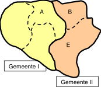

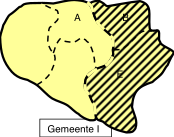

_Twee (of meer) gemeenten worden samengevoegd zonder dat er wijzigingen aan de woonplaatsen plaatsvinden._

Voor de BAG betekent dit het samenvoegen van twee (of meer) gemeentelijke BAG’s. De individuele objecten worden in dit scenario niet gemuteerd:

- Woonplaatscodes wijzigen niet.
- In de identificerende nummers (de identificatiecodes) van de meeste objecten is de gemeentecode opgenomen. De identificatiecodes van de reeds bestaande objecten verandert niet.

## Scenario 1b: Samenvoeging van gemeenten met woonplaatssamenvoeging

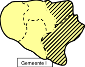

_Twee (of meer) gemeenten worden samengevoegd, waarbij twee woonplaatsen worden samengevoegd._

Voor de BAG betekent dit het samenvoegen van twee (of meer) gemeentelijke BAG's. De betrokken woonplaatsen worden ingetrokken onder het gelijktijdig benoemen van een nieuwe woonplaats:

- Woonplaatscodes wijzigen niet.
- De betrokken openbare ruimten en, indien van toepassing de nummeraanduidingen, worden "omgehangen" naar de nieuwe woonplaats, zoals beschreven bij de gebeurtenis [Wijzigen woonplaatsgrens]({{-site.baseurl-}}/gebeurtenissen/wijzigen-woonplaatsgrens).

_Let op! Deze wijzigingen kunnen gevolgen hebben voor de postcode. Het is belangrijk dat de plannen in een vroegtijdig stadium worden gedeeld met PostNL._

## Scenario 2a: Grenswijziging door overhevelen van hele woonplaatsen

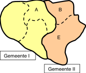

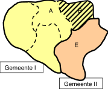

_Een woonplaats wordt overgeheveld van de ene gemeente naar de andere._

De individuele objecten worden in dit scenario niet gemuteerd:

- Woonplaatscodes wijzigen niet.
- In de identificerende nummers (de identificatiecodes) van de meeste objecten is de gemeentecode opgenomen. De identificatiecodes van de reeds bestaande objecten verandert niet.

## Scenario 2b: Grenswijziging door overhevelen en samenvoegen van hele woonplaatsen

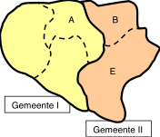

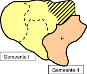

_Een woonplaats wordt overgeheveld van de ene gemeente naar de andere en daar samengevoegd met een andere woonplaats._

De betrokken woonplaatsen worden ingetrokken onder het gelijktijdig benoemen van een nieuwe woonplaats:

- Woonplaatscodes wijzigen niet.
- De betrokken openbare ruimten en, indien van toepassing de nummeraanduidingen, worden "omgehangen" naar de nieuwe woonplaats, zoals beschreven bij de gebeurtenis [Wijzigen woonplaatsgrens]({{-site.baseurl-}}/gebeurtenissen/wijzigen-woonplaatsgrens).

_Let op! Deze wijzigingen kunnen gevolgen hebben voor de postcode. Het is belangrijk dat de plannen in een vroegtijdig stadium worden gedeeld met PostNL._

## Scenario 3a: Grenswijziging door overhevelen van woonplaatsdeel en vorming van nieuwe woonplaats

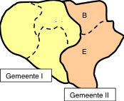

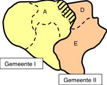

Een deel van een woonplaats wordt overgeheveld van de ene gemeente naar de andere en vormt daar een nieuwe woonplaats.

De betrokken woonplaats (B) wordt ingetrokken onder het gelijktijdig benoemen van nieuwe woonplaatsen (C en D) door de twee verschillende gemeenten:

- Alleen de nieuwe woonplaats krijgt een nieuwe woonplaatscode, die door de BAG-beheerorganisatie wordt toegekend.
- De betrokken openbare ruimten en, indien van toepassing de nummeraanduidingen, worden "omgehangen" naar de correcte nieuwe woonplaatsen, zoals beschreven bij de gebeurtenis [Wijzigen woonplaatsgrens]({{-site.baseurl-}}/gebeurtenissen/wijzigen-woonplaatsgrens).
- Voor de grenssituatie wordt, daar waar dat van toepassing is, een identificatiecode bijbehorende woonplaats opgenomen bij de nummeraanduiding.
- Een openbare ruimte mag maar in één woonplaats liggen. Daarom moeten, daar waar dat van toepassing is, openbare ruimten in tweeën gesplitst worden door het intrekken van de oude openbare ruimte en het opvoeren van nieuwe openbare ruimten.

_Let op! Deze wijzigingen kunnen gevolgen hebben voor de postcode. Het is belangrijk dat de plannen in een vroegtijdig stadium worden gedeeld met PostNL._

## Scenario 3b: Grenswijziging door overhevelen van woonplaatsdeel en woonplaatssamenvoeging

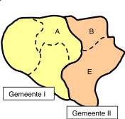

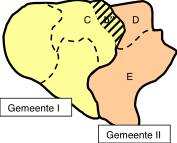

Een deel van een woonplaats wordt overgeheveld van de ene gemeente naar de andere en wordt daar samengevoegd met een andere woonplaats.

De betrokken woonplaatsen (A en B) worden ingetrokken onder het gelijktijdig benoemen van nieuwe woonplaatsen (C en D) door de twee verschillende gemeenten:

- Woonplaatscodes wijzigen niet.

- De betrokken openbare ruimten en, indien van toepassing de nummeraanduidingen, worden "omgehangen" naar de correcte nieuwe woonplaatsen, zoals beschreven bij de gebeurtenis [Wijzigen woonplaatsgrens]({{-site.baseurl-}}/gebeurtenissen/wijzigen-woonplaatsgrens).
- Voor de grenssituatie wordt, daar waar dat van toepassing is, een identificatiecode bijbehorende woonplaats opgenomen bij de nummeraanduiding.
- Omdat een openbare ruimte maar in één woonplaats mag liggen moeten, daar waar dat van toepassing is, openbare ruimten in tweeën gesplitst worden door het intrekken van de oude openbare ruimte en het opvoeren van nieuwe openbare ruimten.

_Let op! Deze wijzigingen kunnen gevolgen hebben voor de postcode. Het is belangrijk dat de plannen in een vroegtijdig stadium worden gedeeld met PostNL._

## Andere scenario's

Andere dan de bovenstaande scenario's zijn mogelijk. Daarbij wordt dezelfde systematiek gevolgd, die beschreven is. Het verdient aanbeveling bij gemeentelijke herindelingen tijdig contact op te nemen met de beheerorganisatie BAG om de exacte consequenties voor de BAG te bespreken.
