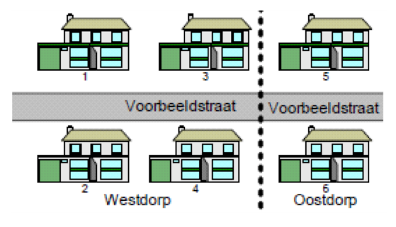

# Hoe wordt het in de BAG geregistreerd als een openbare ruimte door twee woonplaatsen loopt?

Wanneer een openbare ruimte in twee woonplaatsen ligt, zal de openbare ruimte gesplitst worden.

- Voorbeeldstraat 1, 2, 3 en 4 in woonplaats Westdorp

En

- Voorbeeldstraat 5 en 6 in woonplaats Oostdorp

Woonplaats Westdorp kent dan een openbare ruimte Voorbeeldstraat met nummers 1 t/m 4 en woonplaats Oostdorp kent ook een openbare ruimte Voorbeeldstraat met de nummers 5 en 6.

Een openbare ruimte die door twee woonplaatsen (Westdorp en Oostdorp) loopt, wordt dus tweemaal in de BAG opgenomen: eenmaal in combinatie met de ene woonplaats en eenmaal in combinatie met de andere woonplaats.
De verblijfsobjecten in woonplaats Westdorp worden gekoppeld aan de openbare ruimte in woonplaats Westdorp en de verblijfsobjecten in woonplaats Oostdorp worden gekoppeld aan de openbare ruimte in woonplaats Oostdorp.
