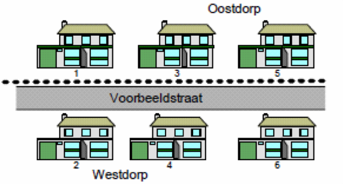
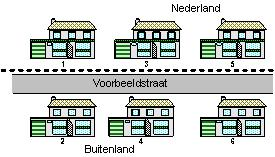

# Hoe wordt het in de BAG geregistreerd als een verblijfsobject in een andere woonplaats of gemeente ligt dan de bijbehorende openbare ruimte?

Indien de openbare ruimte in woonplaats A ligt (bijvoorbeeld parallel aan de woonplaatsgrens), maar de bijbehorende verblijfsobjecten liggen aan de andere kant van de grens in woonplaats B (met opritten die uitkomen op de openbare ruimte in woonplaats A), dan wordt de optionele relatie tussen woonplaats en nummeraanduiding toegepast (zie ook de relaties in de [Catalogus BAG 2018](https://imbag.github.io/catalogus/hoofdstukken/algemene-principes#34-relaties-tussen-bag-objecten){:target="blank"}).

In onderstaande afbeelding wordt deze situatie geïllustreerd:

- Voorbeeldstraat 1, 3 en 5 in woonplaats Oostdorp

En

- Voorbeeldstraat 2, 4 en 6 in woonplaats Westdorp

Woonplaats Westdorp kent de openbare ruimte Voorbeeldstraat, dus de nummers 2, 4 en 6 leveren geen problemen op: nummeraanduiding 2, 4 en 6 krijgen een verwijzing naar openbare ruimte Voorbeeldstraat. Voorbeeldstraat heeft een verwijzing naar woonplaats Westdorp. Dus het correcte adres Voorbeeldstraat 2 in Westdorp is hiermee ontstaan. Voor de nummers 1, 3 en 5 zal de optionele relatie nummeraanduiding - woonplaats gebruikt dienen te worden. Dit gebruik wordt hieronder toegelicht.

## Verschillende situaties toegelicht
Er zijn drie situaties denkbaar waarbij een verblijfsobject in een andere woonplaats of gemeente ligt dan de bijbehorende openbare ruimte, namelijk:

- Situatie 1a: In het geval de openbare ruimte in een woonplaats langs de woonplaatsgrens loopt en er verblijfsobjecten in de andere woonplaats aan deze openbare ruimte liggen.
- Situatie 1b: In het geval de openbare ruimte in een gemeente langs de gemeentegrens loopt en er verblijfsobjecten in de andere gemeente aan deze openbare ruimte liggen.
- Situatie 2: In het geval de openbare ruimte in het buitenland langs de grens loopt en er verblijfsobjecten in Nederland aan deze openbare ruimte liggen.

### Situatie 1a

Zoals blijkt uit bovenstaande toelichting, leveren de nummers 2, 4 en 6 uit de afbeelding geen problemen op. Zij krijgen een verwijzing naar de juiste woonplaats. Voor de nummers 1, 3 en 5 moet echter ook de optionele relatie nummeraanduiding – woonplaats worden gebruikt: nummeraanduiding 1, 3 en 5 horen bij openbare ruimte Voorbeeldstraat. Openbare ruimte Voorbeeldstraat ligt in woonplaats Westdorp, maar omdat dit het foutieve adres Voorbeeldstraat 1 in Westdorp zou opleveren, moet ingegrepen worden. Door het gebruiken van de optionele relatie nummeraanduiding – woonplaats wordt aangegeven dat het verblijfsobject in een andere woonplaats ligt dan de woonplaats waar de openbare ruimte in ligt. De nummeraanduidingen 1, 3 en 5 krijgen dus (behalve hun normale verwijzing naar de openbare ruimte Voorbeeldstraat) ook een verwijzing naar woonplaats Oostdorp.

### Situatie 1b

Als de openbare ruimte Voorbeeldstraat in een Nederlandse buurgemeente ligt, beschikt de gemeente zelf niet over de gegevens van de openbare ruimte en moet de openbare ruimte-ID (inclusief de gemeentecode die deel uitmaakt van de identificatiecode openbare ruimte) worden opgehaald uit de Landelijke Voorziening. Deze openbare ruimte-ID wordt gebruikt bij de 'identificatiecode bijbehorende openbare ruimte' van de betrokken nummeraanduidingen. Door de gemeentecode is deze ID altijd uniek. De openbare ruimte van de buurgemeente zelf wordt niet opgenomen in de eigen BAG. Een openbare ruimte wordt namelijk uitsluitend geregistreerd in de woonplaats waarin deze is gelegen.(Hiermee is overigens de naam van de openbare ruimte in de lokale BAG niet bekend. Als deze naam in toepassingen nodig is, moeten hiervoor (technische) voorzieningen worden getroffen, bijvoorbeeld door de naam op te nemen in het niet-authentieke deel van de toepassing.)

In de BAG mag een woonplaats maar in één gemeente liggen. Dit betekent dat in situatie 1b tegelijkertijd ook sprake is van situatie 1a (de verblijfsobjecten bevinden zich in een andere woonplaats dan de woonplaats waartoe de openbare ruimte behoort). Ook in dit geval dient dus de optionele relatie nummeraanduiding – woonplaats te worden gebruikt.

### Situatie 2

Als de openbare ruimte Voorbeeldstraat in het buitenland ligt, kan de openbare ruimte-ID natuurlijk niet uit de Landelijke Voorziening worden opgehaald. In dit geval kan de gemeente niet anders dan de betreffende openbare ruimte in de eigen BAG opnemen (en dus doorleveren aan de LV) met een eigen ID-nummer en verwijzend naar een woonplaats in de eigen gemeente. Hiervoor moet een duidelijk proces-verbaal worden op gesteld.

