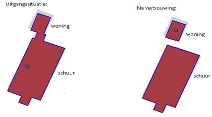

# Kunnen ingrijpende wijzigingen aan een pand met zich mee brengen dat er een nieuw pand ontstaat?

Er zijn situaties waarin er dermate ingrijpende wijzigingen aan het oorspronkelijke object plaatsvinden dat het oorspronkelijke object in feite niet meer bestaat. In zo'n situatie wordt aan het oorspronkelijke pand de status `pand gesloopt` toegekend en wordt er een nieuw pand met een nieuw bouwjaar opgevoerd. Deze werkwijze brengt met zich mee dat het voor afnemers duidelijk is dat er een nieuw object in de plaats is gekomen voor een object dat niet meer bestaat. Het is aan de gemeente als bronhouder om te beoordelen of er sprake is van een nieuw object.

Nieuwe objecten krijgen in de registratie een nieuw bouwjaar. Het bouwjaar van een pand wordt bepaald bij de totstandkoming van het pand. Dit betekent dat het bouwjaar niet wijzigt als er een aanbouw wordt gerealiseerd. Bij een aanbouw wordt alleen de pandgeometrie aangepast, het bouwjaar van het oorspronkelijk pand blijft gehandhaafd.

### Voorbeelden

----

#### Voorbeeld 1

Een voorbeeld van een situatie waarin het oude pand wordt gesloopt en een nieuw pand met een nieuw bouwjaar in de BAG wordt opgevoerd is een situatie waarbij een nieuw pand wordt gerealiseerd op de bestaande fundering van een oud pand.

----

#### Voorbeeld 2

Een voorbeeld van een situatie waarin het pand blijft bestaan en het oorspronkelijk bouwjaar gehandhaafd blijft, is een pand dat volledig gestript en vernieuwd wordt, maar waarvan de bouwkundige constructie intact blijft.

----

#### Voorbeeld 3

Bij een winkelpand waar bovenop extra appartementen worden gebouwd, ligt het -afhankelijk van de bouwkundige constructie- voor de hand dat de woningen die bovenop de bestaande winkel gebouwd zijn een uitbreiding zijn van het bestaande pand.
Alleen wanneer de appartementen als zelfstandige bouwkundig constructieve eenheid als apart pand aan te merken zouden zijn, is het mogelijk voor de appartementen een ander bouwjaar te registreren dan voor de winkel. Dat zou overigens betekenen dat het oorspronkelijke winkelpand in zijn geheel gesloopt kan worden, zonder dat de bovenop gebouwde appartementen zouden instorten.

----

#### Voorbeeld 4

Een bestaand pand kan dusdanige bouwkundige wijzigingen ondergaan dat het wordt opgesplitst in twee afzonderlijke objecten.  Wanneer de afzonderlijke objecten beide als pand kunnen worden gecategoriseerd, ontstaan er twee panden. Op het bestaande pand wordt een correctie in de geometrie doorgevoerd. Het nieuwe pand wordt apart opgevoerd met het oorspronkelijke bouwjaar.
Het ligt voor de hand het bestaande ID te gebruiken voor het pand dat in de nieuwe situatie het bestaande verblijfsobject bevat.

Daarnaast moet ook nog naar de verblijfsobjecten worden gekeken. Wat hiermee dient te gebeuren hangt af van de situatie.
Het ligt voor de hand dat de oppervlakte van het verblijfsobject aangepast moet worden. Afhankelijk van de situatie is het ook mogelijk dat de pandrelatering en de locatie van de verblijfsobjecten aangepast moeten worden. Er zijn ook nog situaties denkbaar waarin er als gevolg van de splitsing van het pand twee verblijfsobjecten ontstaan. In dat geval moet de gebeurtenis splitsen van verblijfsobjecten worden gevolgd.

Onderstaande situatie illustreert het splitsen van panden en de daarmee gepaard gaande wijziging van verblijfsobject:

