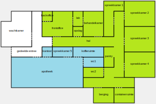
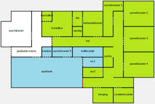
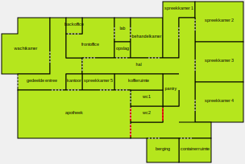
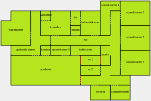
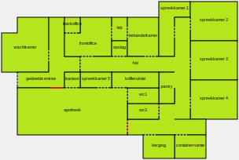

# Uitwerking aaneengesloten samenhangend gebruik en ontsluiting van een verblijfsobject

## Inleiding
Bij een verblijfsobject staat het samenhangende gebruik van een ruimte centraal. Er dient in ruimtelijke zin sprake te zijn van een eenheid van gebruik. Er kan alleen sprake zijn van een eenheid van gebruik als die eenheid exclusief beschikt over alle basisvoorzieningen die zijn vereist voor alle gebruiksdoelen van het verblijfsobject.

In deze uitwerking worden ruimten in een pand afgebakend als verblijfsobject. Als basis dient hiervoor een indeling van een fictief medisch centrum met een huisartsenpraktijk en een apotheek. Hiervan zijn verschillende variaties uitgewerkt, waarbij de bereikbaarheid van ruimten wordt aangepast, om te duiden wat de gevolgen hiervan zijn voor het aaneengesloten samenhangende gebruik van de verschillende ruimten. De focus ligt hierbij op de aanwezigheid van de vereiste basisvoorzieningen, het binnendoor bereikbaar zijn van de ruimten en de ontsluiting van de ruimten.

De verblijfsobjecten worden steeds in kleur weergegeven. Als een ruimte geen onderdeel is van een verblijfsobject, wordt deze in wit weergegeven. De variatie op de uitgangssituatie wordt aangegeven met een rode kleur.

## Voorbeelden

----

### Medisch centrum uitgangssituatie

De uitgangssituatie bij dit voorbeeld betreft een pand met meerdere ruimten en de volgende kenmerken:

*Huisartsenpraktijk* (groen)
* De ruimten binnen de huisartsenpraktijk zijn allemaal binnendoor bereikbaar;
* De huisartsenpraktijk beschikt exclusief over de minimaal vereiste basisvoorzieningen voor gebruiksdoel 'gezondheidszorgfunctie': water (in de pantry) en een toilet;
* De hal in de huisartsenpraktijk onsluit alle ruimtes via de deur tussen de huisartsenpraktijk naar de gedeelde entree;

*Apotheek* (blauw)
* De ruimten binnen de apotheek zijn allemaal binnendoor bereikbaar;
* De apotheek beschikt exclusief over de minimaal vereiste basisvoorzieningen voor gebruiksdoel 'gezondheidszorgfunctie': water (in de koffieruimte) en een toilet;
* De ruimten binnen de apotheek worden ontsloten via de deur tussen de apotheek en de gedeelde entree;

De gedeelde entree fungeert als gedeelde verkeersruimte en gedeelde verkeersruimten maken nooit deel uit van het verblijfsobject. Verder is er in dit geval geen specifieke regel van toepassing die toestaat dat een verblijfsobject is ontsloten via een ander
verblijfsobject.
De wachtkamer is geen object voor de BAG, omdat deze niet de beschikking heeft over de minimaal vereiste basisvoorzieningen.

De huisartsenpraktijk en de apotheek zijn twee separate verblijfsobjecten.

----

### Variant 1 Doorgang met tussendeur

Er wordt een doorgang gemaakt en een tussendeur geplaatst tussen de huisartsenpraktijk en de apotheek. De tussendeur kan niet op slot.

>Sloten en beweegbare delen in de gevel, het dak of de laagstgelegen vloer, zoals deuren en ramen, te openen lichtkappen en kruipluiken hoeven niet aanwezig zijn, mits deze wel eenvoudig kunnen worden geplaatst.
>
>(Catalogus BAG 2018, 10.8 Afbakening van verblijfobjecten, vraag 5. Heeft de ruimte een afsluitbare toegang?)

Ook wanneer de tussendeur niet op slot kan, is er toch sprake van een ruimte die eenvoudig afgesloten kan worden gemaakt.
Het belangrijkste criterium voor de afbakening van een vbo is de kleinste eenheid van functioneel zelfstandig gebruik. Hiervan is nog steeds sprake bij zowel de huisartsenpraktijk als de apotheek. Dit blijven twee separate verblijfsobjecten.

----

### Variant 2 Ontsluiting via apotheek

De toegang van de huisartsenpraktijk naar de gedeelde entree wordt dichtgezet met een muur. Vervolgens wordt er een doorgang gemaakt tussen de huisartsenpraktijk en de apotheek met een niet afsluitbare deur.

De ruimten binnen de huisartsenpraktijk zijn hiermee alleen bereikbaar geworden via de apotheek. De huisartsenpraktijk kan nu geen apart verblijfsobject meer zijn, omdat het niet is toegestaan dat een verblijfsobject (de huisartsenpraktijk) is ontsloten via een ander verblijfsobject (de apotheek).

>Een verblijfsobject moet beschikken over een of meer eigen afsluitbare toegangen vanaf de openbare weg, een eigen erf en/of een gedeelde verkeersruimte, tenzij een specifieke regel in de catalogus toestaat dat een verblijfsobject is ontsloten via een ander verblijfsobject.
>
>(Catalogus BAG 2018, 10.8 Afbakening van verblijfobjecten, vraag 3. Is de ruimte ontsloten via een eigen toegang vanaf de openbare weg, een eigen erf en/of een gedeelde verkeersruimte of geldt er een specifieke regel?)

Alle ruimten binnen het pand zijn binnendoor bereikbaar en de gedeelde entree en de wachtkamer zijn nu onderdeel van het verblijfsobject. De ontsluiting van het verblijfsobject is via de afsluitbare toegang naar buiten. Er moet nu één verblijfsobject worden afgebakend.

----

### Variant 3 Basisvoorziening via apotheek

WC2 wordt aan de kant van de huisartsenpraktijk dichtgemaakt met een muur en is nu alleen bereikbaar via de apotheek. Vervolgens wordt er een doorgang gemaakt tussen de huisartsenpraktijk en de apotheek met een afsluitbare deur. Hierdoor heeft de huisartsenpraktijk niet meer exclusief de beschikking over alle vereiste basisvoorzieningen. Er kan alleen gebruik gemaakt worden van het toilet via de apotheek. Daarmee kan er geen sprake meer zijn van eenheid van gebruik voor de ruimten binnen de huisartsenpraktijk.

Alle ruimten binnen het pand zijn binnendoor bereikbaar en de gedeelde entree en de wachtkamer zijn nu onderdeel van het verblijfsobject. De ontsluiting van het verblijfsobject is via de afsluitbare toegang naar buiten. Er moet nu één verblijfsobject worden afgebakend.

----

### Variant 4 Basisvoorziening via huisartsenpraktijk

WC1 wordt aan de kant van de apotheek dichtgemaakt met een muur en is nu alleen bereikbaar via de huisartsenpraktijk. Vervolgens wordt er een doorgang gemaakt tussen de apotheek en de huisartsenpraktijk met een afsluitbare deur. Hierdoor heeft de apotheek niet meer exclusief de beschikking over alle vereiste basisvoorzieningen. Er kan alleen gebruik gemaakt worden van het toilet via de huisartsenpraktijk. Daarmee kan er geen sprake meer zijn van eenheid van gebruik voor de ruimten binnen de apotheek.

Alle ruimten binnen het pand zijn binnendoor bereikbaar en de gedeelde entree en de wachtkamer zijn nu onderdeel van het verblijfsobject. De ontsluiting van het verblijfsobject is via de afsluitbare toegang naar buiten. Er moet nu één verblijfsobject worden afgebakend.

----

### Variant 5 Ontsluiting via huisartsenpraktijk
De toegang van de apotheek naar de gedeelde entree wordt dichtgezet met een muur. Vervolgens wordt er een doorgang gemaakt tussen de apotheek en de huisartsenpraktijk met een niet afsluitbare deur.

De ruimten binnen de apotheek zijn hiermee alleen bereikbaar geworden via de huisartsenpraktijk. De apotheek kan nu geen apart verblijfsobject meer zijn, omdat het niet is toegestaan dat een verblijfsobject (de apotheek) is ontsloten via een ander verblijfsobject (de huisartsenpraktijk).

>Een verblijfsobject moet beschikken over een of meer eigen afsluitbare toegangen vanaf de openbare weg, een eigen erf en/of een gedeelde verkeersruimte, tenzij een specifieke regel in de catalogus toestaat dat een verblijfsobject is ontsloten via een ander verblijfsobject.
>
>(Catalogus BAG 2018, 10.8 Afbakening van verblijfobjecten, vraag 3. Is de ruimte ontsloten via een eigen toegang vanaf de openbare weg, een eigen erf en/of een gedeelde verkeersruimte of geldt er een specifieke regel?)

Alle ruimten binnen het pand zijn binnendoor bereikbaar en de gedeelde entree en de wachtkamer zijn nu onderdeel van het verblijfsobject. De ontsluiting van het verblijfsobject is via de afsluitbare toegang naar buiten. Er moet nu één verblijfsobject worden afgebakend.

