# Uitwerking onderscheid panden en verplaatsbare objecten

## Achtergrond

In de praktijk was het voor sommige gemeenten niet duidelijk hoe objecten op recreatieterreinen in de BAG geregistreerd dienen te worden. Daarom heeft het (voormalig) ministerie van IenM in navolging van een [advies van het BAG BAO](http://www.geobasisregistraties.nl/documenten/brief/2016/04/25/advies-bag-bao-stacaravans) een verduidelijking van de voorschriften voor het afbakenen van panden opgesteld en alle gemeenten per [brief](http://www.geobasisregistraties.nl/documenten/brief/2016/06/17/brief-van-ienm-aan-alle-gemeenten-inzake-stacaravans-en-de-bag) hierover geïnformeerd. De kernboodschap van de verduidelijking is dat een object dat naar aard en constructie als geheel verplaatsbaar is, geen pand is. Daarnaast is verduidelijkt dat de intentie om een object ergens duurzaam te plaatsen geen rol speelt bij pandafbakening in de BAG.

Het gevolg is dat sommige gemeenten objecten op recreatieterreinen opnieuw moeten beoordelen. Per object moet onderzocht worden of dit object als pand in de BAG opgenomen moet worden. Het is in de praktijk goed mogelijk dat sommige objecten op een recreatierrein wel als pand in de BAG moeten worden afgebakend en andere objecten niet. Omdat deze afbakening plaatsvindt op basis van de bouwkundige en constructieve kenmerken is het duidelijk wat afnemers van de BAG-registratie kunnen verwachten.

Het belang van de registratie van objecten op recreatieterreinen in de BAG is gering in het kader van de gedachte van eenmalige inwinning en meervoudig gebruik van overheidsgegevens. Bij de afbakening van objecten op recreatieterreinen is gezien (de beheersbaarheid van) de registratie enige terughoudendheid op zijn plaats.

## Voorbeelden ter illustratie

Om gemeenten te ondersteunen bij de afbakening en de uniformiteit te bevorderen worden in dit document enkele handreikingen voor beoordeling van objecten gegeven. Hierbij lichten we toe hoe moet worden beoordeeld of er sprake is van een pand of niet. Deze toelichting is bedoeld om duidelijk te maken welke kenmerken van het object van belang zijn bij het beoordelen of er sprake is van een verplaatsbaar object. De voorbeelden zijn op zichzelf staande voorbeelden die illustreren hoe de richtlijn geïnterpreteerd dient te worden. Dit document heeft niet als doel een volledig overzicht te zijn waar gemeenten alle objecten binnen hun eigen gemeente naast kunnen leggen. Van gemeenten wordt verwacht dat zij per object op basis van de juiste overwegingen beoordelen of een object als pand in de BAG opgenomen dient te worden of niet.
We hebben de voorbeelden uitgewerkt in drie verschillende categorieën. Objecten die geen pand zijn, objecten die wel een pand zijn en objecten die als grensgeval aangemerkt worden.

## Stappen in de beoordeling

1. Wat is het te beoordelen object?

    Het gaat om 'het geheel van samenstellende, integrerende onderdelen'. Een onderdeel is integrerend als het een onlosmakelijk deel van het geheel is geworden.

    Bij aanbouwsels die aan een oorspronkelijk verplaatsbaar object zijn toegevoegd, moet worden beoordeeld of het oorspronkelijke object zonder die toevoeging nog zelfstandig kan functioneren (met andere woorden: 'wat blijft er over als je het aanbouwsel weghaalt').
    Blijft het oorspronkelijke object als zodanig bruikbaar, dan is de toevoeging geen integrerend deel. In dat geval is nog steeds sprake van een op zichzelf verplaatsbaar object.
    Van integrerende delen die een onlosmakelijk geheel vormen is slechts sprake indien bij verwijdering van het aanbouwsel een onvolledig object overblijft dat niet op zichzelf kan functioneren (bijvoorbeeld doordat een (gedeelte van een) wand ontbreekt). In dat geval kan het oorspronkelijke object niet meer op zichzelf staand worden beschouwd en moet het geheel worden beoordeeld.

    Bij plaatsing van een aangevoerd object op een voor dat doel ontworpen funderingsconstructie is in principe sprake van een geheel van integrerende delen (fundering en het daarop geplaatste) dat niet meer als geheel kan worden verplaatst.

2. Is het te beoordelen object ter plaatse tot stand gekomen en kan het slechts door het van elkaar scheiden van de integrerende onderdelen worden verwijderd?

    Kort gezegd gaat het om de vraag of het object is 'gebouwd' of 'neergezet'. In het algemeen is het nog eenvoudiger om de vraag te stellen hoe het object kan worden verwijderd; betekent dat slopen, of kan het objectief gezien in zijn geheel worden verplaatst?

## Voorbeelden geen pand

----

### Voorbeeld 1.1

Object – Het gehele rechthoekige object.

Beoordeling – Het object is in zijn geheel geplaatst en verplaatsbaar en is daarom geen pand. Ook in het geval dat onderstaand object permanent op deze locatie blijft staan is er geen sprake van een pand. De subjectieve intentie een object ergens permanent te laten staan is namelijk niet relevant bij de beoordeling of er sprake is van een pand.

----

### Voorbeeld 1.2 Idem als 1.1

Object – Het gehele rechthoekige object.

Onderstaand object is geen pand, omdat het naar aard en constructie als geheel verplaatsbaar is. Zowel de beperkte omvang, de vorm, als de aard van de constructie van dit object maakt dat dit object naar objectieve maatstaven relatief eenvoudig te verplaatsen is. Dat de onderkant van het object met enkele plankjes is dichtgemaakt doet hier niets aan af.

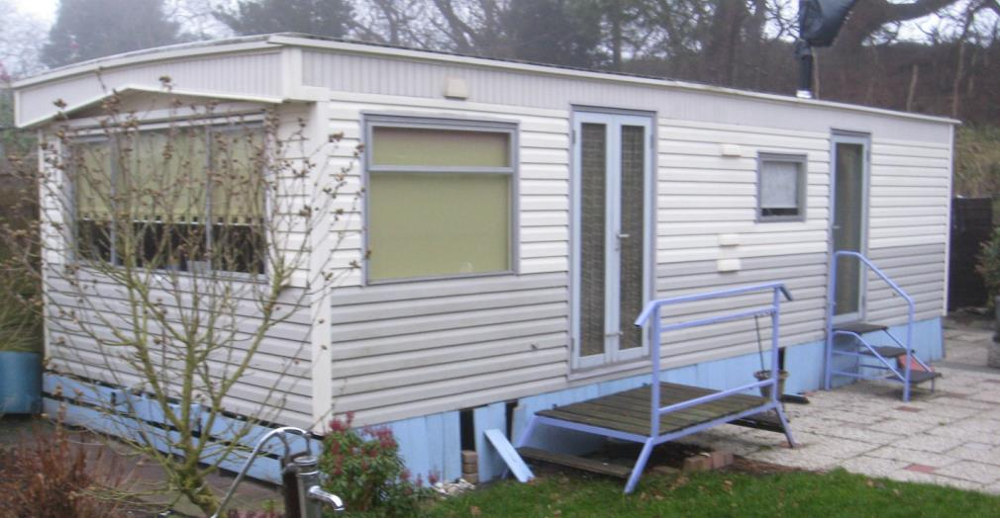

----

### Voorbeeld 1.3

Object – De veranda is geen integrerend onderdeel en blijft dus buiten beschouwing. De ondersteunende palen worden hier evenmin beschouwd als een integrerend onderdeel, aangezien ze niet noodzakelijk lijken voor de instandhouding.

Beoordeling – Het object kan worden beschouwd als een 'neergezet' object en kan in zijn geheel worden verplaatst.
Het kan slechts anders worden als de ondersteunende palen een fundering met een noodzakelijke constructieve functie vormen. Dan is sprake van een integrerend onderdeel zonder welk het object niet zelfstandig kan functioneren.

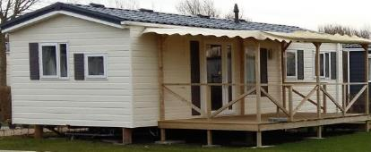

----

### Voorbeeld 1.4

Object - De aangebrachte overkapping maakt geen integraal onderdeel uit van het object. Het object beschikt zelf ook over een eigen toegangsdeur. De entree in deze situatie is daarmee een afzonderlijk toevoegsel. Ook zonder de aanwezigheid van deze entree blijft er een op zichzelf staand object over.

Beoordeling - Het object wordt beschouwd als een 'neergezet' en verplaatsbaar object en is geen pand.

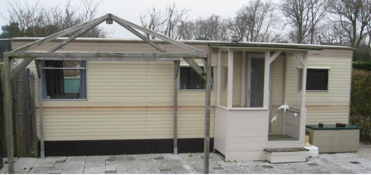

----

### Voorbeeld 1.5

Object - De aangebrachte overkapping maakt geen integraal onderdeel uit van het object.

Beoordeling - Het object wordt beschouwd als een 'neergezet' en verplaatsbaar object en is geen pand.

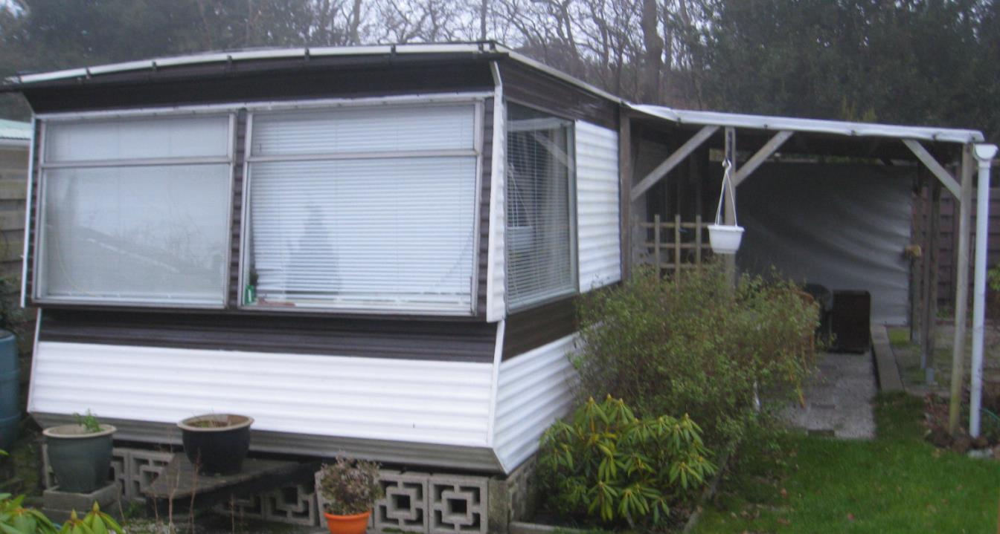

----

## Voorbeelden wel een pand

----

### Voorbeeld 2.1

Object – Het geheel, inclusief het uitbouwtje rechts.

Beoordeling – Een object als dit betreft doorgaans een ter plaatse gebouwd object. Onder andere de vorm en het materiaal van het dak wijzen er niet op dat het in dit geval zou gaan om een in zijn geheel aangevoerd en neergezet object dat eenvoudig weer kan worden verplaatst. Onderstaand object is daarom een pand.

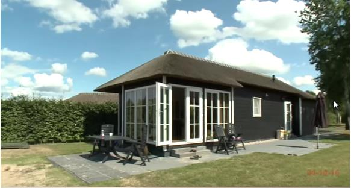

----

### Voorbeeld 2.2

Object – Het geheel.

Beoordeling –De grote omvang van het object zorgt ervoor dat het object naar objectieve maatstaven niet te verplaatsen is. Via dit voorbeeld maken we duidelijk dat alleen objecten die relatief eenvoudig te vervoeren zijn als verplaatsbaar worden aangemerkt. Objecten die uitsluitend via ongebruikelijke vormen van (zwaar) transport verplaatst kunnen worden, worden binnen de BAG niet als verplaatsbaar aangemerkt. Onderstaand object is daarom een pand.

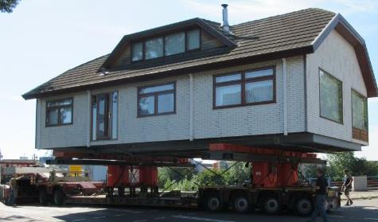

----

### Voorbeeld 2.3

Object - Het object bestaat uit twee geïntegreerde delen. Er is sprake van geïntegreerde delen omdat de twee gedeelten niet als op zichzelf staande objecten gezien kunnen worden.

Beoordeling – Het geheel wordt geacht niet in zijn geheel neergezet te zijn en is ook niet in zijn geheel te verplaatsen. Daarom is onderstaand object een pand.

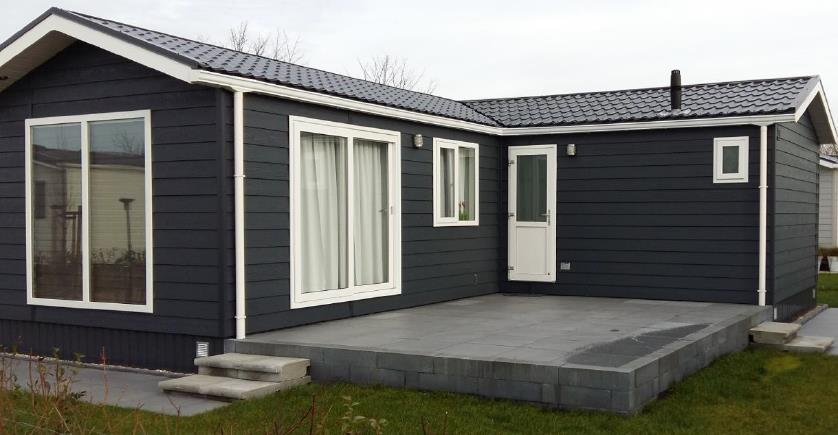

----

### Voorbeeld 2.4

Object – Het geheel.

Beoordeling – Het geheel wordt aangemerkt als ter plaatse opgebouwd en niet in zijn geheel neergezet. Het kan objectief gezien ook niet worden verplaatst. Het object wordt aangemerkt als een pand.

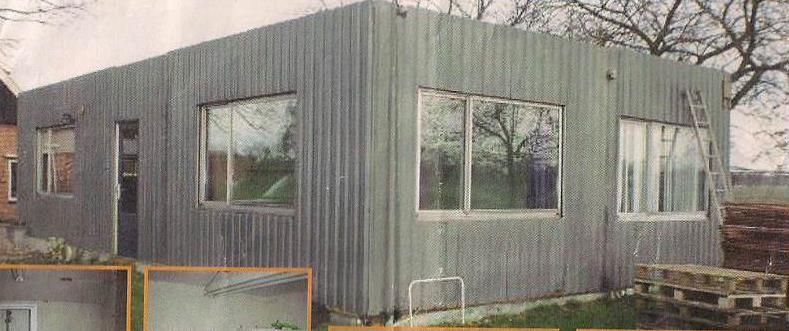

----

### Voorbeeld 2.5

Object – Het geheel. De twee delen van het object zijn dusdanig met elkaar verweven dat wordt aangenomen dat het geïntegreerde onderdelen zijn.

Beoordeling – Het geheel wordt aangemerkt als ter plaatse opgebouwd en niet zijn geheel te verplaatsen. Onderstaand object wordt aangemerkt als een pand. Dat het object op enige hoogte boven de grond staat, maakt hiervoor geen verschil.

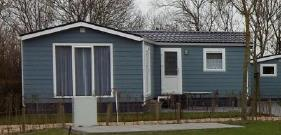

----

## Toepassing richtlijn in grensgevallen

In dit hoofdstuk hebben we voorbeelden opgenomen waarin op basis van de foto niet eenvoudig vastgesteld kan worden of er sprake is van een pand. Bij deze voorbeelden geven wij aan onder welke voorwaarden er sprake is van een pand.

----

### Voorbeeld 3.1

Object – Van onderstaand object is op basis van de foto niet te bepalen of dit een pand is. De uiterlijke kenmerken van het object wijzen erop dat het van oorsprong een verplaatsbaar object is. Het is in dit geval echter niet duidelijk of de aangebouwde entree een geïntegreerd onderdeel van het object is. De vraag is dan wat er van het geheel overblijft als je de entree weghaalt. Blijft er in die situatie een volwaardig object over, dan is er geen sprake van geïntegreerde onderdelen. Het oorspronkelijke object moet dan op zichzelf worden beoordeeld. Als de entree wel verweven is met het oorspronkelijke object, is er sprake van geïntegreerde onderdelen die tezamen een geïntegreerd geheel vormen.

Beoordeling – Als er sprake is van een geïntegreerd geheel, dan is dit geheel als pand aan te merken. Het is in dat geval niet als geheel eenvoudig neergezet, en ook niet eenvoudig als geheel te verplaatsen. Het oorspronkelijke object op zichzelf kan niet als pand worden beschouwd.

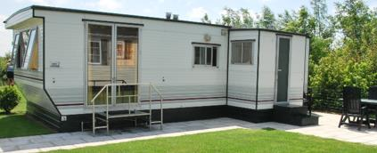

----

### Voorbeeld 3.2

Object – De uiterlijke kenmerken van het object wijzen erop dat het oorspronkelijk een verplaatsbaar object is. Het is in dit geval echter niet duidelijk of de aangebouwde entree een geïntegreerd onderdeel van het object is. De vraag is wat er van het geheel overblijft als je de entree weghaalt. Blijft er in die situatie een volwaardig object over, dan is er geen sprake van geïntegreerde onderdelen. Het oorspronkelijke object moet dan op zichzelf worden beoordeeld.
Als het aanbouwsel wel verweven is met het oorspronkelijke object, is er sprake van geïntegreerde onderdelen die tezamen een geïntegreerd geheel vormen.

Beoordeling – Als er sprake is van een geïntegreerd geheel, dan moet dit als pand worden aangemerkt omdat het geheel ter plaatse is opgebouwd en niet als geheel verplaatst kan worden. Als het aanbouwsel een op zichzelf staande toevoeging is en daarom het oorspronkelijke object op zichzelf moet worden beoordeeld, is er geen sprake van een pand. Dit object is vanwege de verplaatsbaarheid niet als pand af te bakenen.

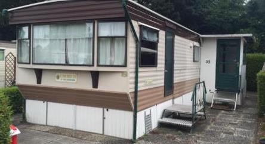

### Voorbeeld 3.3

Object – De uiterlijke kenmerken van het geheel lijken er op te wijzen dat het witte deel een verplaatsbaar object is, waaraan een afzonderlijk deel is aangebouwd. Het is in dit geval echter niet zonder meer duidelijk of het aangebouwde (bruine) deel een geïntegreerd deel van het geheel is. De vraag is wat er van het oorspronkelijke object overblijft als je dit deel weghaalt. Blijft er in die situatie een volwaardig object over, dan is er geen sprake van geïntegreerde onderdelen. De delen moeten dan afzonderlijk worden beoordeeld. Als de aanbouw wel verweven is met het object zelf, is er sprake van geïntegreerde onderdelen die tezamen een onlosmakelijk geheel vormen. Het verschil in materialen en afwerking kan een aanwijzing zijn dat het niet om geïntegreerde onderdelen gaat.
De dakafwerking zou er echter op kunnen wijzen dat de delen niet meer van elkaar kunnen worden gescheiden. Dat beide delen een eigen toegang hebben kan echter een aanwijzing zijn dat het wel om afzonderlijke objecten gaat.

Beoordeling – Indien sprake is van een onlosmakelijk geheel, dan is dit geheel als pand aan te merken. Staan de twee delen echter op zichzelf, dan is sprake van twee objecten die elk op zichzelf moeten worden beoordeeld. Het witte object als zodanig kan in dat geval niet als pand worden aangemerkt, aangezien het een verplaatsbaar object is. Het (bruine) rechtergedeelte kan in dat geval wel als pand worden beschouwd, omdat dit een niet verplaatsbaar object is dat zelfstandig aan de panddefinitie voldoet.

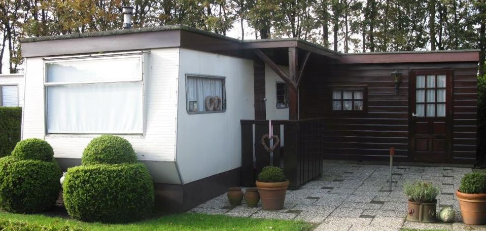

----

### Voorbeeld 3.4

Object – Op basis van deze foto is het niet duidelijk of onderstaand object als geheel een pand is.

Beoordeling – Als het oorspronkelijke object verplaatsbaar was, dan is het object over het algemeen nog steeds verplaatsbaar als het is afgewerkt aan de onderzijde. Als de afwerking aan de onderzijde echter dusdanig is dat gesproken moet worden van een samenhangende bouwkundige constructie waarbij het oorspronkelijke object niet meer als zodanig als verplaatsbaar moet worden beschouwd, kan het een pand zijn. Het gaat hierbij dus niet om de (cosmetische) afwerking, maar om de vraag of het oorspronkelijke object ter plaatse geïntegreerd is samengevoegd met een deel dat een constructieve functie heeft.

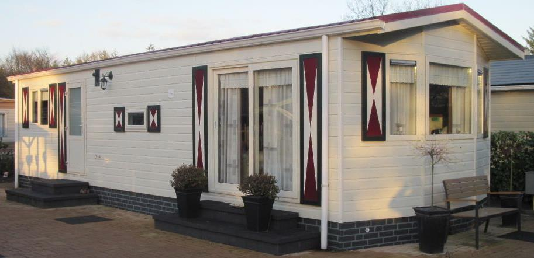
