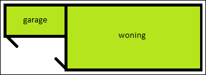
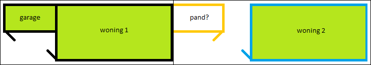
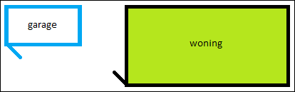
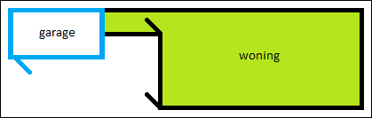
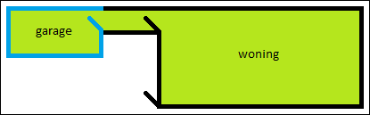
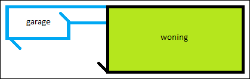

# {{ page.title }}

Een bouwwerk is geen afzonderlijk pand als dit bouwwerk bij de _totstandkoming*_ exclusief ondersteunend is aan het bouwwerk waartegen het rechtstreeks is aangebouwd. Het maakt hierbij niet uit of:

- het ondersteunende bouwwerk bouwkundig-constructief zelfstandig is;
- het ondersteunende bouwwerk later werd gebouwd dan het bouwwerk waaraan het ondersteunend is;
- het ondersteunende bouwwerk alleen buitenom kan worden bereikt door in de openlucht te komen (al dan niet onder een overkapping);
- het ondersteunende bouwwerk exclusief ondersteunend is aan slechts een gedeelte van het bouwwerk waartegen het rechtstreeks is aangebouwd;
- de bouwwerken deels ook tegen andere bouwwerken zijn aangebouwd;
- er ook andere ondersteunende bouwwerken ondersteunend zijn aan hetzelfde bouwwerk.

> *_Bij totstandkoming wordt gekeken naar de nieuwe situatie die ontstaat als gevolg van aanbouw van een bouwwerk aan een bestaand object. Dit betekent dat als een bouwwerk aan een pand is aangebouwd, dit bouwwerk niet per definitie onderdeel uitmaakt van het pand.
Zie de beslisboomvraag ['Was het bouwwerk bij de totstandkoming een functioneel zelfstandige eenheid?']({{-site.baseurl-}}/beslisboomvragen/pand-02) voor meer toelichting._

### Voorbeelden

In de voorbeelden hieronder wordt gesproken van een garage, hier kan echter ook bijgebouw worden gelezen.

----

#### 1.1 Woning met aangebouwde garage

Een woning en garage die bij de _totstandkoming_ (van die garage) aan elkaar worden gebouwd vormen samen **één pand**. De garage is hier als exclusief ondersteunend gebouw tegen de woning aangebouwd. Het maakt daarbij niet uit of de garage alleen bereikt kan worden door in de openlucht te komen (zie ook de opsomming over ondersteunende bouwwerken hierboven).

De gebruiksoppervlakte van de garage telt mee, omdat de garage onderdeel is van het verblijfsobject. Zie hiervoor ook de laatste paragraaf van vraag 2 van de verblijfsobjectafbakening in de Catalogus BAG 2018:

"_De binnenruimten van een verblijfsobject moeten onderling binnendoor bereikbaar zijn zonder het verblijfsobject te verlaten. Binnenruimten aan weerszijden van bouwkundige scheidingsconstructies tussen bouwwerken die tezamen een ondeelbare eenheid vormen in de afbakening van panden en die elk alleen daarom niet zelfstandig voldoen aan de definitie van een pand, worden hierbij geacht onderling binnendoor bereikbaar te zijn als het ontbreken van openingen in dergelijke scheidingsconstructies de enige belemmering vormt om een groter verblijfsobject af te bakenen. **Zo maakt een garagebox die rechtstreeks tegen een woning is aangebouwd en exclusief ondersteunend is aan de woning, samen met de woning deel uit van hetzelfde verblijfsobject, ongeacht of de garagebox vanuit de woning alleen te bereiken is door in de openlucht te komen.**_"

----

#### 1.2 Woning met niet exclusief ondersteunend aangebouwde garage

Omgekeerd kan bijvoorbeeld een tweede aangebouwde garage, die **niet exclusief ondersteunend** is aan het pand waartegen het is aangebouwd, niet direct als een apart pand worden afgebakend. Er moet alsnog aan de overige afbakeningscriteria worden voldaan. Het is in dat geval aan de bronhouder om te bepalen of het bouwwerk bij de totstandkoming een bouwkundig-constructief zelfstandige eenheid is of dat het bij het pand van de woning hoort waartegen het is aangebouwd.

De gebruiksoppervlakte van de garage telt in elk geval niet mee voor woning 2.

----

#### 1.3 Woning met losstaande garage

Een woning en garage die los van elkaar zijn gebouwd vormen **twee panden**. De gebruiksoppervlakte van de garage telt niet mee voor de woning.

----

#### 1.4 Woning met verbonden garage niet binnendoor bereikbaar

Als deze woning en garage niet bij de _totstandkoming_, maar later met elkaar worden verbonden, dan blijven het **twee panden**. De verbinding naar de garage is binnendoor bereikbaar vanuit de woning en daarmee onderdeel van dat pand geworden. Daardoor telt de gebruiksoppervlakte van de verbinding mee voor de oppervlakte van het verblijfsobject. Omdat de garage zelf als afzonderlijk pand niet binnendoor bereikbaar is, telt de oppervlakte van de garage niet mee voor de woning.

----

#### 1.5 Woning met verbonden garage binnendoor bereikbaar

Ook als de garage binnendoor bereikbaar wordt gemaakt, blijven het **twee panden**. Door het binnendoor bereikbaar maken, telt de gebruiksoppervlakte van de garage nu wél mee voor de woning.

----

#### 1.6 Woning met uitbreiding garage

Hier wordt de garage uitgebreid naar de woning. De uitbreiding is niet binnendoor bereikbaar vanuit de woning. Dit betekent dat de uitbouw geen onderdeel uitmaakt van hetzelfde pand als de woning. De oppervlakte van de garage en de uitbouw telt daarom niet mee in de gebruiksoppervlakte van de woning.

----

#### 1.7 Woning met losstaande garage en aangebouwde nieuwe woning

Als tegen een bestaand bijgebouw, dat exclusief ondersteunend is aan een andere woning, een nieuwe woning wordt gebouwd, blijft dat bijgebouw een **apart pand**. De nieuwe woning is op zijn beurt niet exclusief ondersteunend aan het bestaande bijgebouw, dus wordt ook afgebakend als **apart pand**. De nieuwe woning krijgt daardoor ook een eigen bouwjaar.
