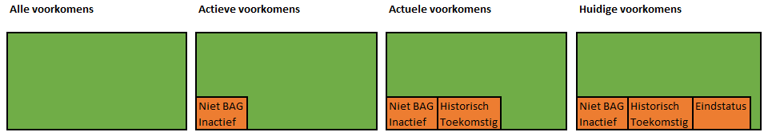

# Wat is het verschil tussen actieve voorkomens, actuele voorkomens en huidige voorkomens?

De levenscyclus van een object is in de BAG zichtbaar in de verschillende voorkomens van dat object. Voorkomens kunnen actief of niet actief ([‘niet BAG’ of ‘inactief’]({{-site.baseurl-}}/artikelen/hoe-ontstaan-niet-bag-en-inactieve-voorkomens)) zijn. Enkel de actieve voorkomens maken onderdeel uit van de geldige levenscyclus van het object.

De actieve (geldige) levenscyclus van een object kan uit zowel actuele als toekomstige en historische voorkomens bestaan. Er is op elk moment in de tijd slechts één geldig voorkomen. Een actueel voorkomen is het actieve voorkomen dat ‘nu’ geldig is. Actueel zegt niets over de status van een voorkomen.

Huidige voorkomens zijn vervolgens weer een deelverzameling van de actuele voorkomens. Het huidige voorkomen is een actueel voorkomen dat een status heeft dat aangeeft dat het object niet in historie geplaatst is.  In historie geplaatste statussen (eindstatussen) zijn: `naamgeving ingetrokken`, `woonplaats ingetrokken`, `plaats ingetrokken`, `niet gerealiseerd verblijfsobject`, `verblijfsobject ingetrokken`, `verblijfsobject ten onrechte opgevoerd`, `niet gerealiseerd pand`, `pand gesloopt` en `pand ten onrechte opgevoerd`.
 Met andere woorden: een huidig voorkomen is een actueel voorkomen zonder eindstatus.

Het onderscheid tussen de verschillende voorkomens wordt hieronder schematisch weergegeven. De oranje gekleurde vakken bevatten de voorkomens die niet tot de selectie behoren.

