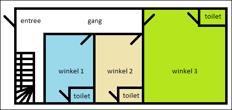
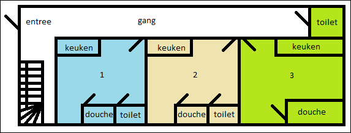
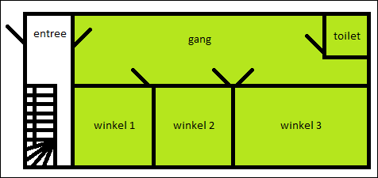
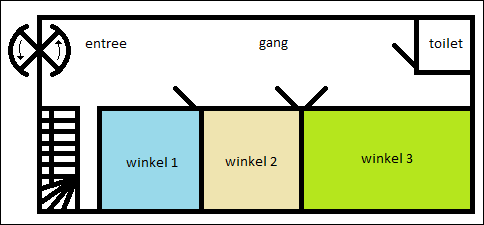

# Wat is het verschil tussen een exclusief ondersteunende voorziening, een gedeelde voorziening en een openbaar toegankelijke voorziening?

Voor verblijfsobjecten betekent _exclusief ondersteunend_ dat een ruimte of basisvoorziening slechts wordt gebruikt door één verblijfsobject. Als een af te bakenen verblijfsobject geen gebruik kan maken van een exclusief ondersteunende voorziening, maar wel van een _voorziening in een nabijgelegen openbaar toegankelijke binnenruimten_ (ofwel een openbaar toegankelijke voorziening), dan kan het zich alsnog als verblijfsobject kwalificeren.

Het kan ook voorkomen dat een af te bakenen verblijfsobject gebruik moet maken van een _gedeelde voorziening_. In dat geval kan er geen sprake zijn van separate verblijfsobjecten.

### Voorbeelden

---

#### Voorbeeld 1 - Exclusief ondersteunende voorziening
Een voorziening die exclusief door het verblijfsobject gebruikt wordt.

Deze winkels hebben elk een eigen toilet als exclusief ondersteunende voorziening. De ontsluiting van de winkels verloopt via de gang die als gedeelde verkeersruimte functioneert. Elke winkel is een apart verblijfsobject.

---

Het is mogelijk dat een exclusief ondersteunende voorziening zich buiten het verblijfsobject zelf bevindt, bijvoorbeeld in een gang dat als gedeelde verkeersruimte functioneert. In dat geval kan de voorziening worden meegenomen in de beoordeling van de functionele zelfstandigheid van het verblijfsobject. De voorziening hoort niet bij de geometrie van het verblijfsobject, de gebruiksoppervlakte wordt wél bij het verblijfsobject opgeteld.

In het geval van deze zelfstandige eenheden, heeft nummer 3 exclusief de beschikking over een toilet dat via de gang bereikbaar is. Het toilet kan daarmee worden meegenomen in de beoordeling van de functionele zelfstandigheid van dit verblijfsobject. Het toilet hoort niet bij de geometrie van het verblijfsobject, de gebruiksoppervlakte van het toilet telt echter wél mee bij het verblijfsobject.

---

#### Voorbeeld 2 - Gedeelde voorziening
Het gaat hier om een voorziening die niet exclusief gebruikt wordt door één verblijfsobject. Als meerdere af te bakenen verblijfsobjecten gebruik moeten maken van de voorziening, dan is er sprake van een gedeelde voorziening en kan er slechts sprake zijn van één verblijfsobject.

Deze winkels maken gebruik van dezelfde voorziening. De winkels vormen gezamenlijk een functioneel zelfstandige eenheid. Het gaat hier dan ook om één verblijfsobject.

---

#### Voorbeeld 3 - Openbaar toegankelijke voorziening
Als een af te bakenen verblijfsobject gebruik kan maken van een openbare voorziening, dan kwalificeert het zich als een verblijfsobject. Bij een openbare voorziening moet worden gedacht aan een voorziening waar iedereen gebruik van mag maken. Bijvoorbeeld bij een winkelcentrum: de voorziening is dan bereikbaar via (of eigenlijk onderdeel van) de gedeelde verkeersruimte. Je hebt dan weliswaar te maken met openingstijden, maar verder zijn er geen toegangsbeperkingen. Bij een kantoor is dat anders, omdat je daar niet zomaar naar binnen mag. Bij een openbaar kantoorgebouw, zoals een gemeente- of provinciehuis, mag dat overigens vaak weer wel.

Deze winkels zijn ontsloten via de gang die als gedeelde verkeersruimte functioneert. Het toilet zit in een nabijgelegen openbaar toegankelijke binnenruimte dat door alle winkels gebruikt kan worden. De winkels kunnen daarmee worden afgebakend als verschillende verblijfsobjecten.
