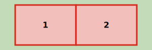
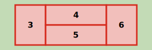
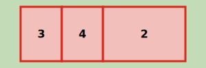

#  Wat is het verschil tussen een ingrijpende verbouwing, het splitsen van verblijfsobjecten en het samenvoegen van verblijfsobjecten?

Of er sprake is van een ingrijpende verbouwing, een splitsing of een samenvoeging hangt af van hoe de nieuwe verblijfsobjecten zich verhouden tot de oorspronkelijke verblijfsobjecten waaruit deze ontstaan. Bij een splitsing ontstaan nieuwe verblijfsobjecten uit één volledig verblijfsobject. Bij een ingrijpende verbouwing ontstaan de nieuwe verblijfsobjecten uit delen van oorspronkelijke verblijfsobjecten. Bij de samenvoeging van verblijfsobjecten ontstaat één verblijfsobject uit uitsluitend volledige oorspronkelijke verblijfsobjecten.

Het onderscheid tussen een ingrijpende verbouwing, het splitsen van verblijfsobjecten en het samenvoegen van verblijfsobjecten wordt hieronder schematisch weergegeven:

*Uitgangssituatie*

*Ingrijpende verbouwing*

*Samenvoegen van verblijfsobjecten*

*Splitsen van verblijfsobjecten*

