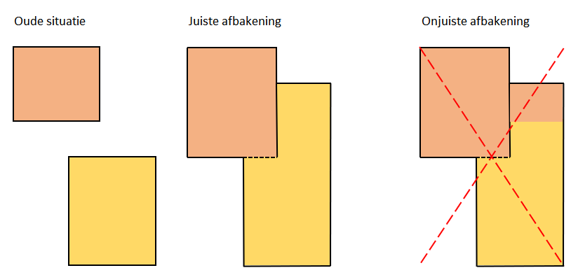
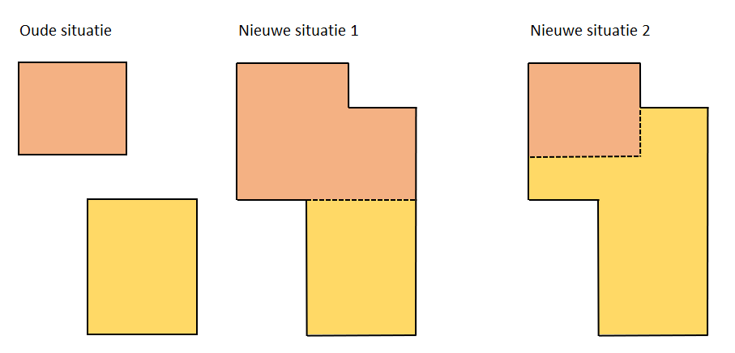

# Wat te doen met panden en verblijfsobjecten als twee panden worden samengevoegd of door een verbouwing aan elkaar komen te liggen?

## Panden
De definitie van pand spreekt van 'bij de totstandkoming'. In een dergelijke situatie waren bij de totstandkoming twee panden, dus het blijven voor de BAG ook twee panden. Vanzelfsprekend moet wel de geometrie van een van beide panden of van beide panden aangepast worden aan de nieuwe situatie. Het advies hierbij is om de oorspronkelijke geometrie van de oude situatie zoveel mogelijk te laten bestaan.
Wanneer in de nieuwe situatie een fysieke scheiding is geplaatst, ligt het voor de hand af te bakenen volgens de constructie. De fysieke scheiding komt dan terug in de pandafbakening. Het is niet de bedoeling de fysieke scheiding te negeren en de geometrie ‘netjes’ te verdelen over beide panden.

Wanneer er geen fysieke scheiding is geplaatst, ligt het voor de hand één van de bestaande panden uit te breiden en het andere pand intact te laten.

## Verblijfsobjecten
Wat de verblijfsobjecten betreft, moet de nieuwe situatie aan de hand van de [{{ site.catalogus_bag_label -}}]({{- site.baseurl -}}{{- site.catalogus_bag_url -}}){:target="blank"} beoordeeld worden. Mogelijk was voor de verbouwing sprake van twee verblijfsobjecten en blijven er ook na de verbouwing twee verblijfsobjecten. In dat geval wijzigt waarschijnlijk alleen de oppervlakte van een of beide verblijfsobjecten. Als de twee verblijfsobjecten worden samengevoegd tot één verblijfsobject, is de gebeurtenis ['Samenvoegen verblijfsobjecten']({{-site.baseurl-}}/gebeurtenissen/samenvoegen-verblijfsobjecten) van toepassing: de 'oude' verblijfsobjecten worden ingetrokken (met de bijbehorende adressen/nummeraanduidingen) en een nieuw verblijfsobject (met nieuw adres/nummeraanduiding) wordt opgevoerd. De pandrelatering van dit verblijfsobject verwijst naar beide panden. Of er was sprake van een hoofdgebouw (met verblijfsobject) en een bijgebouw (zonder verblijfsobject) en is ook na de verbouwing sprake van één verblijfsobject. In dat geval gaat het aangebouwde deel uitmaken van dat verblijfsobject en moet tenminste de oppervlakte gewijzigd worden. Tevens moet de pandrelatering van dat verblijfsobject dan naar beide panden gaan verwijzen. Een andere variant is het samenvoegen van twee bijgebouwen. Ook hier blijft sprake van twee panden, waarin al dan niet verblijfsobject(en) ontstaan.

