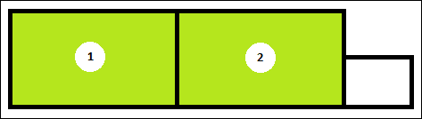
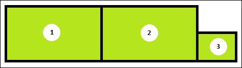
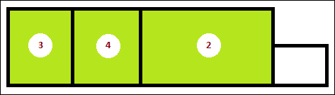

# Wat te doen wanneer er een extra verblijfsobject wordt toegevoegd aan een pand?

Het hangt van de situatie af hoe een verblijfsobject aan een pand moet worden toegevoegd. Het gaat om óf een splitsing van verblijfsobjecten óf het toevoegen van een verblijfsobject aan een pand óf het constateren van een nieuw object.

Hieronder wordt geschetst welke gebeurtenis wanneer gebruikt moet worden.

### Uitgangssituatie

---

###Toevoegen verblijfsobject aan pand/constatering nieuw object

Als het nieuwe verblijfsobject ontstaat in een gedeelte van een pand waarin zich nog geen verblijfsobject bevindt, wordt het verblijfsobject opgevoerd volgens de gebeurtenis ['Verblijfsobject toevoegen aan pand']({{-site.baseurl-}}/gebeurtenissen/verblijfsobject-toevoegen-aan-pand) of de gebeurtenis ['Constatering nieuw object']({{-site.baseurl-}}/gebeurtenissen/constatering-nieuw-object). Hierbij is het de bedoeling dat de gebeurtenis ['Verblijfsobject toevoegen aan pand']({{-site.baseurl-}}/gebeurtenissen/verblijfsobject-toevoegen-aan-pand) gebruikt wordt als het verblijfsobject op basis van een vergunning of ambtelijke verklaring (bij een bekende vergunningsvrije situatie) in de BAG wordt geregistreerd. Als er sprake is van het constateren van een mogelijk illegaal verblijfsobject is het de bedoeling de gebeurtenis ['Constatering nieuw object']({{-site.baseurl-}}/gebeurtenissen/constatering-nieuw-object) te gebruiken.

---

###Splitsen van een verblijfsobject

Als het nieuwe verblijfsobject ontstaat in een gedeelte van een pand waarin zich al wel een verblijfsobject bevindt, wordt het verblijfsobject opgevoerd volgens de gebeurtenis ['Splitsen verblijfsobject']({{-site.baseurl-}}/gebeurtenissen/splitsen-verblijfsobject). Als er sprake is van het constateren van een mogelijk illegaal verblijfsobject wordt het verblijfsobject (en de nummeraanduiding) op basis van een document van constatering in de BAG geregistreerd.
