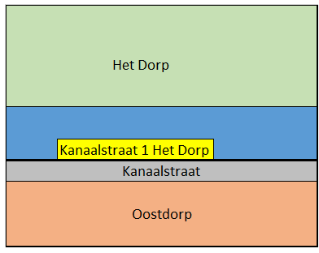

# Benoemen ligplaats

Naam gebeurtenis
: Benoemen ligplaats

Code gebeurtenis
: BGR-BSLLP

Beschrijving gebeurtenis
: Door de gemeente is een ligplaats(en) vastgesteld.

Betrokken objecttype
: LIGPLAATS en NUMMERAANDUIDING

Brondocument
: Het vaststellingsbesluit

Resultaat
: De ligplaats(en) is correct opgenomen in de BAG met de status `Plaats aangewezen`.

Voorbeeld 1
: Op de Crocussenlaan in Het Dorp wordt op 25/1/2017 een ligplaats vastgesteld middels een vaststellingsbesluit met kenmerk 89000. Aan deze ligplaats wordt het huisnummer 44 toegekend. Dit is vastgelegd in het huisnummerbesluit met nummer 55551.

Voorbeeld 2
: In Het Dorp wordt een ligplaats benoemd. Deze ligplaats wordt ontsloten via de Kanaalstraat in Oostdorp. Dit betekent dat de nummeraanduiding een directe woonplaats relatie krijgt met de Woonplaats Het Dorp zodat het adres Kanaalstraat 1, Het Dorp wordt.

