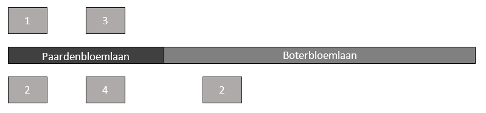
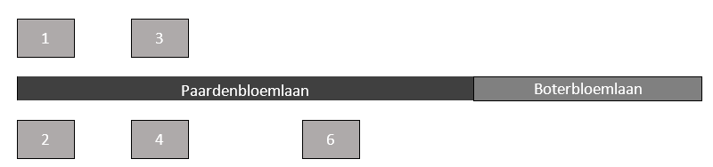

# Gedeeltelijk hernoemen openbare ruimte

Naam gebeurtenis
: Gedeeltelijk hernoemen openbare ruimte

Code gebeurtenis
: BRA-GHO

Beschrijving gebeurtenis
: Door de gemeente is aan een deel van een openbare ruimte een andere naam toegekend waarbij dit deel onderdeel wordt van een andere reeds bestaande openbare ruimte.

Betrokken objecttype
: OPENBARE RUIMTE en NUMMERAANDUIDING

Brondocument
: Het besluit tot het vaststellen van openbare ruimten (straatnaambesluit).

Resultaat
: De namen en de ID's van de betrokken openbare ruimten blijven bestaan in de BAG. De nummeraanduiding(en) dia aan de nieuwe openbare ruimte liggen worden hieraan gerelateerd.

Voorbeeld
: In Het Dorp wordt de Boterbloemlaan gedeeltelijk hernoemd tot Paardenbloemlaan. Een ander gedeelte blijft Boterbloemlaan heten. Gevolg is dat het verblijfsobject met adres Boterbloemlaan 2 nu adres Paardenbloemlaan 6 krijgt. Dit is vastgelegd in een besluit van 9 mei 2017 met nummer 1089.

Uitgangssituatie

Nieuwe situatie

