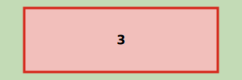

# Samenvoegen verblijfsobjecten

Naam gebeurtenis
: Samenvoegen verblijfsobjecten

Code gebeurtenis
: BGR-SSVSAMEN

Beschrijving gebeurtenis
: Als gevolg van verbouw worden één of meerdere verblijfsobjecten die als zodanig al zijn geregistreerd in de BAG samengevoegd. Deze gebeurtenis is alleen bedoeld voor fysiek bestaande verblijfsobjecten en niet voor vergunde verblijfsobjecten.

Betrokken objecttype
: PAND en VERBLIJFSOBJECT en NUMMERAANDUIDING

Brondocument
: De omgevingsvergunning, een samenvoegingsvergunning of een ambtelijke verklaring van een bevoegd ambtenaar en indien van toepassing het huisnummerbesluit (die desgewenst geïntegreerd deel kan uitmaken van de vergunning).

Resultaat
: Het verblijfsobject dat als gevolg van de verbouwing ontstaat is opgevoerd in de BAG met status `Verblijfsobject gevormd`. De bijbehorende nummeraanduiding is opgevoerd met status `Naamgeving uitgegeven`. Ook worden de nieuwe attribuutwaarden (bijvoorbeeld de te wijzigen geometrie) alvast in de BAG geregistreerd. De verblijfsobjecten die na de realisatie van de verbouwing ophouden te bestaan worden op het moment van vergunningverlening nog niet gemuteerd. Deze verblijfsobjecten worden via de gebeurtenis ['Verbouwing gereed']( https://imbag.github.io/praktijkhandleiding/gebeurtenissen/verbouwing-gereed) ingetrokken als de verbouwing gereed wordt gemeld.

Opmerkingen
: Als de samenvoeging een wijziging in één of meer attributen van het pand(en) met zich meebrengt wordt de pandstatus via de gebeurtenis ['Kleine verbouwing object']({{-site.baseurl-}}/gebeurtenissen/kleine-verbouwing-object) gewijzigd naar `Verbouwing pand`.
: Een schematisch figuur van het samenvoegen van verblijfsobjecten is hieronder weergegeven. Het figuur is opgesteld als bovenaanzicht van een pand.
>
: Uitgangssituatie
: 
>
: Samenvoegen van verblijfsobjecten
: 

Voorbeeld 1
: Op de Hyacintenlaan in Het Dorp worden de twee verblijfsobjecten met de huisnummers 10 en 12 op 31/3/2017 samengevoegd tot één nieuw verblijfsobject. Dit is vastgelegd in het dossier met nummer 64251. Het nieuwe verblijfsobject krijgt huisnummer 10 zoals is vastgesteld in het huisnummerbesluit met nummer 9058 van 31/3/2016.
: _Dit voorbeeld kent een vervolg in de gebeurtenis ['Melding of waarneming afzien van verbouwing']({{-site.baseurl-}}/gebeurtenissen/melding-of-waarneming-afzien-van-verbouwing)._

Voorbeeld 2
: De muur tussen de twee winkels met nummer 40 en 42 aan de hyacintenlaan wordt doorgebroken. De twee bestaande verblijfsobjecten worden samengevoegd tot één verblijfsobject. De oorspronkelijke panden blijven bestaan. Het nieuwe verblijfsobject wordt gerelateerd aan beide panden en krijgt huisnummer 40.
