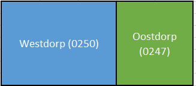
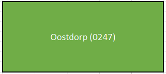

# Samenvoegen woonplaatsen

Naam gebeurtenis
: Samenvoegen woonplaatsen

Code gebeurtenis
: BRA-SAW

Beschrijving gebeurtenis
: Twee woonplaatsen worden samengevoegd tot één nieuwe woonplaats.

Betrokken objecttype
: WOONPLAATS, NUMMERAANDUIDING en OPENBARE RUIMTE

Brondocument
: Het woonplaatsbesluit

Resultaat
: Van één van de woonplaatsen wordt de geometrie aangepast. De woonplaats die ophoudt te bestaan krijgt de status `Woonplaats ingetrokken`. De openbare ruimten in de laatstgenoemde woonplaats verwijzen naar de andere woonplaats. Er worden mogelijkerwijs nieuwe postcodes toegekend aan de nummeraanduidingen van de adresseerbare objecten die gelegen zijn in de woonplaats die ophoudt te bestaan.

Opmerkingen
: Het identificerende nummer van de woonplaats blijft ook ongewijzigd als de samengevoegde woonplaats een andere naam krijgt. Het hernoemen van de woonplaats wordt in dat geval als afzonderlijke gebeurtenis in de BAG geregistreerd na de samenvoeging.
: Een woonplaats kan alleen worden ingetrokken als er geen enkele nummeraanduiding of openbare ruimte is, die verwijst naar deze woonplaats.
: Bovendien moet het gemeentelijk grondgebied gemeentedekkend opgedeeld zijn in woonplaatsen. Het intrekken van een nieuwe woonplaats kan daarom alleen plaatsvinden bij gebiedsvermindering of bij wijzigingen in de begrenzingen van andere woonplaatsen binnen de gemeente.

Voorbeeld
: Woonplaats Oostdorp en de woonplaats Westdorp worden samengevoegd omdat er in woonplaats Westdorp tegen de verwachting in nooit iemand is gaan wonen. Woonplaats Westdorp wordt daarom ingetrokken in de BAG. De geometrie van woonplaats Oostdorp wordt aangepast. Omdat er geen objecten in woonplaats Westdorp liggen, zijn er verder geen BAG-mutaties.

Uitgangssituatie

Nieuwe situatie

