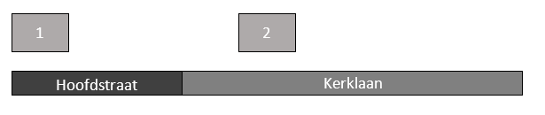
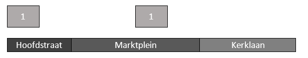

# Splitsen van een openbare ruimte

Naam gebeurtenis
: Splitsen van een openbare ruimte

Code gebeurtenis
: BRA-SOR

Beschrijving gebeurtenis
: Door de gemeente is aan een deel van een openbare ruimte een andere naam toegekend. Het afgesplitste deel wordt een nieuwe openbare ruimte die nog niet bestond in de BAG.

Betrokken objecttype
: (OPENBARE RUIMTE) en NUMMERAANDUIDING

Brondocument
: Het besluit tot het vaststellen van openbare ruimten (straatnaambesluit).

Resultaat
: De oorspronkelijke openbare ruimte(n) worden niet gemuteerd in de BAG, omdat er geen gegeven wijzigt dat deel uitmaakt van de BAG registratie. Het afgesplitste deel wordt als nieuwe openbare ruimte opgevoerd in de BAG. Van de nummeraanduiding(en) aan het afgesplitste gedeelte is de verwijzing naar de openbare ruimte gewijzigd. Als er nummeraanduidingen met een postcode veranderen van openbare ruimte, moet bij PostNL worden nagevraagd of de wijziging leidt tot een aanpassing van de postcode in de BAG.

Voorbeeld
: Delen van de Kerklaan (B) en de Hoofdstraat (A) worden op 9 mei 2017 afgesplitst. Deze delen gaan tezamen op in de nieuwe openbare ruimte Marktplein (D). Dit is vastgelegd in het besluit met nummer 2345. Het café gelegen aan de Kerklaan 2 krijgt als nieuw adres Marktplein 1. Dit is vastgelegd in besluit 98761-2.

Uitgangssituatie

Nieuwe situatie

