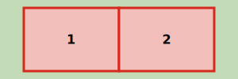
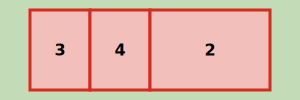

# Splitsen verblijfsobject

Naam gebeurtenis
: Splitsen verblijfsobject

Code gebeurtenis
: BGR-SSVSPLITS

Beschrijving gebeurtenis
: Als gevolg van verbouw worden één of meerdere verblijfsobjecten die als zodanig al zijn geregistreerd in de BAG gesplitst. Deze gebeurtenis is alleen bedoeld voor fysiek bestaande verblijfsobjecten en niet voor vergunde verblijfsobjecten.

Betrokken objecttype
: PAND en VERBLIJFSOBJECT en NUMMERAANDUIDING

Brondocument
: De omgevingsvergunning, een splitsingsvergunning of een ambtelijke verklaring van een bevoegd ambtenaar en indien van toepassing het huisnummerbesluit (die desgewenst geïntegreerd deel kan uitmaken van de vergunning).

Resultaat
: Verblijfsobjecten die als gevolg van de verbouwing ontstaan zijn opgevoerd in de BAG met status `Verblijfsobject gevormd`. De bijbehorende nummeraanduidingen zijn opgevoerd met status `Naamgeving uitgegeven`. Indien van toepassing wordt de pandstatus gewijzigd naar `Verbouwing pand`. Ook worden de nieuwe attribuutwaarden (bijvoorbeeld de te wijzigen geometrie) alvast in de BAG geregistreerd. De verblijfsobjecten die na de realisatie van de verbouwing ophouden te bestaan worden op het moment van vergunningverlening nog niet gemuteerd. Deze verblijfsobjecten worden via de gebeurtenis ['Verbouwing gereed']( https://imbag.github.io/praktijkhandleiding/gebeurtenissen/verbouwing-gereed) ingetrokken als de verbouwing gereed wordt gemeld.

Opmerkingen
: Een schematisch figuur van het splitsen van verblijfsobjecten is hieronder weergegeven. Het figuur is opgesteld als bovenaanzicht van een pand.
>
: Uitgangssituatie
: 
>
: Splitsen van verblijfsobjecten
: 

Voorbeeld
: Op de Crocussenlaan in Het Dorp wordt het verblijfsobject met huisnummer 4 gesplitst in twee nieuwe verblijfsobjecten. Dit is vastgelegd in splitsingsvergunning met nummer 64244. De nieuwe verblijfsobjecten krijgen de huisnummers 4 en 4A zoals in vastgelegd in het huisnummerbesluit met nummer 6289 van 31/3/2017.
: _Dit voorbeeld kent een vervolg in de gebeurtenis ['Melding of waarneming afzien van verbouwing']({{-site.baseurl-}}/gebeurtenissen/melding-of-waarneming-afzien-van-verbouwing)._
