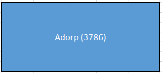
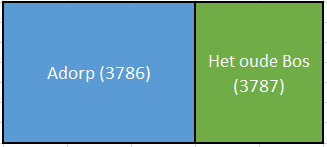

# Splitsen woonplaats

Naam gebeurtenis
: Splitsen woonplaats

Code gebeurtenis
: BRA-SPW

Beschrijving gebeurtenis
: Een gedeelte van een woonplaats wordt afgesplitst en bestaat daarna als nieuwe (nog niet bestaande) woonplaats (waardoor het aantal woonplaatsen in de BAG toeneemt).

Betrokken objecttype
: WOONPLAATS, NUMMERAANDUIDING en OPENBARE RUIMTE

Brondocument
: Het woonplaatsbesluit

Resultaat
: De nieuwe woonplaats wordt opgevoerd met een nieuw ID. Van de bestaande woonplaats wordt de geometrie aangepast maar blijft het ID behouden. De openbare ruimten in het afgesplitste gebied verwijzen naar de nieuwe woonplaats. Er worden nieuwe postcodes toegekend aan de nummeraanduidingen van de adresseerbare objecten die gelegen zijn aan deze openbare ruimten.

Voorbeeld
: De gemeente besluit een stuk bos van de woonplaats Adorp als aparte woonplaats te benoemen. Deze nieuwe woonplaats ontstaat met een nieuw ID en de naam Het oude bos. Het aantal woonplaatsen in de BAG neemt hierdoor toe. In het Het oude bos bevinden zich geen BAG-objecten. Dit betekent dat er geen objecten overgehangen hoeven te worden. Van woonplaats Adorp wordt de geometrie aangepast.

Uitgangssituatie

Nieuwe situatie

