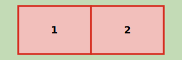

# Verlenen bouwvergunning ingrijpende verbouwing

Naam gebeurtenis
: Verlenen bouwvergunning ingrijpende verbouwing

Code gebeurtenis
: BGR-VBI

Beschrijving gebeurtenis
: De gemeente verleent een vergunning voor het uitvoeren van een ingrijpende verbouwing. Onder een ingrijpende verbouwing wordt een verbouwing verstaan waarbij een wijziging optreedt in het onderscheiden van verblijfsobjecten: er worden als gevolg van de verbouwing één of meer nieuwe verblijfsobjecten opgevoerd. Deze gebeurtenis is alleen bedoeld voor fysiek bestaande verblijfsobjecten en niet voor vergunde verblijfsobjecten.

Betrokken objecttype
: PAND en VERBLIJFSOBJECT en NUMMERAANDUIDING

Brondocument
: De omgevingsvergunning en indien van toepassing het huisnummerbesluit (die desgewenst geïntegreerd deel kan uitmaken van de vergunning).

Resultaat
: De verblijfsobjecten die als gevolg van de verbouwing ontstaan zijn opgevoerd in de BAG met status `Verblijfsobject gevormd`. De bijbehorende nummeraanduidingen zijn opgevoerd met status `Naamgeving uitgegeven`. Ook worden de nieuwe attribuutwaarden (bijvoorbeeld de te wijzigen geometrie) alvast in de BAG geregistreerd. De verblijfsobjecten die na de realisatie van de verbouwing ophouden te bestaan worden op het moment van vergunningverlening nog niet gemuteerd. Deze verblijfsobjecten worden via de gebeurtenis ['Verbouwing gereed']( https://imbag.github.io/praktijkhandleiding/gebeurtenissen/verbouwing-gereed) ingetrokken als de verbouwing gereed wordt gemeld.

Opmerkingen
: Als de verbouwing een wijziging in één of meer attributen van het pand met zich meebrengt wordt de pandstatus via de gebeurtenis ['Kleine verbouwing object']({{-site.baseurl-}}/gebeurtenissen/kleine-verbouwing-object) gewijzigd naar `Verbouwing pand`.
: Een schematisch figuur van een ingrijpende verbouwing is hieronder weergegeven. Het figuur is opgesteld als bovenaanzicht van een pand.
>
: Uitgangssituatie
: 
>
: Ingrijpende verbouwing
: 

Voorbeeld
: Op de Hyacintenlaan in Het Dorp wordt voor het pand met twee verblijfsobjecten met huisnummers 16 en 16 a op 31/3/2017 een omgevingsvergunning verleend (met dossiernummer 64243). Het pand wordt van binnen ingrijpend gewijzigd en omgebouwd tot vier zelfstandige appartementen. De appartementen krijgen de huisnummers 16, 16A, 16B en 16C. Het pand zelf ondergaat geen wijzigingen.
