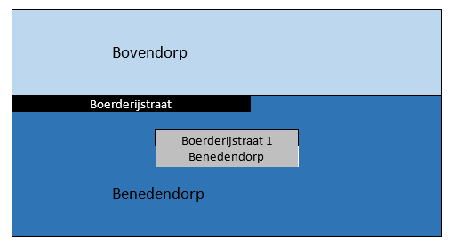
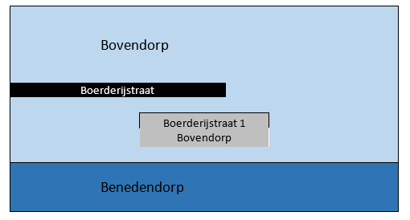

# Wijzigen woonplaatsgrens

Naam gebeurtenis
: Wijzigen grens woonplaats

Code gebeurtenis
: BRA-WGW

Beschrijving gebeurtenis
: Door de gemeente wordt besloten de grens tussen twee woonplaatsen te wijzigen. In het betrokken gebied liggen al dan niet één of meer panden, verblijfsobjecten, standplaatsen, ligplaatsen of openbare ruimten.

Betrokken objecttype
: WOONPLAATS, NUMMERAANDUIDING en OPENBARE RUIMTE

Brondocument
: Het woonplaatsbesluit

Resultaat
: De geometrie van de woonplaatsen is gewijzigd. De betrokken objecten verwijzen naar de woonplaats waarin deze zijn komen te liggen. Er wordt een nieuwe postcode toegekend aan de nummeraanduiding(en) die van woonplaats zijn veranderd. Als door de wijziging een deel van een openbare ruimte in een andere woonplaats komt te liggen, is het mogelijk dat ook de volgende gebeurtenissen van toepassing zijn:
- ['Gedeeltelijk hernoemen openbare ruimte']({{-site.baseurl-}}/gebeurtenissen/gedeeltelijk-hernoemen-openbare-ruimte)
- ['Het verlengen, inkorten of verleggen openbare ruimte']({{-site.baseurl-}}/gebeurtenissen/het-verlengen,-inkorten-of-verleggen-openbare-ruimte)
- ['Splitsen van een openbare ruimte']({{-site.baseurl-}}/gebeurtenissen/splitsen-van-een-openbare-ruimte)

Voorbeeld
: In verband met het aanleggen van een snelweg wordt de grens tussen twee woonplaatsen aangepast. Een deel van de woonplaats Benedendorp wordt bij Bovendorp getrokken. De geometrie van beide woonplaatsen wordt aangepast in de BAG. De in dit gebied gelegen Boerderijstraat waaraan een boerderij met het adres Boerderijstraat 1 Benedendorp is gelegen, komt hierdoor in woonplaats Bovendorp te liggen. Omdat de gehele openbare ruimte in Bovendorp komt te liggen, wordt de Boerderijstraat overgehangen naar woonplaats Bovendorp. Hierdoor verandert het adres van de boerderij automatisch naar Bovendorp. Omdat het object in een andere woonplaats komt te liggen wordt door PostNL een andere postcode toegekend aan het object. Deze gewijzigde postcode wordt in de BAG geregistreerd. Het verblijfsobject en het pand worden niet gemuteerd.

Uitgangssituatie

Nieuwe situatie

