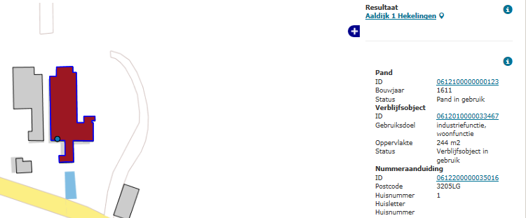
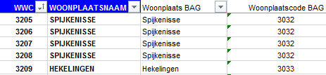

# 4-cijferige postcode in verkeerde woonplaats volgens PostNL (NPW)

PostNL:

BAG:

## Wat wordt er gerapporteerd?

Het woonplaatsbeginsel (zoals is beschreven in artikel 2.4 in het [Convenant inzake postcodes](http://www.geobasisregistraties.nl/basisregistraties/documenten/convenant/2014/02/20/index){:target="_blank" rel="noreferrer"}) is leidend in het postcodesysteem. Dat wil zeggen dat postcodes uniek zijn per woonplaats. In deze analyse hebben we de 4-cijferige codes die per wijk en woonplaats bekend zijn bij PostNL vergeleken met de BAG. In de rapportage staan de postcodes die ten onrechte in een andere woonplaats voorkomen dan bekend is bij PostNL.

## Hoe kan het resultaat gecorrigeerd worden?

Controleer de postcode met het postcode bericht van PostNL. Als de postcode klopt volgens het bericht, verzoeken we u een nieuwe postcode aan te vragen bij PostNL.

## Hoe kan het resultaat worden voorkomen?

Bij gemeente- en woonplaatsgrenswijzigingen vraagt u een nieuwe postcode aan bij PostNL, zoals beschreven staat in het [Convenant inzake postcodes](http://www.geobasisregistraties.nl/basisregistraties/documenten/convenant/2014/02/20/index){:target="_blank" rel="noreferrer"}. Een speciale situatie doet zich voor als een pand met verblijfsobject in woonplaats A ligt, maar wordt ontsloten door een openbare ruimte in woonplaats B. De nummeraanduiding krijgt dan een postcode uit woonplaats A. Zie voor een uitgebreide uitleg het artikel ['Hoe wordt het in de BAG geregistreerd als een verblijfsobject in een andere woonplaats of gemeente ligt dan de bijbehorende openbare ruimte?']({{-site.baseurl-}}/artikelen/hoe-wordt-het-in-de-bag-geregistreerd-als-een-verblijfsobject-in-een-andere-woonplaats-of-gemeente-ligt-dan-de-bijbehorende-openbare-ruimte)
