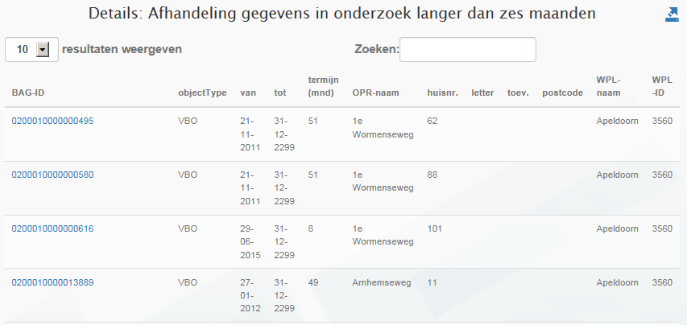

# Afhandeling gegevens in onderzoek langer dan zes maanden (VIL)

## Wat wordt er gerapporteerd?

De wet BAG schrijft voor dat een onderzoek naar de juistheid van een bepaald gegeven binnen zes maanden afgerond moet zijn. Deze rapportage geeft de objecten weer waarvan deze onderzoekstermijn is verstreken. In de rapportage worden objecten getoond waarvan het onderzoek in de afgelopen periode te laat is afgerond én objecten waarvan het onderzoek al langer dan zes maanden loopt en nog níet is afgerond. Bij het bepalen van de termijn worden de tijdvakken van aaneengesloten voorkomens met de indicatie 'in onderzoek' bij elkaar opgeteld. De objecten waarvan het onderzoek nog niet is afgerond zijn te herkennen aan de tot datum 31-12-2299 (deze objecten hebben in de BAG feitelijk geen einddatum).

## Hoe kan het resultaat gecorrigeerd worden?

De resultaten kunnen voor objecten waarvan het onderzoek nog niet is afgerond gecorrigeerd worden door het onderzoek alsnog af te ronden. Omdat het onderzoek in dat geval wel te laat is afgerond zal het object nog één keer worden gerapporteerd in de volgende rapportage. Daarna zal het object dan niet meer voorkomen in de rapportage. Objecten waarvan het onderzoek blijvend niet wordt afgerond, zullen steeds opnieuw worden getoond in de rapportage.

## Hoe kan het resultaat worden voorkomen?

Het resultaat kan voorkomen worden door onderzoeken binnen zes maanden af te ronden. Het kan zijn dat het hiervoor nodig is dat binnengemeentelijke processen die zich buiten de BAG afspelen geoptimaliseerd moeten worden.
