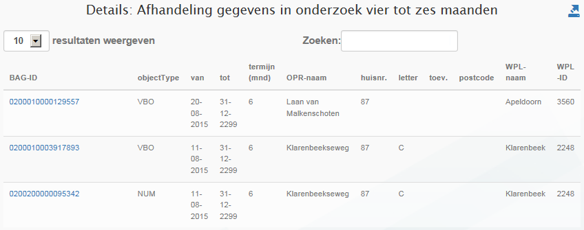

# Afhandeling gegevens in onderzoek vier tot zes maanden (VIK)

## Wat wordt er gerapporteerd?

Deze rapportage geeft aan welke objecten vier tot zes maanden in onderzoek staan. Hierbij worden de tijdvakken van aaneengesloten voorkomens met deze indicatie bij elkaar op geteld. De onderzoekstermijn van deze objecten dreigt te verlopen. Deze rapportage stelt de gemeente in staat actie te ondernemen zodat het onderzoek alsnog tijdig afgerond kan worden.

## Hoe kan het resultaat gecorrigeerd worden?

Deze rapportage geeft situaties weer die nog binnen de wettelijke termijn vallen. Er is daarom nog geen sprake van objecten die gecorrigeerd moeten worden.

## Hoe kan een resultaat worden voorkomen?

U kunt voorkomen dat het object uiteindelijk als te laat wordt gerapporteerd door het onderzoek tijdig af te ronden.
