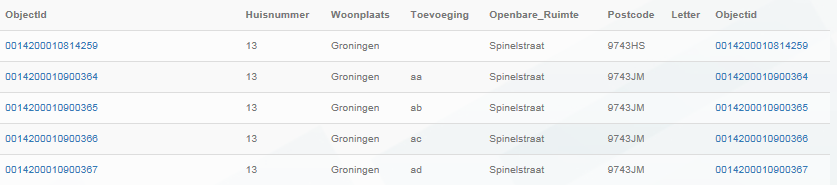

# Afwijkende postcode-huisnummercombinatie (NPH)

## Wat wordt er gerapporteerd?

De postcode-huisnummer combinatie zou uniek moeten zijn. Maar er komen postcode-huisnummer-huisletter/huisnummertoevoegingen combinaties voor waarbij het huisnummer hetzelfde is maar de postcodes verschillen.

In de detailgegevens worden _alle_ objecten weergegeven in dezelfde openbare ruimte met de afwijkende postcode-huisnummercombinatie. We hebben hiervoor gekozen omdat dit duidelijk maakt waar het verkeerd gaat en de gehele reeks niet meer als unieke sleutel te gebruiken is. Dit betekent niet dat alle objecten fout zijn. Vaak is er één afwijkend object dat ervoor zorgt dat de reeks wordt gerapporteerd. Als dit ene foute object wordt aangepast, wordt de gehele reeks in een volgende rapportage niet meer getoond.

## Hoe kan het resultaat gecorrigeerd worden?

Het resultaat kan gecorrigeerd worden door de postcode met het brondocument (het bericht van PostNL) te vergelijken en de postcode aan te passen volgens de gebeurtenis ['Hernummeren adresseerbaar object']({{-site.baseurl-}}/gebeurtenissen/hernummeren-adresseerbaar-object). In het geval van adresseerbare objecten zonder eigen postaal afgiftepunt verzoeken wij u volgens het nieuwe [Conventant inzake postcodes](http://www.geobasisregistraties.nl/basisregistraties/documenten/convenant/2014/02/20/index){:target="_blank" rel="noreferrer"} te werken.

## Hoe kan het resultaat worden voorkomen?

Het resultaat kan worden voorkomen door de postcode uit het bericht van PostNL juist over te nemen en ervoor te zorgen dat alle huisnummer-huisnummertoevoeging combinaties met hetzelfde huisnummer dezelfde postcode krijgen.
