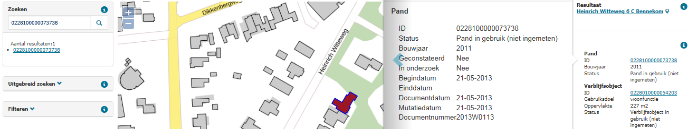

# Bouwjaar en datum gereedmelding verschillen (BDI)

## Wat wordt er gerapporteerd?

Het actuele bouwjaar verschilt met de datum waarop de pandstatus voor de eerste keer is omgezet van `Bouw gestart` naar `Pand in gebruik (niet ingemeten)` of `Pand in gebruik`. Dit zou het moment moeten zijn dat de bouw gereed is en daarmee wordt ook het bouwjaar vastgesteld.

Als de pandstatus `Bouw gestart` meer dan 1 keer voorkomt in de levencyclus van een pand, kan dit wijzen op een verkeerde registratie van de gebeurtenis ['Kleine verbouwing object']({{-site.baseurl-}}/gebeurtenissen/kleine-verbouwing-object).

## Hoe kan het resultaat gecorrigeerd worden?

Het resultaat kan worden gecorrigeerd door het bouwjaar te controleren en aan te passen.

## Hoe kan het resultaat worden voorkomen?

Het resultaat kan worden voorkomen door correcte bouwjaren en statussen op te voeren en door de gebeurtenis ['Kleine verbouwing object']({{-site.baseurl-}}/gebeurtenissen/kleine-verbouwing-object) correct te registreren.
