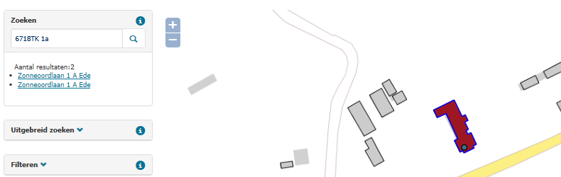

# Identieke postcode huisnummer – openbare ruimte combinatie (PHO)

## Wat wordt er gerapporteerd?

Identieke adressen zijn opvallend. Om te voorkomen dat toegestane situaties waarin sloop en nieuwbouw tegelijkertijd plaatsvinden worden geteld, rapporteren we verblijfsobjecten met de status `Verblijfsobject gevormd` alleen als de ingangsdatum van deze verblijfsobjecten ouder dan twee jaar is.

Objecten waarbij de huisletter of toevoeging identiek is, maar in een verschillend veld staat, worden gezien als objecten met identieke adressen. Bijv. huisnummer 434 H: in het ene voorkomen staat de `H` in het huisletterveld en bij het tweede voorkomen staat de `H` in het huisnummertoevoegingenveld.

## Hoe kan het resultaat gecorrigeerd worden?

Als blijkt dat één van de adressen ingetrokken kan worden omdat de sloop is afgerond, dan kan de situatie hersteld worden door dat object in te trekken. De situatie kan ook zijn ontstaan doordat een toevoeging onterecht niet in de BAG is opgenomen. Door alsnog een toevoeging op te nemen, ontstaan er twee verschillende adressen.

## Hoe kan het resultaat worden voorkomen?

Het resultaat kan worden voorkomen door typefouten te voorkomen en door de juiste statussen toe te kennen aan verblijfsobjecten. Trek verblijfsobjecten in wanneer bij nieuwbouw, verbouwing of splitsing een verblijfsobject verdwijnt, zodat deze niet naast het nieuwe verblijfsobject blijft bestaan. Verblijfsobjecten die ontstaan bij een ingrijpende verbouwing, splitsing of samenvoeging krijgen de status `Verblijfsobject gevormd` wanneer de vergunning wordt verleend.
