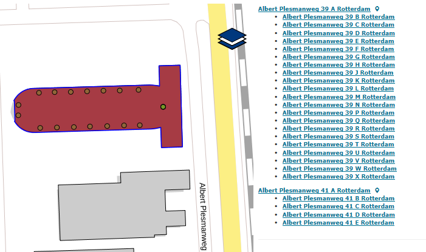

# Nevenadressen voor mogelijk niet relevante ingangen (NNO)

## Wat wordt er gerapporteerd?

Gerapporteerd worden nevenadressen die mogelijk zijn toegekend aan niet relevante toegangen. Er wordt in principe aan elk adresseerbaar object slechts één adres toegekend. Een nevenadres mag alleen worden toegekend wanneer er _meerdere relevante toegangen_ zijn en een toegang _een wezenlijke betekenis_ heeft bij het aanduiden van het object, zoals een leveranciersingang. Daarbij geldt dat een nevenadres een eigenschap is van hetzelfde adresseerbaar object als het bijbehorende hoofdadres. Met het nevenadres wordt expliciet niet een bepaald gedeelte van een adresseerbaar object aangeduid.
Nevenadressen die gerelateerd zijn aan dezelfde openbare ruimte als het hoofdadres zijn qua locatie niet te onderscheiden van het hoofdadres omdat beide adressen zijn gerelateerd aan hetzelfde verblijfsobject en dus exact dezelfde locatie hebben in de BAG.

## Hoe kan het resultaat gecorrigeerd worden?

We verzoeken u de gerapporteerde nevenadressen na te lopen en in te trekken als er geen sprake is van een relevante toegang met een wezenlijke betekenis.
Een andere mogelijkheid is dat er toch sprake is van meerdere verblijfsobjecten. Het nevenadres wordt dan ingetrokken en opnieuw opgevoerd als hoofdadres bij een nieuw verblijfsobject.

## Hoe kan het resultaat worden voorkomen?

Het resultaat kan worden voorkomen door nevenadressen niet te gebruiken om ruimten in een pand een adres te geven. Alleen als deze ruimten voldoen aan de definitie van verblijfsobject krijgen ze een (hoofd)adres.
