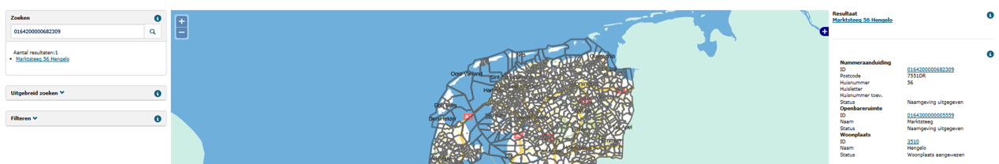

# Nummeraanduidingen zonder adresseerbaar object (NZA)

## Wat wordt er gerapporteerd?

Een nummeraanduiding mag niet bestaan zonder bijbehorend adresseerbaar object in de BAG.

## Hoe kan het resultaat gecorrigeerd worden?

Het resultaat kan gecorrigeerd worden door de nummeraanduiding in te trekken via een enkelvoudige mutatie. De LV staat toe dat nummeraanduidingen ingetrokken kunnen worden zonder dat er een verblijfsobject wordt ingetrokken.

## Hoe kan het resultaat worden voorkomen?

Dit resultaat kan voor hoofdadressen niet meer voorkomen in de LV BAG omdat nummeraanduidingen en verblijfsobjecten alleen gezamenlijk opgevoerd mogen worden. Bij verblijfsobjecten met nevenadressen is het belangrijk om deze nevenadressen niet te vergeten te vermelden in de nieuwe situatie bij het muteren van het verblijfsobject.
