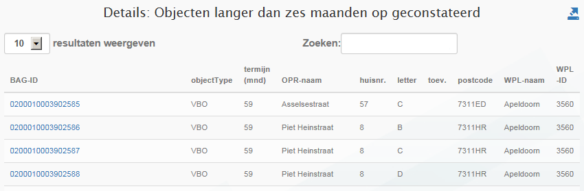

# Objecten langer dan zes maanden op geconstateerd (AGL)

## Wat wordt er gerapporteerd?

Deze rapportage geeft aan welke objecten langer dan zes maanden met de indicatie geconstateerd in de BAG staan. Hierbij worden de tijdvakken van aaneengesloten voorkomens met deze indicatie bij elkaar op geteld. Hoewel de wet BAG niet voorschrijft wat de maximale termijn is voor de indicatie geconstateerd, is het niet wenselijk dat objecten lang als geconstateerd in de BAG zijn. De indicatie geconstateerd wijst op een mogelijk illegale situatie. In deze situaties is het wenselijk dat er handhavend of formaliserend wordt opgetreden.

## Hoe kan het resultaat gecorrigeerd worden?

U kunt deze resultaten corrigeren door formaliserend of handhavend op te treden waardoor deze objecten niet meer als geconstateerd in de BAG staan.

## Hoe kan een resultaat worden voorkomen?
U kunt voorkomen dat objecten in deze rapportage voorkomen door ervoor te zorgen dat objecten maximaal zes maanden de indicatie geconstateerd hebben.
