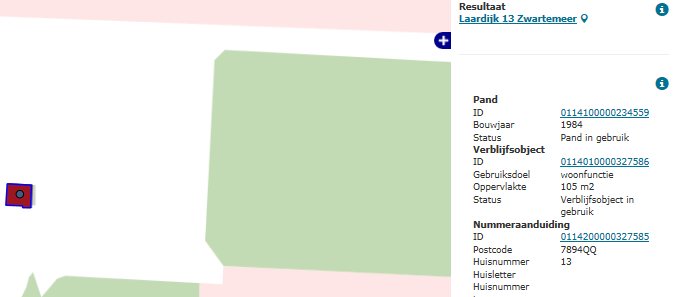

# Ongeldige postcodes volgens PostNL (NPO)

## Wat wordt er gerapporteerd?

PostNL geeft de postcodes uit. In deze rapportage staan postcodes uit de BAG waarvan PostNL heeft aangegeven dat ze ongeldig zijn, omdat deze niet zijn uitgegeven door PostNL.

De postcodes worden gecontroleerd door PostNL. Dit gebeurt aan de hand van een maandelijks extract. Door dit proces kan het gebeuren dat een gerapporteerde postcode nog eenmaal wordt gerapporteerd in de volgende rapportage. Daarna zal de postcode dan niet meer worden gerapporteerd.

In bepaalde situaties kan PostNL een "ambtshalve" postcode toekennen. De gemeente is verplicht deze postcode op te nemen in de BAG. PostNL is de bronhouder van de postcode en het bericht waarin PostNL een postcode toekent is een brondocument dat in de BAG moet worden geregistreerd. Dit kunnen ook verblijfsobjecten zijn met het gebruiksdoel `Overige gebruiksfunctie`.

Sinds november 2016 worden ongeldige postcodes van verblijfsobjecten met het gebruiksdoel `Overige gebruiksfunctie` ook gerapporteerd.

## Hoe kan het resultaat gecorrigeerd worden?

Controleer de postcode met het bericht van PostNL, misschien is er sprake van een typefout. U kunt dit eventueel verifiëren met uw PostNL contactpersoon. U kunt de postcode dan aanpassen.
Als de postcode wel overeenkomt met het bericht van PostNL, verzoeken wij u contact op te nemen met PostNL en het bericht op te sturen. Als u geen bericht heeft, verzoeken we u om een postcode aan te vragen bij PostNL. Ook als een nummeraanduiding ooit is ingetrokken maar het huisnummer opnieuw is gebruikt voor een andere nummeraanduiding, dient u een nieuwe postcode aan te vragen.

Verblijfsobjecten met gebruiksdoel `Overige gebruiksfunctie` krijgen geen postcode, tenzij deze ambtshalve zijn toegekend door PostNL. Als er verblijfsobjecten met gebruiksdoel `Overige gebruiksfunctie` in bovengenoemd tabblad staan, verzoeken we u om deze postcode te verwijderen of het gebruiksdoel te corrigeren (behalve als de postcode ambtshalve is toegekend door PostNL). Om de aanvraag te versnellen adviseert PostNL om de volgende zaken mee te sturen: huisnummerbesluit, situatietekening en gebruiksdoel.

## Hoe kan het resultaat worden voorkomen?

Voorkom typefouten en vraag altijd een postcode aan bij een nieuwe nummeraanduiding, zoals beschreven staat in het [Convenant inzake postcodes](http://www.geobasisregistraties.nl/basisregistraties/documenten/convenant/2014/02/20/index){:target="_blank" rel="noreferrer"}.
