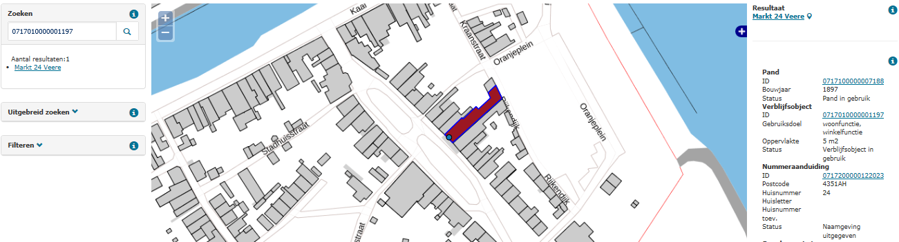

# Opvallende gebruiksoppervlakte ten opzichte van het gebruiksdoel (GOW)

## Wat wordt er gerapporteerd?

Deze rapportage signaleert verblijfsobjecten waarvan de gebruiksoppervlakte in relatie tot het gebruiksdoel opvallend is. De gerapporteerde verblijfsobjecten hebben de status `In gebruik` of de status `Buiten gebruik` (bij deze statussen is de gebruiksoppervlakte definitief vastgesteld). Deze verblijfsobjecten worden gerapporteerd als:

- een verblijfsobject, met niet uitsluitend het gebruiksdoel `Overige gebruiksfunctie`, een gebruiksoppervlakte heeft van minder dan 10 m²;
- een verblijfsobject de waarden `999`, `9999`, `99999` of `999999` m² als gebruiksoppervlakte heeft;
- een verblijfsobject, met uitsluitend het gebruiksdoel `Woonfunctie`, een gebruiksoppervlakte van meer dan 2700 m² heeft.

## Hoe kan het resultaat gecorrigeerd worden?

Controleer of het gebruiksdoel overeenkomt met het vergunde gebruiksdoel en of het gebruiksoppervlak klopt. We verzoeken u deze gegevens te corrigeren zoals beschreven in de gebeurtenis ['Correctie naar aanleiding van signalering']({{-site.baseurl-}}/gebeurtenissen/correctie-naar-aanleiding-van-signalering). Bij een klein oppervlak verzoeken we u te controleren of het verblijfsobject voldoet aan de definitie. Als dit niet het geval blijkt, kunt u een verblijfsobject eventueel intrekken conform de gebeurtenis ['Archivering bestaand object na constatering']({{-site.baseurl-}}/gebeurtenissen/archivering-bestaand-object-na-constatering).

## Hoe kan het resultaat worden voorkomen?

Deze constateringen kunnen voorkomen worden door de juiste gebruiksdoelen en gebruiksoppervlakten te registreren, en verblijfsobjecten volgens de wettelijke definitie afbakenen.
