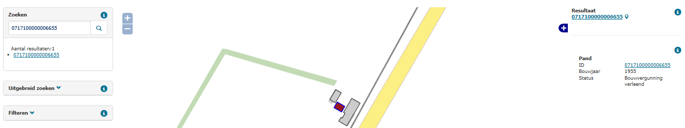

## Panden met een bouwjaar van meer dan vijf jaar oud met status `bouwvergunning verleend` of `bouw gestart` (PBL)

### Wat wordt er gerapporteerd?

Deze rapportage signaleert panden waarvan het gereedmelden opvallend lang op zich laat wachten. Er wordt gekeken naar panden met een bouwjaar dat meer dan 5 jaar in het verleden ligt en waarvan de status `Bouwvergunning verleend` of `Bouw gestart` is. De kans bestaat dat er een gereedmelding niet is verwerkt binnen de gemeente, of dat er een vergunning ingetrokken moet worden. Oude bouwjaren in combinatie met pandstatussen `Bouwvergunning verleend` en `Bouw gestart` kunnen ook wijzen op een onjuiste registratie van verbouw.

### Hoe kan het resultaat gecorrigeerd worden?

De situatie kan, indien noodzakelijk, hersteld worden door de status van het pand aan te passen. Als blijkt dat de vergunning wordt ingetrokken is dit de status `niet gerealiseerd pand`. Als het pand al gerealiseerd is dan ligt het voor de hand dat het pand de status `in gebruik (niet ingemeten)` of `in gebruik` krijgt.

### Hoe kan het resultaat worden voorkomen?

Deze constateringen kunnen voorkomen worden door het proces na het verlenen van de vergunning goed bij te houden. Als er geen invulling wordt gegeven aan een verleende vergunning, kunt u ervoor kiezen de vergunning in te trekken. De pandstatussen `vergunning verleend` en `bouw gestart` mogen niet gebruikt worden bij verbouwingen.
