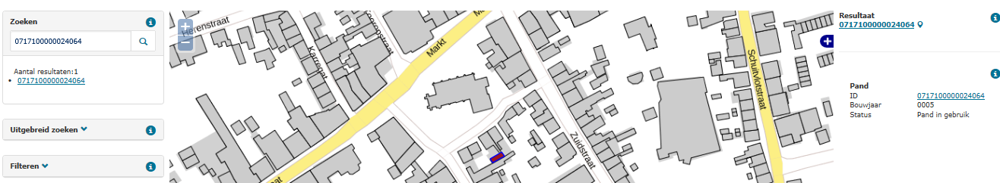

# Panden met onwaarschijnlijke bouwjaren (BOW)

## Wat wordt er gerapporteerd?

Bouwjaren vóór het jaar 1200 zijn onwaarschijnlijk en kunnen wijzen op typefouten. Ook bouwjaren die twee jaar of verder na het jaar van de peildatum liggen, worden gerapporteerd.

## Hoe kan het resultaat gecorrigeerd worden?

Het resultaat kan worden gecorrigeerd door het bouwjaar te controleren en zonodig aan te passen. 

## Hoe kan het resultaat worden voorkomen?

Het resultaat kan worden voorkomen door correcte bouwjaren en statussen op te voeren.
