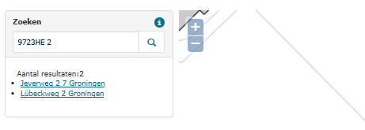

# Postcode-huisnummercombinatie bij meerdere openbare ruimtes (NPD)

## Wat wordt er gerapporteerd?

Samen met het huisnummer vormt de postcode een unieke code voor elk adres. In de rapportage vindt u dezelfde postcode - huisnummer combinaties in verschillende openbare ruimten.
In de detailgegevens worden _alle_ objecten weergegeven met de identieke postcode en huisnummercombinatie. We hebben hiervoor gekozen omdat dit duidelijk maakt waar het verkeerd gaat en de gehele reeks niet meer als unieke sleutel te gebruiken is. Dit betekent niet dat alle objecten fout zijn. Vaak is er één afwijkend object dat ervoor zorgt dat de reeks wordt gerapporteerd. Als dit ene foute object wordt aangepast, wordt de gehele reeks in een volgende rapportage niet meer getoond.

## Hoe kan het resultaat gecorrigeerd worden?

We adviseren om eerst op basis van de berichten van PostNL te controleren of de juiste postcode is opgevoerd. Indien nodig vraagt u nieuwe postcodes aan.

## Hoe kan het resultaat worden voorkomen?

Door altijd via PostNL een postcode aan te vragen en deze juist te verwerken, kan worden voorkomen dat er dezelfde postcode - huisnummer combinaties opgenomen worden in de BAG.
