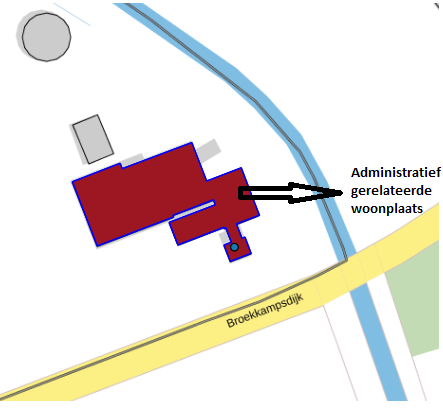

# Relatie adresseerbaar object – woonplaats onjuist (RAW)

## Wat wordt er gerapporteerd?

Een adresseerbaar object is administratief niet gerelateerd aan de woonplaats waarin het zich geometrisch bevindt. Meestal ontstaat er een ongeldige situatie doordat er geen optionele woonplaatsrelatie is opgenomen bij de nummeraanduiding als het object gelegen is aan een openbare ruimte in een andere woonplaats.

## Hoe kan het resultaat gecorrigeerd worden?

Het ligt voor de hand dat het deze situatie hersteld kan worden door de administratieve woonplaatsrelatie te wijzigen. Afhankelijk van de situatie kan het ook zijn dat de situatie hersteld kan worden door de woonplaatsgeometrie aan te passen.

## Hoe kan het resultaat worden voorkomen?

Wanneer het object in dezelfde woonplaats ligt als de openbare ruimte waardoor het ontsloten wordt, hoeft er geen aparte relatie met een woonplaats gelegd te worden. Wanneer een object in een andere woonplaats ligt dan de openbare ruimte, vult u de optionele identificatiecode van de bijbehorende woonplaats in. Zie voor een uitgebreide uitleg ook het artikel ['Hoe wordt het in de BAG geregistreerd als een verblijfsobject in een andere woonplaats of gemeente ligt dan de bijbehorende openbare ruimte?']({{-site.baseurl-}}/artikelen/hoe-wordt-het-in-de-bag-geregistreerd-als-een-verblijfsobject-in-een-andere-woonplaats-of-gemeente-ligt-dan-de-bijbehorende-openbare-ruimte).
