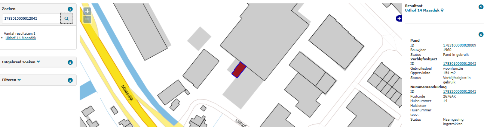

# Statusconflict adresseerbaar object – nummeraanduiding (CAN)

## Wat wordt er gerapporteerd?

Een adresseerbaar object met een huidige status mag niet gerelateerd zijn aan een nummeraanduiding met een beëindigde status. Hieronder treft u de ongeldige statuscombinaties aan:

Adresseerbaar object | Nummeraanduiding |
|:---:|:---:|
`Plaats aangewezen` | `Naamgeving ingetrokken` |
`Verblijfsobject gevormd` | `Naamgeving ingetrokken` |
`Verblijfsobject in gebruik` | `Naamgeving ingetrokken` |
`Verblijfsobject in gebruik (niet ingemeten)` | `Naamgeving ingetrokken` |
`Verblijfsobject buiten gebruik` | `Naamgeving ingetrokken` |

## Hoe kan het resultaat gecorrigeerd worden?

Het resultaat kan gecorrigeerd worden door het adresseerbare object alsnog in te trekken. Eventueel kunnen er nieuwe objecten opgevoerd worden, als dit nodig is om de BAG registratie op orde te krijgen.

## Hoe kan het resultaat worden voorkomen?

Omdat nummeraanduidingen en adresseerbare objecten samen opgevoerd moeten worden, kan deze situatie alleen ontstaan bij het doorvoeren van mutaties. Het is belangrijk dat nummeraanduidingen en adresseerbare objecten gezamenlijk worden ingetrokken.
