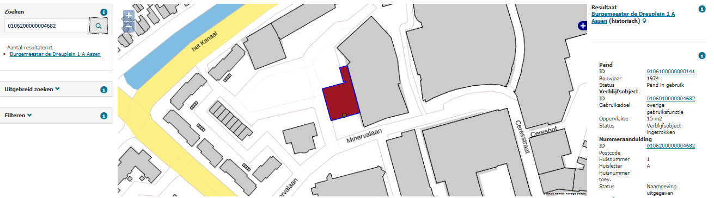

# Statusconflict nummeraanduiding – adresseerbaar object (CNA)

## Wat wordt er gerapporteerd?

Een nummeraanduiding met een huidige status mag niet gerelateerd zijn aan een adresseerbaar object met een beëindigde status. Hieronder treft u de ongeldige statuscombinaties aan.

Nummeraanduiding | Adresseerbaar object |
|:---:|:---:|
`Naamgeving uitgegeven` | `Plaats ingetrokken` |
`Naamgeving uitgegeven` | `Verblijfsobject ingetrokken` |
`Naamgeving uitgegeven` | `Niet gerealiseerd verblijfsobject` |

## Hoe kan het resultaat gecorrigeerd worden?

Het resultaat kan gecorrigeerd worden door de nummeraanduiding alsnog in te trekken. De LV BAG staat toe dat nummeraanduidingen ingetrokken kunnen worden zonder dat er een verblijfsobject wordt ingetrokken. Eventueel kunnen er nieuwe objecten opgevoerd worden, als dit nodig is om de BAG registratie op orde te krijgen.

## Hoe kan het resultaat worden voorkomen?

Omdat nummeraanduidingen en adresseerbare objecten samen opgevoerd moeten worden, kan deze situatie alleen ontstaan bij het doorvoeren van mutaties. Het is belangrijk dat nummeraanduidingen en adresseerbare objecten gezamenlijk worden ingetrokken. Bij adresseerbare objecten met nevenadressen is het belangrijk om niet te vergeten deze nevenadressen in te trekken als het adresseerbare object en het hoofdadres worden ingetrokken.
