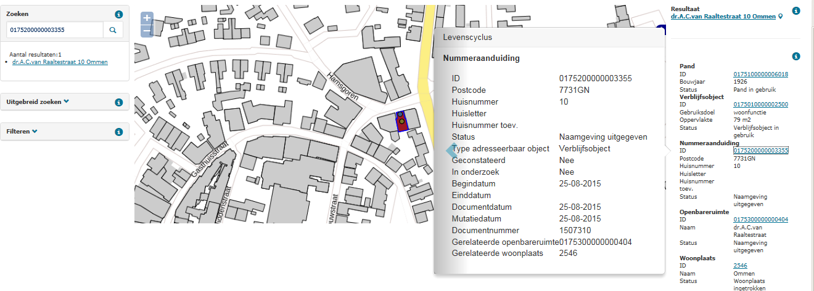

# Statusconflict nummeraanduiding – woonplaats (CNW)

## Wat wordt er gerapporteerd?

Een nummeraanduiding met een huidige status mag niet gerelateerd zijn aan een woonplaats met een beëindigde status. Hieronder treft u de ongeldige statuscombinatie aan.

Nummeraanduiding | Woonplaats |
|:---:|:---:|
`Naamgeving uitgegeven` | `Woonplaats ingetrokken` |

## Hoe kan het resultaat gecorrigeerd worden?

Het resultaat kan gecorrigeerd worden door de status van één van beide objecten aan te passen. Het resultaat kan ook gecorrigeerd worden door de woonplaatsrelatie van de nummeraanduiding aan te passen. Het kan zijn dat de nummeraanduiding na een woonplaatsgrenswijziging ten onrechte nog niet is gerelateerd aan de nieuwe woonplaats.

## Hoe kan het resultaat worden voorkomen?

Dit resultaat kan voorkomen worden door goed na te gaan of een statuswijziging van een object gevolgen heeft voor gerelateerde objecten. Als een woonplaats bijvoorbeeld wordt ingetrokken, dan moeten de gerelateerde nummeraanduidingen met een huidige status ook worden ingetrokken of gerelateerd worden aan een andere woonplaats (met een huidige status).
