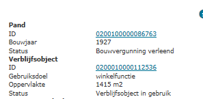
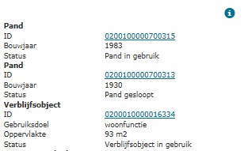

# Statusconflict verblijfsobject – pand (CVP)

## Wat wordt er gerapporteerd?

Bepaalde statuscombinaties tussen een verblijfsobject en het gerelateerde pand zijn in de praktijk onmogelijk. Hieronder treft u het overzicht met ongeldige statuscombinaties aan.

Verblijfsobject | Pand |
|:---:|:---:|
`Verblijfsobject in gebruik` | `Bouwvergunning verleend` |
`Verblijfsobject in gebruik (niet ingemeten)` | `Bouwvergunning verleend` |
`Verblijfsobject buiten gebruik` | `Bouwvergunning verleend` |
`Verblijfsobject in gebruik` | `Bouw gestart` |
`Verblijfsobject in gebruik (niet ingemeten)` | `Bouw gestart` |
`Verblijfsobject buiten gebruik` | `Bouw gestart` |
`Verblijfsobject gevormd` | `Niet gerealiseerd pand` |
`Verblijfsobject in gebruik` | `Niet gerealiseerd pand` |
`Verblijfsobject in gebruik (niet ingemeten)` | `Niet gerealiseerd pand` |
`Verblijfsobject buiten gebruik` | `Niet gerealiseerd pand` |
`Verblijfsobject gevormd` | `Pand gesloopt` |
`Verblijfsobject in gebruik` | `Pand gesloopt` |
`Verblijfsobject in gebruik (niet ingemeten)` | `Pand gesloopt` |
`Verblijfsobject buiten gebruik` | `Pand gesloopt` |

## Hoe kan het resultaat gecorrigeerd worden?

Het resultaat kan gecorrigeerd worden door afhankelijk van de situatie de status van het pand of het verblijfsobject aan te passen.

## Hoe kan het resultaat worden voorkomen?

Dit resultaat kan voorkomen worden door goed na te gaan of een statuswijziging van een object gevolgen heeft voor gerelateerde objecten. Als een verblijfsobject bijvoorbeeld gereed wordt gemeld, dan moet het gerelateerde pand ook gereed worden gemeld.
