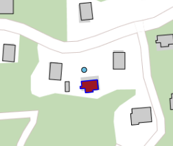
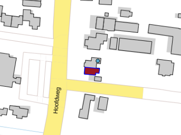

# Verblijfsobject buiten pand (VBP)

## Wat wordt er gerapporteerd?

De BAG schrijft voor dat de geometrie van het verblijfsobject binnen de pandgeometrie moet liggen van minimaal één van de gerelateerde panden. Het kan misgaan op het moment dat de geometrie van het pand wordt aangepast. Ook als de relatie tussen een pand en een verblijfsobject wordt gewijzigd, ontstaat er soms een ongeldige situatie, doordat het verblijfsobject binnen het verkeerde pand is komen te liggen.

#### Berekening percentage rapportage
Het percentage van deze rapportage wordt berekend door het aantal verblijfsobjecten dat zich buiten een pand bevindt te delen door het totaal aantal verblijfsobjecten in de gemeente. Dit percentage wordt vervolgens in het Kwaliteitsdashboard getoond links van de titel van de rapportagebalk. 

## Hoe kan het resultaat gecorrigeerd worden?

Er zijn meerdere mogelijke oplossingen:
- Het aanpassen van de pandgeometrie waardoor het verblijfsobject weer binnen de pandgeometrie komt te liggen;
- Het aanpassen van de geometrie van het verblijfsobject waardoor het verblijfsobject weer binnen de pandgeometrie komt te liggen;
- Het wijzigen van het gerelateerde pand waardoor het verblijfsobject weer binnen de juiste pandgeometrie komt te liggen.

## Hoe kan het resultaat worden voorkomen?

U kunt het resultaat voorkomen door goed te controleren of wijzigingen in de geometrie of de pandrelatering ervoor zorgen dat ook andere gegevens aangepast moeten worden.
