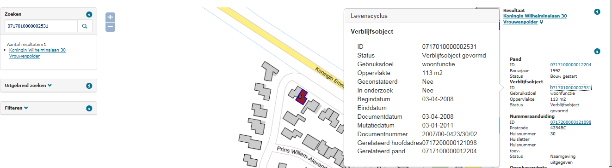

# Verblijfsobjecten ouder dan vijf jaar met status `gevormd` (VGL)

## Wat wordt er gerapporteerd?

Deze rapportage signaleert verblijfsobjecten waarvan het gereedmelden opvallend lang op zich laat wachten. Er wordt gekeken naar verblijfsobjecten die langer dan 5 jaar de status `Verblijfsobject gevormd` hebben. De kans bestaat dat er een gereedmelding niet is verwerkt binnen de gemeente, of dat er een vergunning ingetrokken moet worden.

## Hoe kan het resultaat gecorrigeerd worden?

De situatie kan, indien noodzakelijk, hersteld worden door de status van het verblijfsobject aan te passen. Als blijkt dat de vergunning wordt ingetrokken, krijgt het object de status `Niet gerealiseerd verblijfsobject`. Als het verblijfsobject al gerealiseerd is, dan ligt het voor de hand dat het verblijfsobject de status `In gebruik (niet ingemeten)` of `In gebruik` krijgt.

## Hoe kan dit resultaat worden voorkomen?

Deze constateringen kunnen voorkomen worden door het proces na het verlenen van de vergunning goed bij te houden. Als er geen invulling wordt gegeven aan een verleende vergunning, kunt u ervoor kiezen de vergunning in te trekken.
