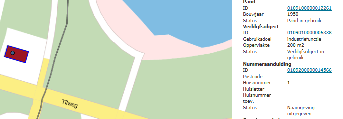

# Verblijfsobjecten zonder postcode (VZP)

## Wat wordt er gerapporteerd?

Er zijn verblijfsobjecten zonder postcode waar die wel wordt verwacht. Dit is het geval bij alle gebruiksdoelen, behalve bij het gebruiksdoel `Overige gebruiksfunctie`. Om te voorkomen dat verblijfsobjecten worden meegenomen waarbij de aanvraag voor een postcode nog loopt, worden in deze rapportage alleen verblijfsobjecten geteld die ouder zijn dan vier weken.

## Hoe kan het resultaat gecorrigeerd worden?

De situatie kan hersteld worden door alsnog een postcode bij PostNL op te vragen voor dit object. Een andere mogelijkheid is het gebruiksdoel te wijzigen in `Overige gebruiksfunctie`.

## Hoe kan het resultaat worden voorkomen?

Deze situaties kunnen voorkomen worden door het proces bij het aanvragen van postcodes zorgvuldig uit te voeren. In het [Convenant inzake postcodes](http://www.geobasisregistraties.nl/basisregistraties/documenten/convenant/2014/02/20/index){:target="_blank" rel="noreferrer"} kunt u teruglezen dat ook aan adresseerbare objecten zonder postaal afgiftepunt een postcode toegekend kan worden.
