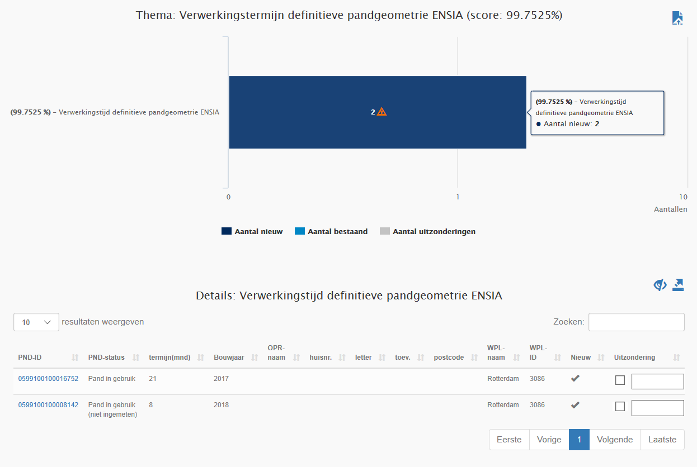
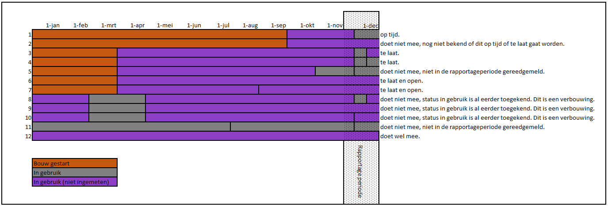

# Verwerkingstermijn definitieve pandgeometrie ENSIA (VPE)

## Wat wordt er gerapporteerd?
De Wet bag schrijft voor dat de definitieve pandgeometrie binnen zes maanden in de BAG geregistreerd wordt. 
Deze rapportage geeft aan in hoeveel procent van de gevallen de geometrie tijdig is verwerkt. Dit percentage kan worden gebruikt voor de beantwoording van de vraag hierover in de ENSIA vragenlijst.

Het aantal resultaten in de rapportage is het totaal van:
1. Panden waarvan de geometrie nog niet is verwerkt terwijl de termijn al wel is verstreken (open en te laat). 
Panden met de status `Pand in gebruik (niet ingemeten)` waarvan de definitieve geometrie al langer dan zes maanden niet beschikbaar is 
gekomen. Hierbij worden de tijdvakken van aaneengesloten voorkomens met deze status bij elkaar opgeteld. 

2. Panden waarvan de geometrie in de rapportageperiode te laat is verwerkt. 
Dit zijn panden die in de periode sinds de vorige rapportage voor het eerst de status `Pand in gebruik` hebben gekregen en die langer dan zes maanden als voorgaande status de status `Pand in gebruik (niet ingemeten)` hebben gehad. Hierbij worden de tijdvakken van aaneengesloten voorkomens met deze status bij elkaar opgeteld. Deze panden zijn in de rapportage te herkennen aan de status `Pand in gebruik`.

Het totaal aantal resultaten wordt afgezet tegen het totaal van:
- Panden waarvan de geometrie nog niet is verwerkt terwijl de termijn al wel is verstreken (open en te laat).  Dit is nummer 1 van de hierboven beschreven resultaten. 
- Panden waarvan de geometrie in de rapportageperiode te laat is verwerkt.  Dit is nummer 2 van de hierboven beschreven resultaten.
- Panden waarvan de geometrie in de rapportageperiode op tijd is verwerkt.  Dit is vergelijkbaar met nummer 2 van de hierboven beschreven resultaten, maar dan met een termijn korter dan zes maanden. 

Panden waarvan de geometrie voorafgaand aan de rapportageperiode is verwerkt of waarvan de geometrie nog verwerkt moet worden maar waarvan de verwerkingstermijn nog niet is verlopen, maken geen onderdeel uit van de rapportage.

**Verbouwingen** 
Panden die al eens de status `Pand in gebruik` hebben gehad, worden niet gerapporteerd. Hiermee voorkomen we dat panden die verbouwd worden ten onrechte als ‘te laat’ worden gezien. Een gereedmelding van een verbouwing is in BAG 1.0 namelijk niet te herkennen in de gegevens. De status `Pand in gebruik (niet ingemeten)` wordt immers zowel bij het verbouwen als bij de gereedmelding van de verbouwing gebruikt. Het uitsluiten van alle verbouwingen zorgt ervoor dat ook verbouwingen, waarvan de geometrie in de praktijk te laat wordt verwerkt, niet als ‘te laat’ worden aangemerkt. Hierdoor valt het percentage hoger (lees: gunstiger) uit dan het feitelijk is.

In onderstaand schema wordt met verschillende voorbeelden toegelicht welke situaties wel en welke situaties niet worden verwerkt in de rapportage:

Voorbeeld: 

|Gemeente X |01-11-2019 | 
|:--- |:--- |
| Totaal aantal | 95 | 
| Op tijd verwerkt | 93 | 
| Te laat verwerkt | 1 | 
| Open en te laat | 1 | 
| Percentage op tijd | 97,89% | 

Gemeente X heeft tussen 1 oktober en 1 november 2019 van 94 panden de definitieve geometrie verwerkt. 
Bij één pand is dit te laat gebeurd (‘Te laat verwerkt’). Daarnaast is er nog één pand waarvan de geometrie nog niet verwerkt is 
(‘Open en te laat’). Dit betekent dat van 93 van de 95 panden de geometrie op tijd is verwerkt. 
Dit leidt tot een percentage van 97,89% (93/95*100). De interventiewaarde van 98% wordt in dit geval net niet gehaald.

## Hoe kan het resultaat gecorrigeerd worden?
Voor de panden waarvan de geometrie nog niet is verwerkt, kunnen de resultaten gecorrigeerd worden door de definitieve geometrie alsnog 
in de BAG op te nemen. Omdat de geometrie in dat geval wel te laat is verwerkt, zal het pand nog één keer worden gerapporteerd in de 
volgende rapportage. Daarna zal het pand dan niet meer voorkomen. 
Panden waarvan de definitieve geometrie blijvend niet wordt verwerkt, zullen steeds opnieuw worden getoond in de rapportage.

## Hoe kan het resultaat worden voorkomen?
Het resultaat kan voorkomen worden door de definitieve geometrie tijdig in de BAG te registreren. 
Het kan zijn dat het hiervoor nodig is dat binnengemeentelijke processen die zich buiten de BAG afspelen geoptimaliseerd moeten worden. 
In de rapportage [Verwerkingstermijn definitieve pandgeometrie vier tot zes maanden (VPK)]({{-site.baseurl-}}/kwaliteitsrapporten/verwerkingstermijn-definitieve-pandgeometrie-vier-tot-zes-maanden) kunt u terugzien bij welke panden overschrijding van de termijn dreigt.

**Panden die met status ‘Pand in gebruik’ zijn opgevoerd** 
Er zijn panden die met de status `Pand in gebruik (niet ingemeten)` zijn opgevoerd en vervolgens niet zijn gemuteerd. Wij beschouwen deze panden als objecten, waarmee iets aan de hand is en die zeker aandacht verdienen. Voor zover bij deze panden bij de opvoer (opbouw van de BAG) sprake was van een verbouwing, is het aannemelijk dat er óf geen invulling is gegeven aan de vergunning, óf dat de verbouwing inmiddels is afgerond en dat de geometrie verwerkt moet gaan worden. 

_Het ligt voor de hand dat de status van deze panden aangepast zou moeten worden._
Als er geen invulling wordt gegeven aan de verbouwing kan de status van deze panden op basis van een schriftelijke verklaring aangepast worden naar `Pand in gebruik`. Het is hierbij geen vereiste dat de verbouwvergunning wordt ingetrokken. Het is na zoveel jaren niet meer aannemelijk dat de verbouwing wordt uitgevoerd. De aanpassing in de BAG zorgt er overigens niet voor dat de verbouwvergunning geen juridische waarde meer heeft. Op het moment dat duidelijk wordt dat de verbouwing toch wordt uitgevoerd, kan de status op een later moment alsnog op `Pand in gebruik (niet ingemeten)` worden gezet. In BAG 2.0 wordt in dat geval de status `Verbouwing Pand` toegekend. 
